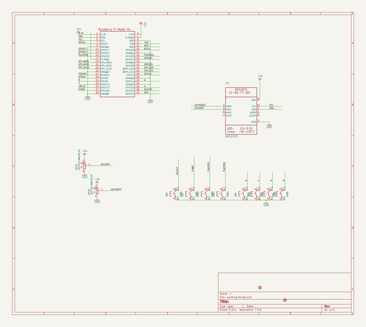
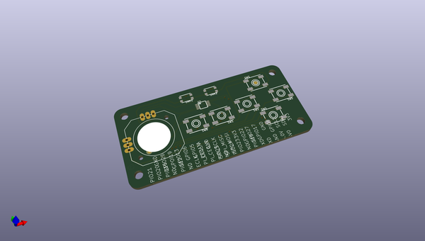
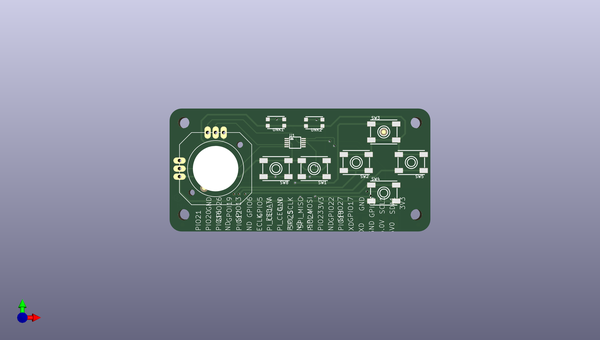
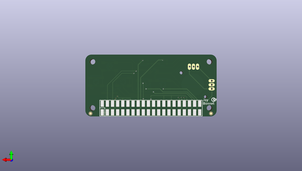

# adafruit_joy_bonnet_pcb
 
## summary 
* id: adafruit_adafruit_joy_bonnet_pcb_adafruit_joy_bonnet
* user: adafruit
* name: adafruit_joy_bonnet_pcb
* board: adafruit_joy_bonnet
* repo: https://github.com/adafruit/Adafruit-Joy-Bonnet-PCB

* src_file_repo_sch: 
* src_file_repo_sch_link: https://github.com/adafruit/Adafruit-Joy-Bonnet-PCB/tree/master/
* full details link: https://github.com/oomlout/oomlout_oomp_project_bot_v_2/tree/main/projects/adafruit_adafruit_joy_bonnet_pcb_adafruit_joy_bonnet/current_version/working  

## schematic  
  
[schematic (pdf)](working_schematic.pdf) 

## pcb  
 
  
  
  
[board (pdf)](working.pdf)  

## working_bom
| Id | Designator | Footprint | Quantity | Designation | Supplier and ref |  | None | 
| --- | --- | --- | --- | --- | --- | --- | --- | 
| 1 | U1 | MSOP10 | 1 | ADS1015 |  |  | [''] | 
| 2 | FID3,FID2 | FIDUCIAL_1MM | 2 | FIDUCIAL_1MM |  |  | [''] | 
| 3 | SW1,SW8,SW5,SW3,SW4,SW2 | EVQ-Q2_SMALLER | 6 | EVQQ |  |  | [''] | 
| 4 | RPI1 | PI_BONNET_SMT | 1 | RASPBERRYPI_BPLUS_BONNETSMT |  |  | [''] | 
| 5 | UNK2,UNK1 | BTN_KMR2_4.6X2.8 | 2 | KMR2 |  |  | [''] | 
| 6 | JOY1 | JOYSTICK_ANALOG_MINITHM | 1 | JOYSTICK_ANALOG_XY |  |  | [''] | 
| 7 | U$7 | PCBFEAT-REV-040 | 1 |  |  |  | [''] | 

## bom_schematic
| Ref | Qnty | Value | Cmp name | Footprint | Description | Vendor | DNP | 
| --- | --- | --- | --- | --- | --- | --- | --- | 
| FID2, FID3 | 2 | FIDUCIAL_1MM | FIDUCIAL_1MM | working:FIDUCIAL_1MM |  |  |  | 
| JOY1 | 1 | JOYSTICK_ANALOG_XY | JOYSTICK_ANALOG_XY | working:JOYSTICK_ANALOG_MINITHM |  |  |  | 
| RPI1 | 1 | RASPBERRYPI_BPLUS_BONNETSMT | RASPBERRYPI_BPLUS_BONNETSMT | working:PI_BONNET_SMT |  |  |  | 
| SW1, SW2, SW3, SW4, SW5, SW8 | 6 | EVQQ | SWITCH_TACT_SMT_EVQQ2_SMALL | working:EVQ-Q2_SMALLER |  |  |  | 
| U1 | 1 | ADS1015 | ADC_ADS1015 | working:MSOP10 |  |  |  | 
| UNK1, UNK2 | 2 | KMR2 | SWITCH_TACT_SMT4.6X2.8 | working:BTN_KMR2_4.6X2.8 |  |  |  | 

