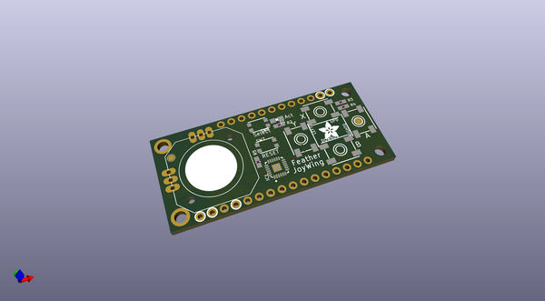
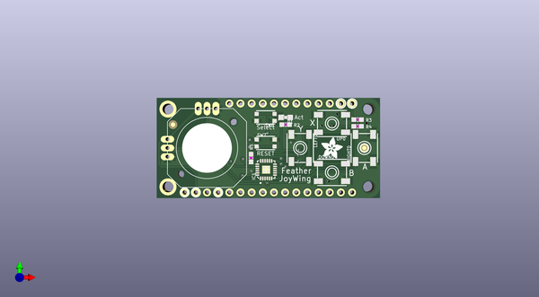

# adafruit_joy_featherwing_pcb
 
## summary 
* id: adafruit_adafruit_joy_featherwing_pcb_joypad_featherwing_rev_c
* user: adafruit
* name: adafruit_joy_featherwing_pcb
* board: joypad_featherwing_rev_c
* repo: https://github.com/adafruit/Adafruit-Joy-Featherwing-PCB

* src_file_repo_sch: 
* src_file_repo_sch_link: https://github.com/adafruit/Adafruit-Joy-Featherwing-PCB/tree/master/
* full details link: https://github.com/oomlout/oomlout_oomp_project_bot_v_2/tree/main/projects/adafruit_adafruit_joy_featherwing_pcb_joypad_featherwing_rev_c/current_version/working  

## schematic  
  
[schematic (pdf)](working_schematic.pdf) 

## pcb  
 
  
  
  
[board (pdf)](working.pdf)  

## working_bom
| Id | Designator | Footprint | Quantity | Designation | Supplier and ref |  | None | 
| --- | --- | --- | --- | --- | --- | --- | --- | 
| 1 | U$9,U$11 | ADAFRUIT_5MM | 2 |  |  |  | [''] | 
| 2 | SW6,SW7 | BTN_KMR2_4.6X2.8 | 2 | KMR2 |  |  | [''] | 
| 3 | IC1 | QFN24_4MM | 1 | ATSAMD09D14A-MU |  |  | [''] | 
| 4 | RIGHT0,UP0,LEFT0,DOWN0 | EVQ-Q2_SMALLER | 4 | 6mm |  |  | [''] | 
| 5 | FID1,FID2 | FIDUCIAL_1MM | 2 | FIDUCIAL_1MM |  |  | [''] | 
| 6 | D1 | CHIPLED_0805_NOOUTLINE | 1 | RED |  |  | [''] | 
| 7 | R3 | 0603-NO | 1 | 10K |  |  | [''] | 
| 8 | R4 | 0603-NO | 1 | 10k |  |  | [''] | 
| 9 | R2,R5 | 0603-NO | 2 | 1k |  |  | [''] | 
| 10 | MS1 | FEATHERWING | 1 | FEATHERWING |  |  | [''] | 
| 11 | JOY1 | JOYSTICK_ANALOG_MINITHM | 1 | JOYSTICK_ANALOG_XY |  |  | [''] | 
| 12 | SJ9,SJ7,SJ2,SJ3,SJ4,SJ8,SJ6,SJ5,SJ1 | SOLDERJUMPER_ARROW_NOPASTE | 9 |  |  |  | [''] | 
| 13 | TP1,TP2 | TESTPOINT_ROUND_2MM | 2 |  |  |  | [''] | 
| 14 | U$7 | PCBFEAT-REV-040 | 1 |  |  |  | [''] | 
| 15 | U$10 | FEATHERLOGO_MED | 1 |  |  |  | [''] | 
| 16 | U$12 | SEESAW_LOGO | 1 |  |  |  | [''] | 

## bom_schematic
| Ref | Qnty | Value | Cmp name | Footprint | Description | Vendor | DNP | 
| --- | --- | --- | --- | --- | --- | --- | --- | 
| D1 | 1 | RED | LED0805_NOOUTLINE | working:CHIPLED_0805_NOOUTLINE |  |  |  | 
| DOWN0 | 1 | 6mm | SWITCH_TACT_SMT_EVQQ2_SMALL | working:EVQ-Q2_SMALLER |  |  |  | 
| FID1, FID2 | 2 | FIDUCIAL_1MM | FIDUCIAL_1MM | working:FIDUCIAL_1MM |  |  |  | 
| IC1 | 1 | ATSAMD09D14A-MU | ATSAMD09D14A-MU | working:QFN24_4MM |  |  |  | 
| JOY1 | 1 | JOYSTICK_ANALOG_XY | JOYSTICK_ANALOG_XY | working:JOYSTICK_ANALOG_MINITHM |  |  |  | 
| LEFT0 | 1 | 6mm | SWITCH_TACT_SMT_EVQQ2_SMALL | working:EVQ-Q2_SMALLER |  |  |  | 
| MS1 | 1 | FEATHERWING | FEATHERWING | working:FEATHERWING |  |  |  | 
| R2, R5 | 2 | 1k | RESISTOR_0603_NOOUT | working:0603-NO |  |  |  | 
| R3 | 1 | 10K | RESISTOR_0603_NOOUT | working:0603-NO |  |  |  | 
| R4 | 1 | 10k | RESISTOR_0603_NOOUT | working:0603-NO |  |  |  | 
| RIGHT0 | 1 | 6mm | SWITCH_TACT_SMT_EVQQ2_SMALL | working:EVQ-Q2_SMALLER |  |  |  | 
| SJ1, SJ2, SJ3, SJ4, SJ5, SJ6, SJ7, SJ8, SJ9 | 9 | SOLDERJUMPER | SOLDERJUMPER | working:SOLDERJUMPER_ARROW_NOPASTE |  |  |  | 
| SW6, SW7 | 2 | KMR2 | SWITCH_TACT_SMT4.6X2.8 | working:BTN_KMR2_4.6X2.8 |  |  |  | 
| TP1, TP2 | 2 | TESTPOINTROUND2MM | TESTPOINTROUND2MM | working:TESTPOINT_ROUND_2MM |  |  |  | 
| UP0 | 1 | 6mm | SWITCH_TACT_SMT_EVQQ2_SMALL | working:EVQ-Q2_SMALLER |  |  |  | 

