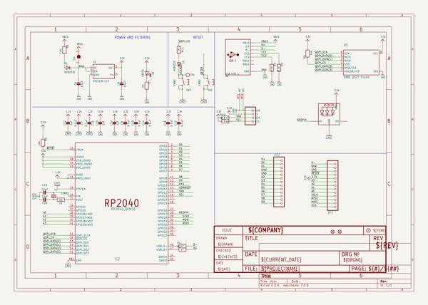
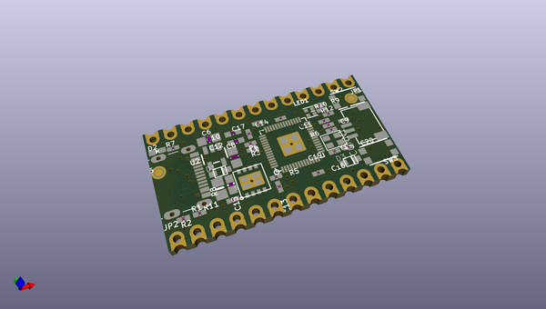
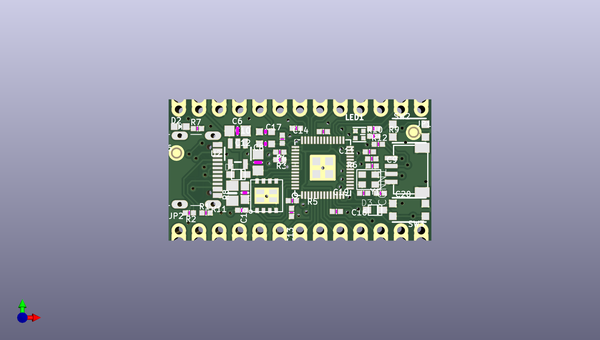
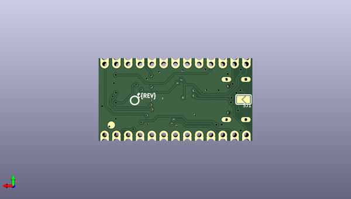

# adafruit_kb2040_pcb
 
## summary 
* id: adafruit_adafruit_kb2040_pcb_adafruit_kb2040
* user: adafruit
* name: adafruit_kb2040_pcb
* board: adafruit_kb2040
* repo: https://github.com/adafruit/Adafruit-KB2040-PCB

* src_file_repo_sch: 
* src_file_repo_sch_link: https://github.com/adafruit/Adafruit-KB2040-PCB/tree/main/
* full details link: https://github.com/oomlout/oomlout_oomp_project_bot_v_2/tree/main/projects/adafruit_adafruit_kb2040_pcb_adafruit_kb2040/current_version/working  

## schematic  
  
[schematic (pdf)](working_schematic.pdf)  

## pcb  
 
  
  
  
[board (pdf)](working.pdf)  

## working_bom
| Id | Designator | Footprint | Quantity | Designation | Supplier and ref |  | None | 
| --- | --- | --- | --- | --- | --- | --- | --- | 
| 1 | R9,R5,R7 | _0402NO | 3 | 10K |  |  | [''] | 
| 2 | C10,C12 | _0603MP | 2 | 1uF |  |  | [''] | 
| 3 | Y1 | CRYSTAL_2.5X2 | 1 | 12MHZ |  |  | [''] | 
| 4 | D1,D3 | SOD-323F | 2 | NSR0320 |  |  | [''] | 
| 5 | SW2,SW3 | BTN_KMR2_4.6X2.8 | 2 | KMR2 |  |  | [''] | 
| 6 | C8,C6 | _0805MP | 2 | 10µF |  |  | [''] | 
| 7 | U2 | SOT23-5 | 1 | AP2112K-3.3 |  |  | [''] | 
| 8 | U$19 | KB2040_TOP | 1 |  |  |  | [''] | 
| 9 | U5 | USON8_4X4 | 1 | 8MB QSPI Flash |  |  | [''] | 
| 10 | R10,R2,R1,R12 | _0402NO | 4 | 5.1K |  |  | [''] | 
| 11 | IC2 | QFN56_7MM_REDUCEDEPAD | 1 | RP2040_QFN56 |  |  | [''] | 
| 12 | R8 | 0805-NO | 1 | FUSE |  |  | [''] | 
| 13 | U$34,U$35 | FIDUCIAL_1MM | 2 | FIDUCIAL_1MM |  |  | [''] | 
| 14 | R11,R6 | _0402NO | 2 | 1K |  |  | [''] | 
| 15 | JP2,JP1 | 1X13_CASTEL | 2 |  |  |  | [''] | 
| 16 | C15 | 0603-NO | 1 | 1uF |  |  | [''] | 
| 17 | D2 | CHIPLED_0603_NOOUTLINE | 1 | GREEN |  |  | [''] | 
| 18 | C11,C17,C14,C7,C16,C13,C9 | _0402NO | 7 | 0.1uF |  |  | [''] | 
| 19 | R3,R4 | _0402NO | 2 | 27 |  |  | [''] | 
| 20 | C19,C20 | _0402NO | 2 | 22pF |  |  | [''] | 
| 21 | LED1 | SK6805_1515 | 1 | WS2812B_SK6805_1515 |  |  | [''] | 
| 22 | X6 | USB_C_CUSB31-CFM2AX-01-X | 1 | USB TYPE C |  |  | [''] | 
| 23 | CONN1 | JST_SH4_SKINNY | 1 | STEMMA_I2C_QTSKINNY |  |  | [''] | 
| 24 | SJ1 | SOLDERJUMPER_ARROW_NOPASTE | 1 |  |  |  | [''] | 
| 25 | TP1 | TESTPOINT_ROUND_1.5MM_NO | 1 |  |  |  | [''] | 
| 26 | U$17 | KB2040_BOT | 1 |  |  |  | [''] | 
| 27 | U$20 | PCBFEAT-REV-040 | 1 |  |  |  | [''] | 

## bom_schematic
| Ref | Qnty | Value | Cmp name | Footprint | Description | Vendor | DNP | 
| --- | --- | --- | --- | --- | --- | --- | --- | 
| C6, C8 | 2 | 10µF | CAP_CERAMIC_0805MP | working:_0805MP |  |  |  | 
| C7, C9, C11, C13, C14, C16, C17 | 7 | 0.1uF | CAP_CERAMIC_0402NO | working:_0402NO |  |  |  | 
| C10, C12 | 2 | 1uF | CAP_CERAMIC_0603MP | working:_0603MP |  |  |  | 
| C15 | 1 | 1uF | CAP_CERAMIC0603_NO | working:0603-NO |  |  |  | 
| C19, C20 | 2 | 22pF | CAP_CERAMIC_0402NO | working:_0402NO |  |  |  | 
| CONN1 | 1 | STEMMA_I2C_QTSKINNY | STEMMA_I2C_QTSKINNY | working:JST_SH4_SKINNY |  |  |  | 
| D1, D3 | 2 | NSR0320 | DIODESOD-323F | working:SOD-323F |  |  |  | 
| D2 | 1 | GREEN | LED0603_NOOUTLINE | working:CHIPLED_0603_NOOUTLINE |  |  |  | 
| IC2 | 1 | RP2040_QFN56 | RP2040_QFN56 | working:QFN56_7MM_REDUCEDEPAD |  |  |  | 
| JP1, JP2 | 2 | HEADER-1X13_CASTEL | HEADER-1X13_CASTEL | working:1X13_CASTEL |  |  |  | 
| LED1 | 1 | WS2812B_SK6805_1515 | WS2812B_SK6805_1515 | working:SK6805_1515 |  |  |  | 
| R1, R2, R10, R12 | 4 | 5.1K | RESISTOR_0402NO | working:_0402NO |  |  |  | 
| R3, R4 | 2 | 27 | RESISTOR_0402NO | working:_0402NO |  |  |  | 
| R5, R7, R9 | 3 | 10K | RESISTOR_0402NO | working:_0402NO |  |  |  | 
| R6, R11 | 2 | 1K | RESISTOR_0402NO | working:_0402NO |  |  |  | 
| R8 | 1 | FUSE | RESISTOR0805_NOOUTLINE | working:0805-NO |  |  |  | 
| SJ1 | 1 | SOLDERJUMPER | SOLDERJUMPER | working:SOLDERJUMPER_ARROW_NOPASTE |  |  |  | 
| SW2, SW3 | 2 | KMR2 | SWITCH_TACT_SMT4.6X2.8 | working:BTN_KMR2_4.6X2.8 |  |  |  | 
| TP1 | 1 | TESTPOINTROUND1.5MMNO | TESTPOINTROUND1.5MMNO | working:TESTPOINT_ROUND_1.5MM_NO |  |  |  | 
| U2 | 1 | AP2112K-3.3 | VREG_SOT23-5 | working:SOT23-5 |  |  |  | 
| U5 | 1 | 8MB QSPI Flash | SPIFLASH_8PIN_4X4 | working:USON8_4X4 |  |  |  | 
| U$34, U$35 | 2 | FIDUCIAL_1MM | FIDUCIAL_1MM | working:FIDUCIAL_1MM |  |  |  | 
| X6 | 1 | USB TYPE C | USB_C | working:USB_C_CUSB31-CFM2AX-01-X |  |  |  | 
| Y1 | 1 | 12MHZ | CRYSTAL2.5X2.0 | working:CRYSTAL_2.5X2 |  |  |  | 

