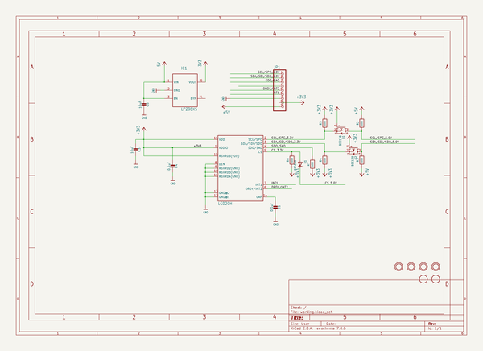
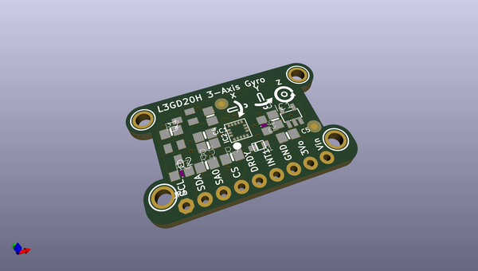
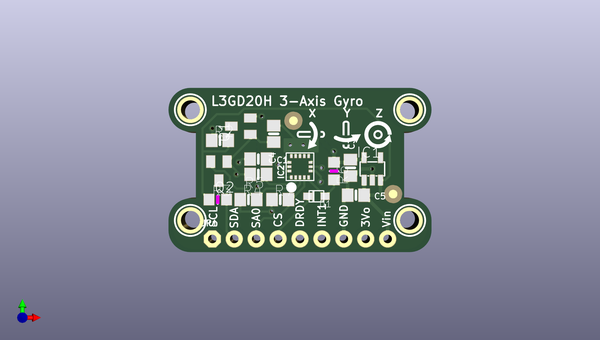
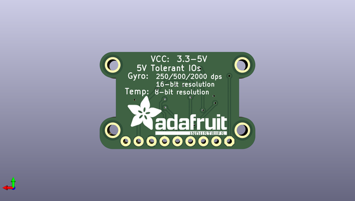

# adafruit_l3gd20_breakout_pcb
 
## summary 
* id: adafruit_adafruit_l3gd20_breakout_pcb_adafruit_l3gd20h_breakout
* user: adafruit
* name: adafruit_l3gd20_breakout_pcb
* board: adafruit_l3gd20h_breakout
* repo: https://github.com/adafruit/Adafruit-L3GD20-Breakout-PCB

* src_file_repo_sch: 
* src_file_repo_sch_link: https://github.com/adafruit/Adafruit-L3GD20-Breakout-PCB/tree/master/
* full details link: https://github.com/oomlout/oomlout_oomp_project_bot_v_2/tree/main/projects/adafruit_adafruit_l3gd20_breakout_pcb_adafruit_l3gd20h_breakout/current_version/working  

## schematic  
  
[schematic (pdf)](working_schematic.pdf) 

## pcb  
 
  
  
  
[board (pdf)](working.pdf)  

## working_bom
| Id | Designator | Footprint | Quantity | Designation | Supplier and ref |  | None | 
| --- | --- | --- | --- | --- | --- | --- | --- | 
| 1 | U$12,U$11,U$14,U$13 | MOUNTINGHOLE_2.0_PLATED | 4 | MOUNTINGHOLE2.0 |  |  | [''] | 
| 2 | U$15,U$16 | FIDUCIAL_1MM | 2 | FIDUCIAL |  |  | [''] | 
| 3 | R6,R3 | _0805MP | 2 | 10K |  |  | [''] | 
| 4 | R2,R5,R4,R7 | 0805-NO | 4 | 10K |  |  | [''] | 
| 5 | IC2 | L3GD20H_LGA16L | 1 | LGD20H |  |  | [''] | 
| 6 | C4,C1 | 0805-NO | 2 | 0.1uF |  |  | [''] | 
| 7 | D1 | SOD-323F | 1 | 1N4148 |  |  | [''] | 
| 8 | IC1 | SOT23-5L | 1 | MIC5225-3.3 |  |  | [''] | 
| 9 | U$3 | SYMBOL_GYROXYZ_10MM | 1 |  |  |  | [''] | 
| 10 | Q1,Q2 | SOT23 | 2 | BSS138 |  |  | [''] | 
| 11 | C5,C3 | 0805-NO | 2 | 10uF |  |  | [''] | 
| 12 | JP1 | 1X09_ROUND_76 | 1 |  |  |  | [''] | 
| 13 | U$10 | ADAFRUIT_TEXT_20MM | 1 |  |  |  | [''] | 

## bom_schematic
| Ref | Qnty | Value | Cmp name | Footprint | Description | Vendor | DNP | 
| --- | --- | --- | --- | --- | --- | --- | --- | 
| C1, C4 | 2 | 0.1uF | CAP_CERAMIC0805-NOOUTLINE | working:0805-NO |  |  |  | 
| C3, C5 | 2 | 10uF | CAP_CERAMIC0805-NOOUTLINE | working:0805-NO |  |  |  | 
| D1 | 1 | 1N4148 | DIODESOD-323F | working:SOD-323F |  |  |  | 
| IC1 | 1 | LP298XS | LP298XS | working:SOT23-5L |  |  |  | 
| IC2 | 1 | LGD20H | GYRO_L3GD20H | working:L3GD20H_LGA16L |  |  |  | 
| JP1 | 1 | HEADER-1X976MIL | HEADER-1X976MIL | working:1X09_ROUND_76 |  |  |  | 
| Q1, Q2 | 2 | BSS138 | MOSFET-NREFLOW | working:SOT23 |  |  |  | 
| R2, R4, R5, R7 | 4 | 10K | RESISTOR0805_NOOUTLINE | working:0805-NO |  |  |  | 
| R3, R6 | 2 | 10K | RESISTOR_0805MP | working:_0805MP |  |  |  | 
| U$11, U$12, U$13, U$14 | 4 | MOUNTINGHOLE2.0 | MOUNTINGHOLE2.0 | working:MOUNTINGHOLE_2.0_PLATED |  |  |  | 
| U$15, U$16 | 2 | FIDUCIAL | FIDUCIAL | working:FIDUCIAL_1MM |  |  |  | 

## mounting_holes
| x | y | package | value | ref | size | 
| --- | --- | --- | --- | --- | --- | 
| 25.4 | 12.83 | MOUNTINGHOLE_2.0_PLATED | MOUNTINGHOLE2.0 | U$11 | m3 | 
| 0.0 | 12.83 | MOUNTINGHOLE_2.0_PLATED | MOUNTINGHOLE2.0 | U$12 | m3 | 
| 0.0 | 0.0 | MOUNTINGHOLE_2.0_PLATED | MOUNTINGHOLE2.0 | U$13 | m3 | 
| 25.4 | 0.0 | MOUNTINGHOLE_2.0_PLATED | MOUNTINGHOLE2.0 | U$14 | m3 | 

