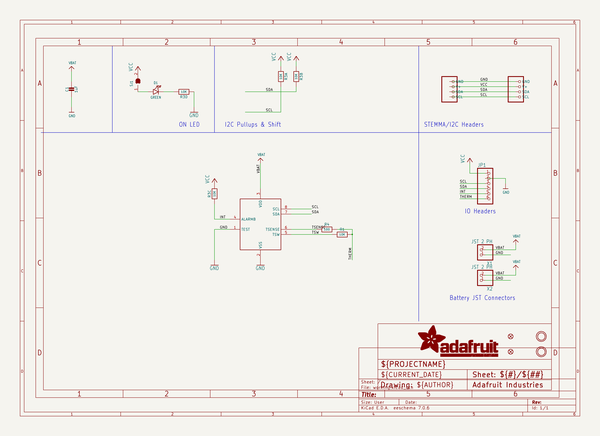
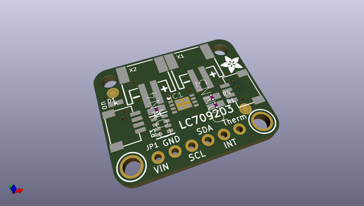
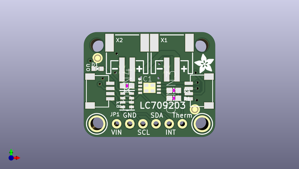
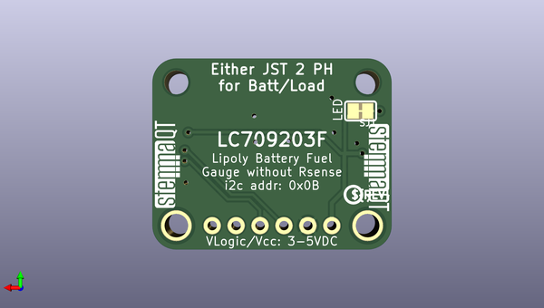

# adafruit_lc709203f_pcb
 
## summary 
* id: adafruit_adafruit_lc709203f_pcb_adafruit_lc709203f_lipoly_liion_fuel_gauge_and_battery_monitor
* user: adafruit
* name: adafruit_lc709203f_pcb
* board: adafruit_lc709203f_lipoly_liion_fuel_gauge_and_battery_monitor
* repo: https://github.com/adafruit/Adafruit-LC709203F-PCB

* src_file_repo_sch: 
* src_file_repo_sch_link: https://github.com/adafruit/Adafruit-LC709203F-PCB/tree/master/
* full details link: https://github.com/oomlout/oomlout_oomp_project_bot_v_2/tree/main/projects/adafruit_adafruit_lc709203f_pcb_adafruit_lc709203f_lipoly_liion_fuel_gauge_and_battery_monitor/current_version/working  

## schematic  
  
[schematic (pdf)](working_schematic.pdf)  

## pcb  
 
  
  
  
[board (pdf)](working.pdf)  

## working_bom
| Id | Designator | Footprint | Quantity | Designation | Supplier and ref |  | None | 
| --- | --- | --- | --- | --- | --- | --- | --- | 
| 1 | U$21,U$19 | MOUNTINGHOLE_2.5_PLATED | 2 | MOUNTINGHOLE2.5 |  |  | [''] | 
| 2 | CONN3,CONN4 | JST_SH4 | 2 | STEMMA_I2C_QT |  |  | [''] | 
| 3 | @HOLE1,@HOLE0 |  | 2 |  |  |  | [''] | 
| 4 | X1,X2 | JSTPH2_BATT | 2 | JST 2 PH |  |  | [''] | 
| 5 | JP1 | 1X06_ROUND_70 | 1 |  |  |  | [''] | 
| 6 | D1 | CHIPLED_0603_NOOUTLINE | 1 | GREEN |  |  | [''] | 
| 7 | FID4,FID3 | FIDUCIAL_1MM | 2 | FIDUCIAL_1MM |  |  | [''] | 
| 8 | IC1 | WDFN8_3X4_0.65 | 1 | LC709203F |  |  | [''] | 
| 9 | R4 | 0603-NO | 1 | 100 |  |  | [''] | 
| 10 | C1 | 0603-NO | 1 | 1uF |  |  | [''] | 
| 11 | R3 | RESPACK_4X0603 | 1 | 10K |  |  | [''] | 
| 12 | U$22 | ADAFRUIT_3.5MM | 1 |  |  |  | [''] | 
| 13 | R1 | 0603-NO | 1 | 10K |  |  | [''] | 
| 14 | SJ1 | SOLDERJUMPER_CLOSEDWIRE | 1 |  |  |  | [''] | 
| 15 | U$25 | PCBFEAT-REV-040 | 1 |  |  |  | [''] | 
| 16 | U$30,U$31 | STEMMAQT | 2 |  |  |  | [''] | 

## bom_schematic
| Ref | Qnty | Value | Cmp name | Footprint | Description | Vendor | DNP | 
| --- | --- | --- | --- | --- | --- | --- | --- | 
| C1 | 1 | 1uF | CAP_CERAMIC0603_NO | working:0603-NO |  |  |  | 
| CONN3, CONN4 | 2 | STEMMA_I2C_QT | STEMMA_I2C_QT | working:JST_SH4 |  |  |  | 
| D1 | 1 | GREEN | LED0603_NOOUTLINE | working:CHIPLED_0603_NOOUTLINE |  |  |  | 
| FID3, FID4 | 2 | FIDUCIAL_1MM | FIDUCIAL_1MM | working:FIDUCIAL_1MM |  |  |  | 
| IC1 | 1 | LC709203F | LC709203F | working:WDFN8_3X4_0.65 |  |  |  | 
| JP1 | 1 | HEADER-1X670MIL | HEADER-1X670MIL | working:1X06_ROUND_70 |  |  |  | 
| R1 | 1 | 10K | RESISTOR_0603_NOOUT | working:0603-NO |  |  |  | 
| R3 | 1 | 10K | RESISTOR_4PACK | working:RESPACK_4X0603 |  |  |  | 
| R4 | 1 | 100 | RESISTOR_0603_NOOUT | working:0603-NO |  |  |  | 
| SJ1 | 1 | SOLDERJUMPERCLOSED | SOLDERJUMPERCLOSED | working:SOLDERJUMPER_CLOSEDWIRE |  |  |  | 
| U$19, U$21 | 2 | MOUNTINGHOLE2.5 | MOUNTINGHOLE2.5 | working:MOUNTINGHOLE_2.5_PLATED |  |  |  | 
| X1, X2 | 2 | JST 2 PH | CON_JST_PH_2PIN_BATT | working:JSTPH2_BATT |  |  |  | 

## mounting_holes
| x | y | package | value | ref | size | 
| --- | --- | --- | --- | --- | --- | 
| 0.0 | 0.0 | MOUNTINGHOLE_2.5_PLATED | MOUNTINGHOLE2.5 | U$19 | m3 | 
| 20.319999999999993 | 0.0 | MOUNTINGHOLE_2.5_PLATED | MOUNTINGHOLE2.5 | U$21 | m3 | 

