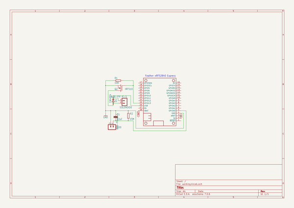
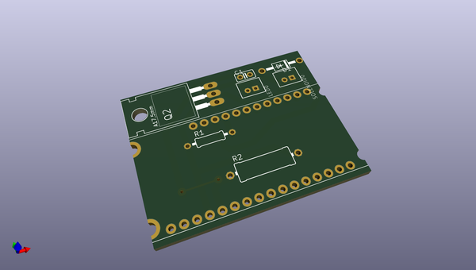
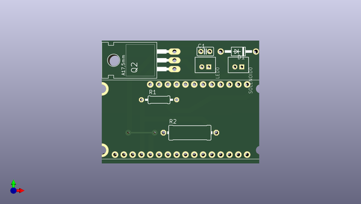
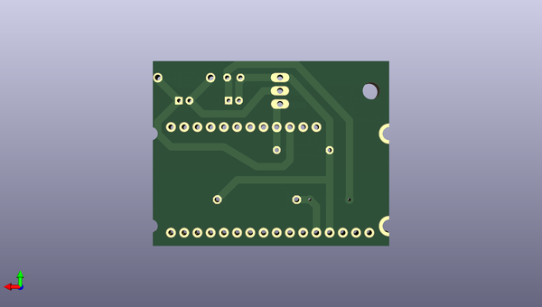

# adafruit_learning_system_guides
 
## summary 
* id: adafruit_adafruit_learning_system_guides_cp_solenoid3
* user: adafruit
* name: adafruit_learning_system_guides
* board: cp_solenoid3
* repo: https://github.com/adafruit/Adafruit_Learning_System_Guides

* src_file_repo_sch: 
* src_file_repo_sch_link: https://github.com/adafruit/Adafruit_Learning_System_Guides/tree/main/
* full details link: https://github.com/oomlout/oomlout_oomp_project_bot_v_2/tree/main/projects/adafruit_adafruit_learning_system_guides_cp_solenoid3/current_version/working  

## schematic  
  
[schematic (pdf)](working_schematic.pdf) 

## pcb  
 
  
  
  
[board (pdf)](working.pdf)  

## working_bom
| Id | Designator | Footprint | Quantity | Designation | Supplier and ref |  | None | 
| --- | --- | --- | --- | --- | --- | --- | --- | 
| 1 | D1 | DO41-10 | 1 | 1N4004 |  |  | [''] | 
| 2 | R2 | 0414_15 | 1 | 15M |  |  | [''] | 
| 3 | SOLENOID0,LED0 | B2B-PH-K-S | 2 |  |  |  | [''] | 
| 4 | R1 | 0207_10 | 1 | 10K |  |  | [''] | 
| 5 | Q2 | TO220 | 1 | IRLB8721 |  |  | [''] | 
| 6 | C1 | C025-025X050 | 1 | 82nF |  |  | [''] | 
| 7 | MS1 | FEATHERWING_DIM | 1 | FEATHERWING_NODIM |  |  | [''] | 

## bom_schematic
| Ref | Qnty | Value | Cmp name | Footprint | Description | Vendor | DNP | 
| --- | --- | --- | --- | --- | --- | --- | --- | 
| C1 | 1 | 82nF | C-EU025-025X050 | working:C025-025X050 |  |  |  | 
| D1 | 1 | 1N4004 | 1N4004 | working:DO41-10 |  |  |  | 
| LED0 | 1 | B2B-PH-K-S | B2B-PH-K-S | working:B2B-PH-K-S |  |  |  | 
| MS1 | 1 | FEATHERWING_NODIM | FEATHERWING_NODIM | working:FEATHERWING_DIM |  |  |  | 
| Q2 | 1 | IRF510 | IRF510 | working:TO220 |  |  |  | 
| R1 | 1 | 10K | R-EU_0207/10 | working:0207_10 |  |  |  | 
| R2 | 1 | 15M | R-EU_0414/15 | working:0414_15 |  |  |  | 
| SOLENOID0 | 1 | B2B-PH-K-S | B2B-PH-K-S | working:B2B-PH-K-S |  |  |  | 

