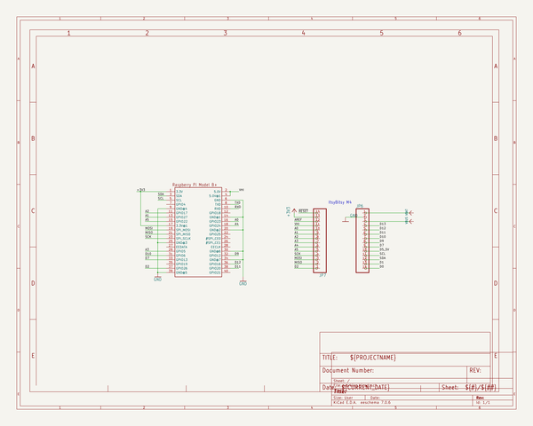
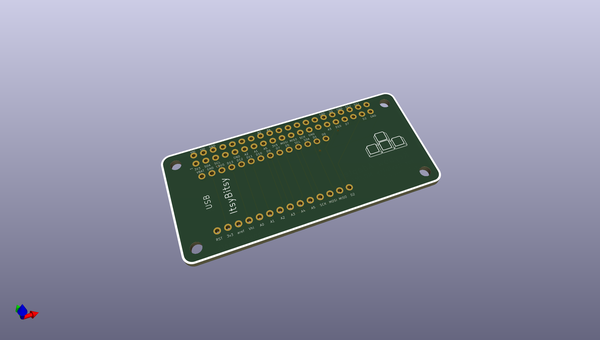
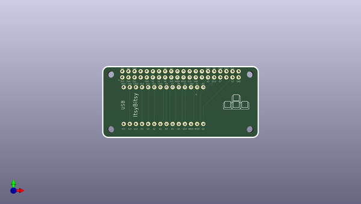
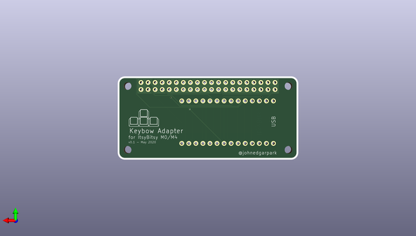

# adafruit_learning_system_guides
 
## summary 
* id: adafruit_adafruit_learning_system_guides_itsybitsy_keybow_04
* user: adafruit
* name: adafruit_learning_system_guides
* board: itsybitsy_keybow_04
* repo: https://github.com/adafruit/Adafruit_Learning_System_Guides

* src_file_repo_sch: 
* src_file_repo_sch_link: https://github.com/adafruit/Adafruit_Learning_System_Guides/tree/main/
* full details link: https://github.com/oomlout/oomlout_oomp_project_bot_v_2/tree/main/projects/adafruit_adafruit_learning_system_guides_itsybitsy_keybow_04/current_version/working  

## schematic  
  
[schematic (pdf)](working_schematic.pdf)  

## pcb  
 
  
  
  
[board (pdf)](working.pdf)  

## working_bom
| Id | Designator | Footprint | Quantity | Designation | Supplier and ref |  | None | 
| --- | --- | --- | --- | --- | --- | --- | --- | 
| 1 | JP6,JP7 | 1X14_ROUND70 | 2 |  |  |  | [''] | 
| 2 | RPI1 | PI_BONNET_NODIM | 1 | RASPBERRYPI_BPLUS_BONNETNODIM |  |  | [''] | 

## bom_schematic
| Ref | Qnty | Value | Cmp name | Footprint | Description | Vendor | DNP | 
| --- | --- | --- | --- | --- | --- | --- | --- | 
| JP6, JP7 | 2 | HEADER-1X14 | HEADER-1X14 | working:1X14_ROUND70 |  |  |  | 
| RPI1 | 1 | RASPBERRYPI_BPLUS_BONNETNODIM | RASPBERRYPI_BPLUS_BONNETNODIM | working:PI_BONNET_NODIM |  |  |  | 

