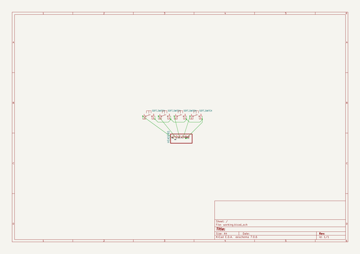
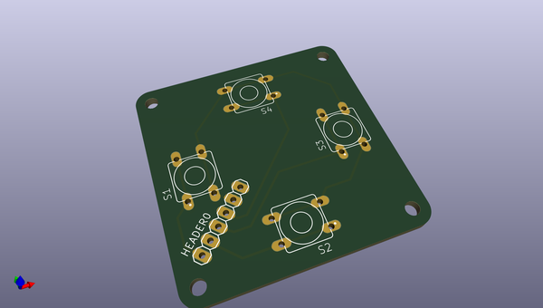
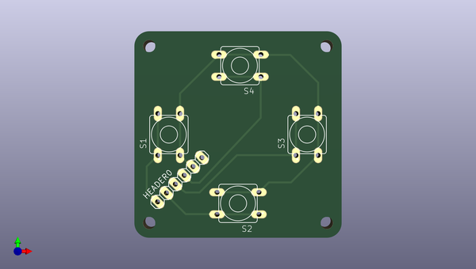
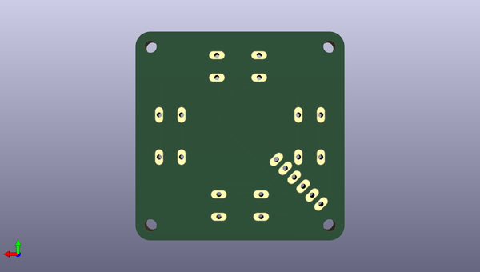

# adafruit_learning_system_guides
 
## summary 
* id: adafruit_adafruit_learning_system_guides_joy_button_pcb
* user: adafruit
* name: adafruit_learning_system_guides
* board: joy_button_pcb
* repo: https://github.com/adafruit/Adafruit_Learning_System_Guides

* src_file_repo_sch: 
* src_file_repo_sch_link: https://github.com/adafruit/Adafruit_Learning_System_Guides/tree/main/
* full details link: https://github.com/oomlout/oomlout_oomp_project_bot_v_2/tree/main/projects/adafruit_adafruit_learning_system_guides_joy_button_pcb/current_version/working  

## schematic  
  
[schematic (pdf)](working_schematic.pdf)  

## pcb  
 
  
  
  
[board (pdf)](working.pdf)  

## working_bom
| Id | Designator | Footprint | Quantity | Designation | Supplier and ref |  | None | 
| --- | --- | --- | --- | --- | --- | --- | --- | 
| 1 | S4,S2,S3,S1 | 8MM_SWITCH | 4 | SOFT_SWITCH |  |  | [''] | 
| 2 | @HOLE1,@HOLE3,@HOLE0,@HOLE2 |  | 4 |  |  |  | [''] | 
| 3 | HEADER0 | 1X06 | 1 |  |  |  | [''] | 

## bom_schematic
| Ref | Qnty | Value | Cmp name | Footprint | Description | Vendor | DNP | 
| --- | --- | --- | --- | --- | --- | --- | --- | 
| HEADER0 | 1 | PINHD-1X6 | PINHD-1X6 | working:1X06 |  |  |  | 
| S1, S2, S3, S4 | 4 | SOFT_SWITCH | SOFT_SWITCH | working:8MM_SWITCH |  |  |  | 

