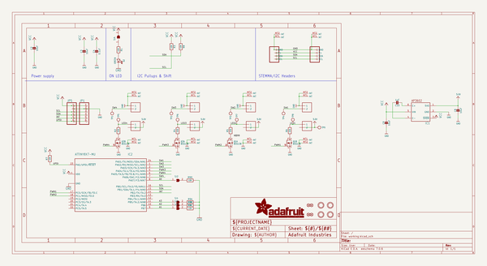
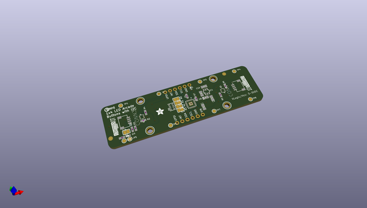
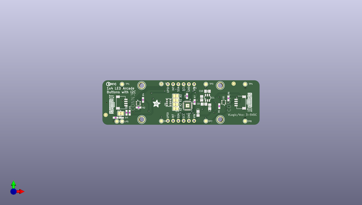
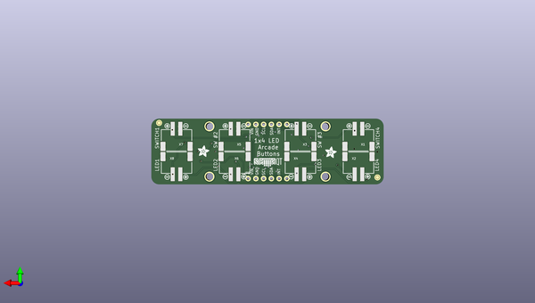

# adafruit_led_arcade_button_1x4_pcb
 
## summary 
* id: adafruit_adafruit_led_arcade_button_1x4_pcb_adafruit_led_arcade_button_1x4
* user: adafruit
* name: adafruit_led_arcade_button_1x4_pcb
* board: adafruit_led_arcade_button_1x4
* repo: https://github.com/adafruit/Adafruit-LED-Arcade-Button-1x4-PCB

* src_file_repo_sch: 
* src_file_repo_sch_link: https://github.com/adafruit/Adafruit-LED-Arcade-Button-1x4-PCB/tree/main/
* full details link: https://github.com/oomlout/oomlout_oomp_project_bot_v_2/tree/main/projects/adafruit_adafruit_led_arcade_button_1x4_pcb_adafruit_led_arcade_button_1x4/current_version/working  

## schematic  
  
[schematic (pdf)](working_schematic.pdf)  

## pcb  
 
  
  
  
[board (pdf)](working.pdf)  

## working_bom
| Id | Designator | Footprint | Quantity | Designation | Supplier and ref |  | None | 
| --- | --- | --- | --- | --- | --- | --- | --- | 
| 1 | C3,C2,C9,C8 | 0805-NO | 4 | 10uF |  |  | [''] | 
| 2 | R4,R2,R6,R5 | 0603-NO | 4 | 100 |  |  | [''] | 
| 3 | IC1 | SOT23-6 | 1 | AP3602 |  |  | [''] | 
| 4 | TP9,TP3,TP1,TP6,TP8,TP5,TP4,TP2,TP7 | TESTPOINT_ROUND_1.5MM | 9 |  |  |  | [''] | 
| 5 | R1,R7,R8,R3 | 0603-NO | 4 | 10K |  |  | [''] | 
| 6 | SJ4,SJ3,SJ2,SJ5,SJ1 | SOLDERJUMPER_CLOSEDWIRE | 5 |  |  |  | [''] | 
| 7 | U$30,U$31,U$53 | STEMMAQT | 3 |  |  |  | [''] | 
| 8 | R9 | RESPACK_4X0603 | 1 | 10K |  |  | [''] | 
| 9 | CONN3,CONN4 | JST_SH4 | 2 | STEMMA_I2C_QT |  |  | [''] | 
| 10 | C4 | 0603-NO | 1 | 0.1uF |  |  | [''] | 
| 11 | C10 | 0805-NO | 1 | 1uF |  |  | [''] | 
| 12 | FID2,FID1,FID4,FID3 | FIDUCIAL_1MM | 4 | FIDUCIAL_1MM |  |  | [''] | 
| 13 | U$3,U$21,U$17,U$19 | MOUNTINGHOLE_2.5_PLATED | 4 | MOUNTINGHOLE2.5 |  |  | [''] | 
| 14 | Q3,Q1 | SOT363 | 2 | BSS138 |  |  | [''] | 
| 15 | IC2 | QFN24_4MM | 1 | ATTINY8X7-MU |  |  | [''] | 
| 16 | JP1,JP5 | 1X06_ROUND_70 | 2 |  |  |  | [''] | 
| 17 | D2 | CHIPLED_0603_NOOUTLINE | 1 | GREEN |  |  | [''] | 
| 18 | U$9,U$2,U$52 | ADAFRUIT_3.5MM | 3 |  |  |  | [''] | 
| 19 | U$25 | PCBFEAT-REV-040 | 1 |  |  |  | [''] | 
| 20 | X7,X8,X2,X1,X3,X6,X5,X4 | JST-XH-2-SV | 8 | CON_JST_XH_2PIN-VERT |  |  | [''] | 
| 21 | U$24,U$20,U$23,U$50,U$15,U$16,U$7,U$26 | SYMBOL_PLUS | 8 |  |  |  | [''] | 
| 22 | U$8,U$47,U$49,U$48,U$45,U$14,U$1,U$46 | SYMBOL_MINUS | 8 |  |  |  | [''] | 

## bom_schematic
| Ref | Qnty | Value | Cmp name | Footprint | Description | Vendor | DNP | 
| --- | --- | --- | --- | --- | --- | --- | --- | 
| C2, C3, C8, C9 | 4 | 10uF | CAP_CERAMIC0805-NOOUTLINE | working:0805-NO |  |  |  | 
| C4 | 1 | 0.1uF | CAP_CERAMIC0603_NO | working:0603-NO |  |  |  | 
| C10 | 1 | 1uF | CAP_CERAMIC0805-NOOUTLINE | working:0805-NO |  |  |  | 
| CONN3, CONN4 | 2 | STEMMA_I2C_QT | STEMMA_I2C_QT | working:JST_SH4 |  |  |  | 
| D2 | 1 | GREEN | LED0603_NOOUTLINE | working:CHIPLED_0603_NOOUTLINE |  |  |  | 
| FID1, FID2, FID3, FID4 | 4 | FIDUCIAL_1MM | FIDUCIAL_1MM | working:FIDUCIAL_1MM |  |  |  | 
| IC1 | 1 | AP3602 | AP3602 | working:SOT23-6 |  |  |  | 
| IC2 | 1 | ATTINY8X7-MU | ATTINY8X7-MU | working:QFN24_4MM |  |  |  | 
| JP1, JP5 | 2 | HEADER-1X670MIL | HEADER-1X670MIL | working:1X06_ROUND_70 |  |  |  | 
| Q1, Q3 | 2 | BSS138 | MOSFET-N_DUAL | working:SOT363 |  |  |  | 
| R1, R3, R7, R8 | 4 | 10K | RESISTOR_0603_NOOUT | working:0603-NO |  |  |  | 
| R2, R4, R5, R6 | 4 | 100 | RESISTOR_0603_NOOUT | working:0603-NO |  |  |  | 
| R9 | 1 | 10K | RESISTOR_4PACK | working:RESPACK_4X0603 |  |  |  | 
| SJ1, SJ2, SJ3, SJ4, SJ5 | 5 | SOLDERJUMPERCLOSED | SOLDERJUMPERCLOSED | working:SOLDERJUMPER_CLOSEDWIRE |  |  |  | 
| TP1, TP2, TP3, TP4, TP5, TP6, TP7, TP8, TP9 | 9 | TESTPOINTROUND1.5MM | TESTPOINTROUND1.5MM | working:TESTPOINT_ROUND_1.5MM |  |  |  | 
| U$3, U$17, U$19, U$21 | 4 | MOUNTINGHOLE2.5 | MOUNTINGHOLE2.5 | working:MOUNTINGHOLE_2.5_PLATED |  |  |  | 
| X1, X2, X3, X4, X5, X6, X7, X8 | 8 | CON_JST_XH_2PIN-VERT | CON_JST_XH_2PIN-VERT | working:JST-XH-2-SV |  |  |  | 

## mounting_holes
| x | y | package | value | ref | size | 
| --- | --- | --- | --- | --- | --- | 
| 38.099999999999994 | 16.510000000000005 | MOUNTINGHOLE_2.5_PLATED | MOUNTINGHOLE2.5 | U$3 | m3 | 
| 0.0 | 16.510000000000005 | MOUNTINGHOLE_2.5_PLATED | MOUNTINGHOLE2.5 | U$17 | m3 | 
| 38.099999999999994 | 0.0 | MOUNTINGHOLE_2.5_PLATED | MOUNTINGHOLE2.5 | U$19 | m3 | 
| 0.0 | 0.0 | MOUNTINGHOLE_2.5_PLATED | MOUNTINGHOLE2.5 | U$21 | m3 | 

