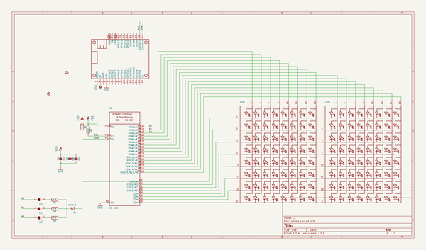
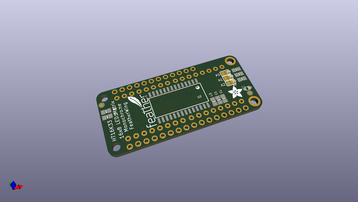
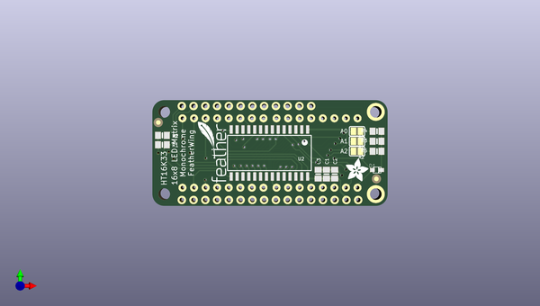
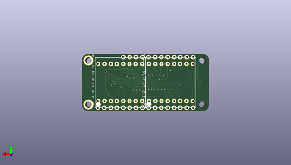

# adafruit_led_backpack_featherwing_pcb
 
## summary 
* id: adafruit_adafruit_led_backpack_featherwing_pcb_alphanumeric_featherwing_rev_a
* user: adafruit
* name: adafruit_led_backpack_featherwing_pcb
* board: alphanumeric_featherwing_rev_a
* repo: https://github.com/adafruit/Adafruit-LED-Backpack-FeatherWing-PCB

* src_file_repo_sch: 
* src_file_repo_sch_link: https://github.com/adafruit/Adafruit-LED-Backpack-FeatherWing-PCB/tree/master/
* full details link: https://github.com/oomlout/oomlout_oomp_project_bot_v_2/tree/main/projects/adafruit_adafruit_led_backpack_featherwing_pcb_alphanumeric_featherwing_rev_a/current_version/working  

## schematic  
  
[schematic (pdf)](working_schematic.pdf) 

## pcb  
 
  
  
  
[board (pdf)](working.pdf)  

## working_bom
| Id | Designator | Footprint | Quantity | Designation | Supplier and ref |  | None | 
| --- | --- | --- | --- | --- | --- | --- | --- | 
| 1 | C3,C1,C2 | 0805-NO | 3 | 10uF |  |  | [''] | 
| 2 | R2,R1 | 0805-NO | 2 | 10K |  |  | [''] | 
| 3 | FID2,FID1 | FIDUCIAL_1MM | 2 | FIDUCIAL" |  |  | [''] | 
| 4 | R3,R5,R4 | 0805-NO | 3 | 47K |  |  | [''] | 
| 5 | A2,A1,A0 | SOLDERJUMPER_REFLOW_NOPASTE | 3 |  |  |  | [''] | 
| 6 | U$2 | ADAFRUIT_5MM | 1 |  |  |  | [''] | 
| 7 | U$1 | FEATHERLOGO_SMALL | 1 |  |  |  | [''] | 
| 8 | D1 | SOD-323F | 1 | 1N4148 |  |  | [''] | 
| 9 | U2 | SOP28_300MIL_SKINNY | 1 | 28-SOIC |  |  | [''] | 
| 10 | MS1 | FEATHERWING | 1 | FEATHERWING |  |  | [''] | 
| 11 | LED2,LED1 | SEGMENT_BL-M07C881UR | 2 |  |  |  | [''] | 

## bom_schematic
| Ref | Qnty | Value | Cmp name | Footprint | Description | Vendor | DNP | 
| --- | --- | --- | --- | --- | --- | --- | --- | 
| A0, A1, A2 | 3 | SOLDERJUMPERREFLOW_NOPASTE | SOLDERJUMPERREFLOW_NOPASTE | working:SOLDERJUMPER_REFLOW_NOPASTE |  |  |  | 
| C1, C2, C3 | 3 | 10uF | CAP_CERAMIC0805-NOOUTLINE | working:0805-NO |  |  |  | 
| D1 | 1 | 1N4148 | DIODESOD-323F | working:SOD-323F |  |  |  | 
| FID1, FID2 | 2 | FIDUCIAL"" | FIDUCIAL{dblquote}{dblquote} | working:FIDUCIAL_1MM |  |  |  | 
| LED1, LED2 | 2 | DISP_SEGMENT_8X8_ROWCATHODE | DISP_SEGMENT_8X8_ROWCATHODE | working:SEGMENT_BL-M07C881UR |  |  |  | 
| MS1 | 1 | FEATHERWING | FEATHERWING | working:FEATHERWING |  |  |  | 
| R1, R2 | 2 | 10K | RESISTOR0805_NOOUTLINE | working:0805-NO |  |  |  | 
| R3, R4, R5 | 3 | 47K | RESISTOR0805_NOOUTLINE | working:0805-NO |  |  |  | 
| U2 | 1 | 28-SOIC | HT16K33_SOP28_SKINNY | working:SOP28_300MIL_SKINNY |  |  |  | 

