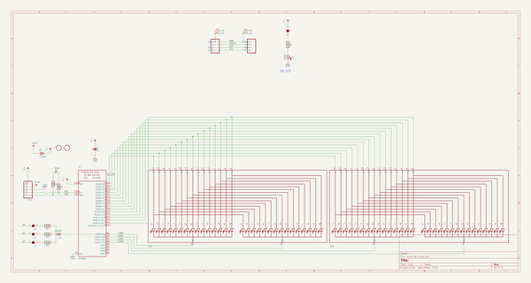
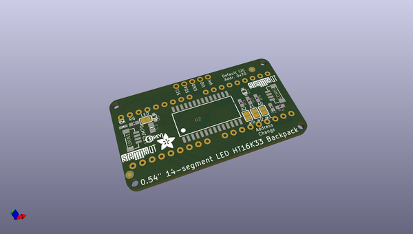
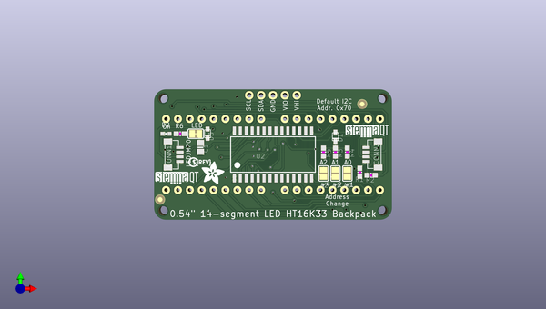
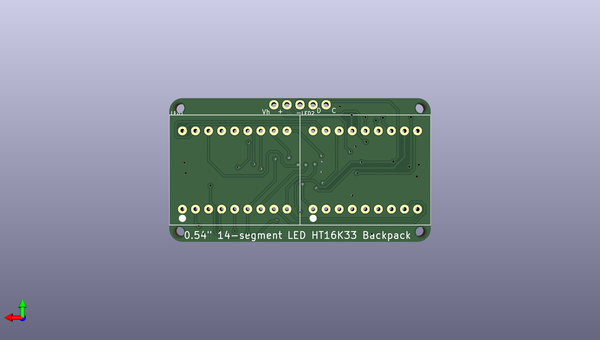

# adafruit_led_backpacks
 
## summary 
* id: adafruit_adafruit_led_backpacks_adafruit_bicolor_8x8_ht16k33_stemma
* user: adafruit
* name: adafruit_led_backpacks
* board: adafruit_bicolor_8x8_ht16k33_stemma
* repo: https://github.com/adafruit/Adafruit-LED-Backpacks

* src_file_repo_sch: 
* src_file_repo_sch_link: https://github.com/adafruit/Adafruit-LED-Backpacks/tree/master/
* full details link: https://github.com/oomlout/oomlout_oomp_project_bot_v_2/tree/main/projects/adafruit_adafruit_led_backpacks_adafruit_bicolor_8x8_ht16k33_stemma/current_version/working  

## schematic  
  
[schematic (pdf)](working_schematic.pdf) 

## pcb  
 
  
  
  
[board (pdf)](working.pdf)  

## working_bom
| Id | Designator | Footprint | Quantity | Designation | Supplier and ref |  | None | 
| --- | --- | --- | --- | --- | --- | --- | --- | 
| 1 | R5,R3,R6,R4 | 0603-NO | 4 | 47K |  |  | [''] | 
| 2 | U$2,U$1 | FIDUCIAL_1MM | 2 | FIDUCIAL |  |  | [''] | 
| 3 | D1,D3 | SOD-323F | 2 | CUS530 |  |  | [''] | 
| 4 | C1 | 0805-NO | 1 | 10uF |  |  | [''] | 
| 5 | @HOLE0,@HOLE2,@HOLE1,@HOLE3 |  | 4 |  |  |  | [''] | 
| 6 | U$8 | PCBFEAT-REV-040 | 1 |  |  |  | [''] | 
| 7 | R2,R1 | 0603-NO | 2 | 10K |  |  | [''] | 
| 8 | U2 | SOP28_300MIL_SKINNY | 1 | HT16K33 |  |  | [''] | 
| 9 | U$3 | ADAFRUIT_5MM | 1 |  |  |  | [''] | 
| 10 | A1,A0,A2 | SOLDERJUMPER_REFLOW_NOPASTE | 3 |  |  |  | [''] | 
| 11 | U$6,U$7 | STEMMAQT | 2 |  |  |  | [''] | 
| 12 | LEDJMP0 | SOLDERJUMPER_CLOSEDWIRE | 1 |  |  |  | [''] | 
| 13 | D2 | CHIPLED_0603_NOOUTLINE | 1 | GREEN |  |  | [''] | 
| 14 | CONN1,CONN2 | JST_SH4_RA | 2 | STEMMA_I2C_QTRA |  |  | [''] | 
| 15 | JP1 | 1X05_ROUND_70 | 1 |  |  |  | [''] | 
| 16 | LED2,LED1 | SEGMENT_STARTBUST_DUAL_KWA-541CBB | 2 |  |  |  | [''] | 

## bom_schematic
| Ref | Qnty | Value | Cmp name | Footprint | Description | Vendor | DNP | 
| --- | --- | --- | --- | --- | --- | --- | --- | 
| A0, A1, A2 | 3 | SOLDERJUMPERREFLOW_NOPASTE | SOLDERJUMPERREFLOW_NOPASTE | working:SOLDERJUMPER_REFLOW_NOPASTE |  |  |  | 
| C1 | 1 | 10uF | CAP_CERAMIC0805-NOOUTLINE | working:0805-NO |  |  |  | 
| CONN1, CONN2 | 2 | STEMMA_I2C_QTRA | STEMMA_I2C_QTRA | working:JST_SH4_RA |  |  |  | 
| D1, D3 | 2 | CUS530 | DIODESOD-323F | working:SOD-323F |  |  |  | 
| D2 | 1 | GREEN | LED0603_NOOUTLINE | working:CHIPLED_0603_NOOUTLINE |  |  |  | 
| JP1 | 1 | HEADER-1X570MIL | HEADER-1X570MIL | working:1X05_ROUND_70 |  |  |  | 
| LED1, LED2 | 2 | DISP_SEGMENT_STARBURST_DUAL_COMMONCATHODE | DISP_SEGMENT_STARBURST_DUAL_COMMONCATHODE | working:SEGMENT_STARTBUST_DUAL_KWA-541CBB |  |  |  | 
| LEDJMP0 | 1 | SOLDERJUMPERCLOSED | SOLDERJUMPERCLOSED | working:SOLDERJUMPER_CLOSEDWIRE |  |  |  | 
| R1, R2 | 2 | 10K | RESISTOR_0603_NOOUT | working:0603-NO |  |  |  | 
| R3, R4, R5, R6 | 4 | 47K | RESISTOR_0603_NOOUT | working:0603-NO |  |  |  | 
| U2 | 1 | HT16K33 | HT16K33_SOP28_SKINNY | working:SOP28_300MIL_SKINNY |  |  |  | 
| U$1, U$2 | 2 | FIDUCIAL | FIDUCIAL | working:FIDUCIAL_1MM |  |  |  | 

