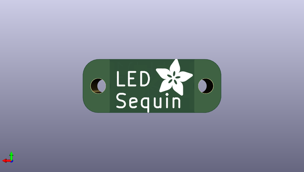

# adafruit_led_sequin_pcb
 
## summary 
* id: adafruit_adafruit_led_sequin_pcb_adafruit_led_sequin
* user: adafruit
* name: adafruit_led_sequin_pcb
* board: adafruit_led_sequin
* repo: https://github.com/adafruit/Adafruit-LED-Sequin-PCB

* src_file_repo_sch: 
* src_file_repo_sch_link: https://github.com/adafruit/Adafruit-LED-Sequin-PCB/tree/master/
* full details link: https://github.com/oomlout/oomlout_oomp_project_bot_v_2/tree/main/projects/adafruit_adafruit_led_sequin_pcb_adafruit_led_sequin/current_version/working  

## schematic  
  
[schematic (pdf)](working_schematic.pdf)  

## pcb  
 
  
  
  
[board (pdf)](working.pdf)  

## working_bom
| Id | Designator | Footprint | Quantity | Designation | Supplier and ref |  | None | 
| --- | --- | --- | --- | --- | --- | --- | --- | 
| 1 | R1 | R0603 | 1 |  |  |  | [''] | 
| 2 | LED1 | 1206 | 1 |  |  |  | [''] | 
| 3 | U$1 | ADAFRUIT_2.5MM | 1 |  |  |  | [''] | 

## bom_schematic
| Ref | Qnty | Value | Cmp name | Footprint | Description | Vendor | DNP | 
| --- | --- | --- | --- | --- | --- | --- | --- | 
| LED1 | 1 | LEDSMT1206 | LEDSMT1206 | working:1206 |  |  |  | 
| R1 | 1 | R-US_R0603 | R-US_R0603 | working:R0603 |  |  |  | 

