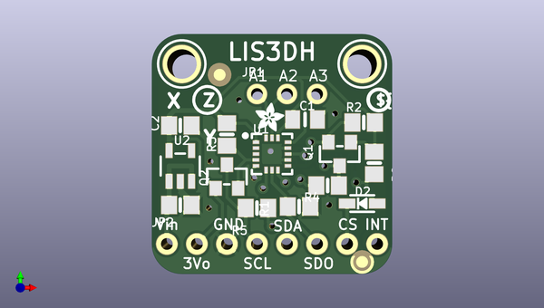

# adafruit_lis3dh_breakout_pcb
 
## summary 
* id: adafruit_adafruit_lis3dh_breakout_pcb_adafruit_lis3dh_original
* user: adafruit
* name: adafruit_lis3dh_breakout_pcb
* board: adafruit_lis3dh_original
* repo: https://github.com/adafruit/Adafruit-LIS3DH-Breakout-PCB

* src_file_repo_sch: 
* src_file_repo_sch_link: https://github.com/adafruit/Adafruit-LIS3DH-Breakout-PCB/tree/master/
* full details link: https://github.com/oomlout/oomlout_oomp_project_bot_v_2/tree/main/projects/adafruit_adafruit_lis3dh_breakout_pcb_adafruit_lis3dh_original/current_version/working  

## schematic  
  
[schematic (pdf)](working_schematic.pdf)  

## pcb  
 
  
  
  
[board (pdf)](working.pdf)  

## working_bom
| Id | Designator | Footprint | Quantity | Designation | Supplier and ref |  | None | 
| --- | --- | --- | --- | --- | --- | --- | --- | 
| 1 | JP1 | 1X03_ROUND | 1 |  |  |  | [''] | 
| 2 | R3,R2,R5,R1,R4,R8 | 0805-NO | 6 | 10K |  |  | [''] | 
| 3 | C2,C3 | 0805-NO | 2 | 10µF |  |  | [''] | 
| 4 | U$21 | ADAFRUIT_2.5MM | 1 |  |  |  | [''] | 
| 5 | U1 | LGA16_3X3MM | 1 | LIS3DHTR |  |  | [''] | 
| 6 | U$9 | PCBFEAT-REV-040 | 1 |  |  |  | [''] | 
| 7 | U$10,U$13 | MOUNTINGHOLE_2.5_PLATED | 2 | MOUNTINGHOLE2.5 |  |  | [''] | 
| 8 | Q2,Q1 | SOT23-WIDE | 2 | BSS138 |  |  | [''] | 
| 9 | D2 | SOD-323 | 1 | 1N4148 |  |  | [''] | 
| 10 | U2 | SOT23-5 | 1 | MIC5225-3.3 |  |  | [''] | 
| 11 | FID2,FID1 | FIDUCIAL_1MM | 2 | FIDUCIAL" |  |  | [''] | 
| 12 | C1 | 0805_10MGAP | 1 | 0.1uF |  |  | [''] | 
| 13 | JP2 | 1X08_ROUND_70 | 1 |  |  |  | [''] | 
| 14 | U$22 | ADAFRUIT_5MM | 1 |  |  |  | [''] | 

## bom_schematic
| Ref | Qnty | Value | Cmp name | Footprint | Description | Vendor | DNP | 
| --- | --- | --- | --- | --- | --- | --- | --- | 
| C1 | 1 | 0.1uF | CAP_CERAMIC0805_10MGAP | working:0805_10MGAP |  |  |  | 
| C2, C3 | 2 | 10µF | CAP_CERAMIC0805-NOOUTLINE | working:0805-NO |  |  |  | 
| D2 | 1 | 1N4148 | DIODESOD-323 | working:SOD-323 |  |  |  | 
| FID1, FID2 | 2 | FIDUCIAL"" | FIDUCIAL{dblquote}{dblquote} | working:FIDUCIAL_1MM |  |  |  | 
| JP1 | 1 | HEADER-1X3ROUND | HEADER-1X3ROUND | working:1X03_ROUND |  |  |  | 
| JP2 | 1 | HEADER-1X870MIL | HEADER-1X870MIL | working:1X08_ROUND_70 |  |  |  | 
| Q1, Q2 | 2 | BSS138 | MOSFET-NWIDE | working:SOT23-WIDE |  |  |  | 
| R1, R2, R3, R4, R5, R8 | 6 | 10K | RESISTOR0805_NOOUTLINE | working:0805-NO |  |  |  | 
| U1 | 1 | LIS3DHTR | ACCEL_LIS3DHTR | working:LGA16_3X3MM |  |  |  | 
| U2 | 1 | MIC5225-3.3 | VREG_SOT23-5 | working:SOT23-5 |  |  |  | 
| U$10, U$13 | 2 | MOUNTINGHOLE2.5 | MOUNTINGHOLE2.5 | working:MOUNTINGHOLE_2.5_PLATED |  |  |  | 

## mounting_holes
| x | y | package | value | ref | size | 
| --- | --- | --- | --- | --- | --- | 
| 0.0 | 0.0 | MOUNTINGHOLE_2.5_PLATED | MOUNTINGHOLE2.5 | U$10 | m3 | 
| 15.240000000000009 | 0.0 | MOUNTINGHOLE_2.5_PLATED | MOUNTINGHOLE2.5 | U$13 | m3 | 

