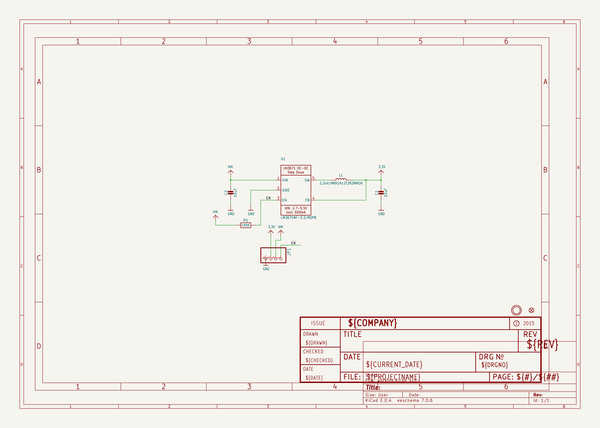
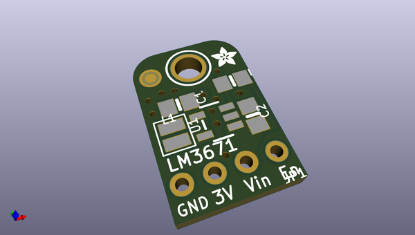
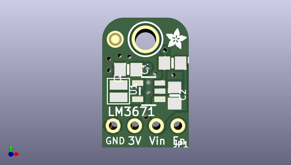
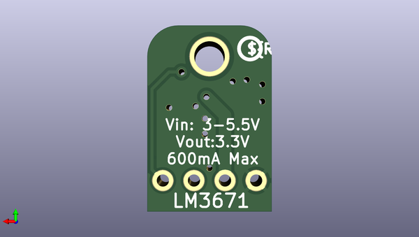

# adafruit_lm3671_buck_converter_pcb
 
## summary 
* id: adafruit_adafruit_lm3671_buck_converter_pcb_adafruit_lm3671_buck
* user: adafruit
* name: adafruit_lm3671_buck_converter_pcb
* board: adafruit_lm3671_buck
* repo: https://github.com/adafruit/Adafruit-LM3671-Buck-Converter-PCB

* src_file_repo_sch: 
* src_file_repo_sch_link: https://github.com/adafruit/Adafruit-LM3671-Buck-Converter-PCB/tree/master/
* full details link: https://github.com/oomlout/oomlout_oomp_project_bot_v_2/tree/main/projects/adafruit_adafruit_lm3671_buck_converter_pcb_adafruit_lm3671_buck/current_version/working  

## schematic  
  
[schematic (pdf)](working_schematic.pdf) 

## pcb  
 
  
  
  
[board (pdf)](working.pdf)  

## working_bom
| Id | Designator | Footprint | Quantity | Designation | Supplier and ref |  | None | 
| --- | --- | --- | --- | --- | --- | --- | --- | 
| 1 | R1 | 0805-NO | 1 | 100K |  |  | [''] | 
| 2 | L1 | INDUCTOR_TAIYOYUDEN_NRH2412T | 1 | 2.2uH/NRH2412T2R2MNGH |  |  | [''] | 
| 3 | FID1 | FIDUCIAL_1MM | 1 | FIDUCIAL" |  |  | [''] | 
| 4 | C1 | 0805-NO | 1 | 22uF |  |  | [''] | 
| 5 | JP1 | 1X04_ROUND | 1 |  |  |  | [''] | 
| 6 | C2 | 0805-NO | 1 | 10uF |  |  | [''] | 
| 7 | U$11 | ADAFRUIT_2.5MM | 1 |  |  |  | [''] | 
| 8 | U$9 | MOUNTINGHOLE_2.5_PLATED | 1 | MOUNTINGHOLE2.5 |  |  | [''] | 
| 9 | U1 | SOT23-5 | 1 | LM3671MF-3.3/NOPB |  |  | [''] | 
| 10 | U$10 | PCBFEAT-REV-040 | 1 |  |  |  | [''] | 

## bom_schematic
| Ref | Qnty | Value | Cmp name | Footprint | Description | Vendor | DNP | 
| --- | --- | --- | --- | --- | --- | --- | --- | 
| C1 | 1 | 22uF | CAP_CERAMIC0805-NOOUTLINE | working:0805-NO |  |  |  | 
| C2 | 1 | 10uF | CAP_CERAMIC0805-NOOUTLINE | working:0805-NO |  |  |  | 
| FID1 | 1 | FIDUCIAL"" | FIDUCIAL{dblquote}{dblquote} | working:FIDUCIAL_1MM |  |  |  | 
| JP1 | 1 | HEADER-1X4ROUND | HEADER-1X4ROUND | working:1X04_ROUND |  |  |  | 
| L1 | 1 | 2.2uH/NRH2412T2R2MNGH | INDUCTORNRH2412T | working:INDUCTOR_TAIYOYUDEN_NRH2412T |  |  |  | 
| R1 | 1 | 100K | RESISTOR0805_NOOUTLINE | working:0805-NO |  |  |  | 
| U1 | 1 | LM3671MF-3.3/NOPB | VREG_LM3671 | working:SOT23-5 |  |  |  | 
| U$9 | 1 | MOUNTINGHOLE2.5 | MOUNTINGHOLE2.5 | working:MOUNTINGHOLE_2.5_PLATED |  |  |  | 

## mounting_holes
| x | y | package | value | ref | size | 
| --- | --- | --- | --- | --- | --- | 
| 0.0 | 0.0 | MOUNTINGHOLE_2.5_PLATED | MOUNTINGHOLE2.5 | U$9 | m3 | 

