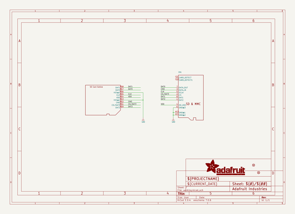
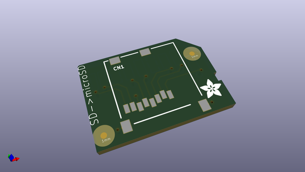
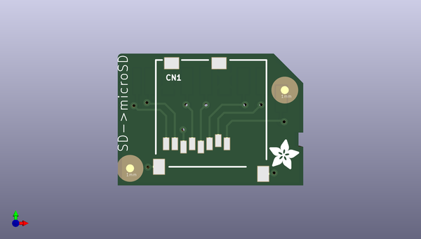
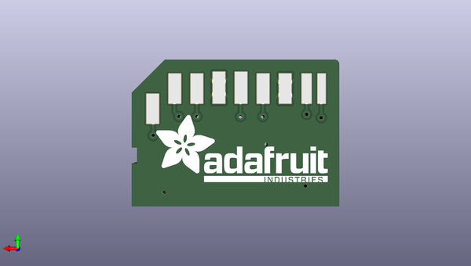

# adafruit_low_profile_microsd_to_sd_adapter_pcb
 
## summary 
* id: adafruit_adafruit_low_profile_microsd_to_sd_adapter_pcb_adafruit_pi_sd_card_adapter
* user: adafruit
* name: adafruit_low_profile_microsd_to_sd_adapter_pcb
* board: adafruit_pi_sd_card_adapter
* repo: https://github.com/adafruit/Adafruit-Low-profile-microSD-to-SD-Adapter-PCB

* src_file_repo_sch: 
* src_file_repo_sch_link: https://github.com/adafruit/Adafruit-Low-profile-microSD-to-SD-Adapter-PCB/tree/master/
* full details link: https://github.com/oomlout/oomlout_oomp_project_bot_v_2/tree/main/projects/adafruit_adafruit_low_profile_microsd_to_sd_adapter_pcb_adafruit_pi_sd_card_adapter/current_version/working  

## schematic  
  
[schematic (pdf)](working_schematic.pdf)  

## pcb  
 
  
  
  
[board (pdf)](working.pdf)  

## working_bom
| Id | Designator | Footprint | Quantity | Designation | Supplier and ref |  | None | 
| --- | --- | --- | --- | --- | --- | --- | --- | 
| 1 | FID2,FID1 | FIDUCIAL-1X2.5 | 2 | FIDUCIAL1X2.5 |  |  | [''] | 
| 2 | U$5 | ADAFRUIT_3.5MM | 1 |  |  |  | [''] | 
| 3 | CN1 | MICROSD | 1 |  |  |  | [''] | 
| 4 | U$6 | ADAFRUIT_TEXT_20MM | 1 |  |  |  | [''] | 
| 5 | U$2 | SDCARD_PCBCARRIER_DOCU | 1 | SDCARD_PCBCARRIERTDOCU |  |  | [''] | 

## bom_schematic
| Ref | Qnty | Value | Cmp name | Footprint | Description | Vendor | DNP | 
| --- | --- | --- | --- | --- | --- | --- | --- | 
| CN1 | 1 | MICROSD | MICROSD | working:MICROSD |  |  |  | 
| FID1, FID2 | 2 | FIDUCIAL1X2.5 | FIDUCIAL1X2.5 | working:FIDUCIAL-1X2.5 |  |  |  | 
| U$2 | 1 | SDCARD_PCBCARRIERTDOCU | SDCARD_PCBCARRIERTDOCU | working:SDCARD_PCBCARRIER_DOCU |  |  |  | 

