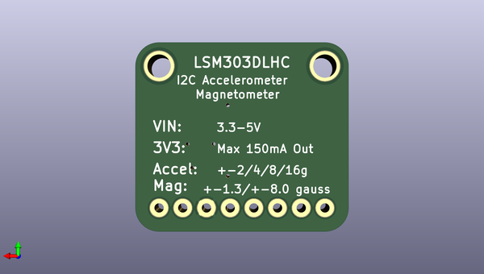

# adafruit_lsm303_pcb
 
## summary 
* id: adafruit_adafruit_lsm303_pcb_adafruit_lsm303dlhc
* user: adafruit
* name: adafruit_lsm303_pcb
* board: adafruit_lsm303dlhc
* repo: https://github.com/adafruit/Adafruit-LSM303-PCB

* src_file_repo_sch: 
* src_file_repo_sch_link: https://github.com/adafruit/Adafruit-LSM303-PCB/tree/master/
* full details link: https://github.com/oomlout/oomlout_oomp_project_bot_v_2/tree/main/projects/adafruit_adafruit_lsm303_pcb_adafruit_lsm303dlhc/current_version/working  

## schematic  
  
[schematic (pdf)](working_schematic.pdf)  

## pcb  
 
  
  
  
[board (pdf)](working.pdf)  

## working_bom
| Id | Designator | Footprint | Quantity | Designation | Supplier and ref |  | None | 
| --- | --- | --- | --- | --- | --- | --- | --- | 
| 1 | U$4,U$3 | MOUNTINGHOLE_2.5_PLATED | 2 | MOUNTINGHOLE2.5 |  |  | [''] | 
| 2 | C1,C5 | _0805 | 2 | 10µF |  |  | [''] | 
| 3 | U$17 | ADAFRUIT_3.5MM | 1 |  |  |  | [''] | 
| 4 | U1 | LGA14 | 1 | LSM303DLHC |  |  | [''] | 
| 5 | FID1,FID2 | FIDUCIAL_1MM | 2 | FIDUCIAL" |  |  | [''] | 
| 6 | U2 | SOT23-5 | 1 | RT9193 |  |  | [''] | 
| 7 | JP1 | 1X08_ROUND_76 | 1 |  |  |  | [''] | 
| 8 | R2,R4,R3,R1 | _0805 | 4 | 10K |  |  | [''] | 
| 9 | C4 | _0805 | 1 | 0.22µF |  |  | [''] | 
| 10 | Q1,Q2 | SOT23-WIDE | 2 | BSS138 |  |  | [''] | 
| 11 | C2 | _0805 | 1 | 0.1uF |  |  | [''] | 
| 12 | C3 | _0805 | 1 | 4.70µF |  |  | [''] | 

## bom_schematic
| Ref | Qnty | Value | Cmp name | Footprint | Description | Vendor | DNP | 
| --- | --- | --- | --- | --- | --- | --- | --- | 
| C1, C5 | 2 | 10µF | CAP_CERAMIC_0805 | working:_0805 |  |  |  | 
| C2 | 1 | 0.1uF | CAP_CERAMIC_0805 | working:_0805 |  |  |  | 
| C3 | 1 | 4.70µF | CAP_CERAMIC_0805 | working:_0805 |  |  |  | 
| C4 | 1 | 0.22µF | CAP_CERAMIC_0805 | working:_0805 |  |  |  | 
| FID1, FID2 | 2 | FIDUCIAL"" | FIDUCIAL{dblquote}{dblquote} | working:FIDUCIAL_1MM |  |  |  | 
| JP1 | 1 | HEADER-1X876MIL | HEADER-1X876MIL | working:1X08_ROUND_76 |  |  |  | 
| Q1, Q2 | 2 | BSS138 | MOSFET-NWIDE | working:SOT23-WIDE |  |  |  | 
| R1, R2, R3, R4 | 4 | 10K | RESISTOR_0805 | working:_0805 |  |  |  | 
| U1 | 1 | LSM303DLHC | LSM303DLHC | working:LGA14 |  |  |  | 
| U2 | 1 | RT9193 | VREG_SOT23-5 | working:SOT23-5 |  |  |  | 
| U$3, U$4 | 2 | MOUNTINGHOLE2.5 | MOUNTINGHOLE2.5 | working:MOUNTINGHOLE_2.5_PLATED |  |  |  | 

## mounting_holes
| x | y | package | value | ref | size | 
| --- | --- | --- | --- | --- | --- | 
| 0.0 | 0.0 | MOUNTINGHOLE_2.5_PLATED | MOUNTINGHOLE2.5 | U$3 | m3 | 
| 17.78 | 0.0 | MOUNTINGHOLE_2.5_PLATED | MOUNTINGHOLE2.5 | U$4 | m3 | 

