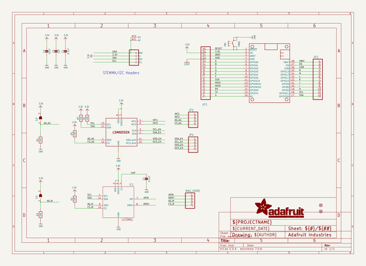
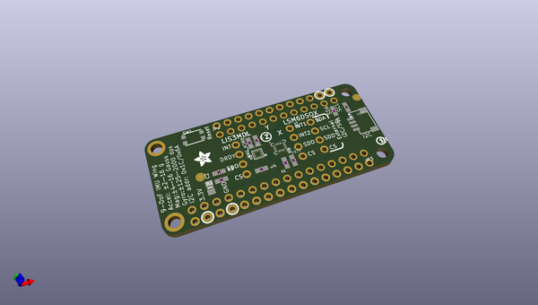
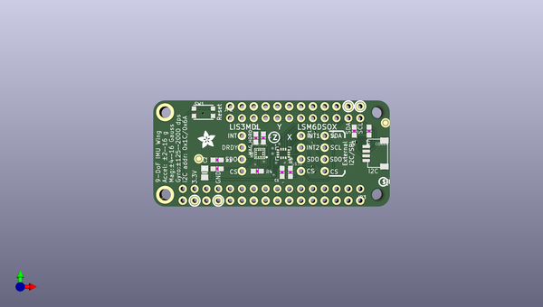
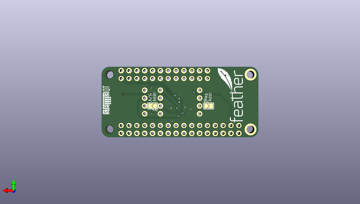

# adafruit_lsm6dsox_lis3mdl_pcb
 
## summary 
* id: adafruit_adafruit_lsm6dsox_lis3mdl_pcb_adafruit_lis3mdl_lsm6dsox_featherwing
* user: adafruit
* name: adafruit_lsm6dsox_lis3mdl_pcb
* board: adafruit_lis3mdl_lsm6dsox_featherwing
* repo: https://github.com/adafruit/Adafruit-LSM6DSOX-LIS3MDL-PCB

* src_file_repo_sch: 
* src_file_repo_sch_link: https://github.com/adafruit/Adafruit-LSM6DSOX-LIS3MDL-PCB/tree/master/
* full details link: https://github.com/oomlout/oomlout_oomp_project_bot_v_2/tree/main/projects/adafruit_adafruit_lsm6dsox_lis3mdl_pcb_adafruit_lis3mdl_lsm6dsox_featherwing/current_version/working  

## schematic  
  
[schematic (pdf)](working_schematic.pdf) 

## pcb  
 
  
  
  
[board (pdf)](working.pdf)  

## working_bom
| Id | Designator | Footprint | Quantity | Designation | Supplier and ref |  | None | 
| --- | --- | --- | --- | --- | --- | --- | --- | 
| 1 | U$35 | LGA-14L | 1 | LSM6DSOX |  |  | [''] | 
| 2 | R4,R1,R2,R5,R7,R3 | 0603-NO | 6 | 10K |  |  | [''] | 
| 3 | JP2 | 1X12_ROUND | 1 |  |  |  | [''] | 
| 4 | CONN4 | JST_SH4 | 1 | STEMMA_I2C_QT |  |  | [''] | 
| 5 | C4,C1 | 0603-NO | 2 | 0.1uF |  |  | [''] | 
| 6 | C2 | 0805-NO | 1 | 10uF |  |  | [''] | 
| 7 | FID1,FID2 | FIDUCIAL_1MM | 2 | FIDUCIAL_1MM |  |  | [''] | 
| 8 | U$51 | PCBFEAT-REV-040 | 1 |  |  |  | [''] | 
| 9 | IC1 | LGA12_2X2MM | 1 | LIS3MDL |  |  | [''] | 
| 10 | SW1 | BTN_KMR2_4.6X2.8 | 1 | KMR2 |  |  | [''] | 
| 11 | JP4,JP1,MAG_HDR0 | 1X04_ROUND | 3 |  |  |  | [''] | 
| 12 | MS1 | FEATHERWING | 1 | FEATHERWING |  |  | [''] | 
| 13 | U$50 | ADAFRUIT_3.5MM | 1 |  |  |  | [''] | 
| 14 | C5 | 0603-NO | 1 | 1uF |  |  | [''] | 
| 15 | JP3 | 1X16_ROUND | 1 |  |  |  | [''] | 
| 16 | SJ1,SJ2 | SOLDERJUMPER_ARROW_NOPASTE | 2 |  |  |  | [''] | 
| 17 | U$31 | STEMMAQT | 1 |  |  |  | [''] | 
| 18 | U$13 | FEATHERLOGO_MED | 1 |  |  |  | [''] | 

## bom_schematic
| Ref | Qnty | Value | Cmp name | Footprint | Description | Vendor | DNP | 
| --- | --- | --- | --- | --- | --- | --- | --- | 
| C1, C4 | 2 | 0.1uF | CAP_CERAMIC0603_NO | working:0603-NO |  |  |  | 
| C2 | 1 | 10uF | CAP_CERAMIC0805-NOOUTLINE | working:0805-NO |  |  |  | 
| C5 | 1 | 1uF | CAP_CERAMIC0603_NO | working:0603-NO |  |  |  | 
| CONN4 | 1 | STEMMA_I2C_QT | STEMMA_I2C_QT | working:JST_SH4 |  |  |  | 
| FID1, FID2 | 2 | FIDUCIAL_1MM | FIDUCIAL_1MM | working:FIDUCIAL_1MM |  |  |  | 
| IC1 | 1 | LIS3MDL | LIS3MDL | working:LGA12_2X2MM |  |  |  | 
| JP1, JP4 | 2 | HEADER-1X4ROUND | HEADER-1X4ROUND | working:1X04_ROUND |  |  |  | 
| JP2 | 1 | HEADER-1X12 | HEADER-1X12 | working:1X12_ROUND |  |  |  | 
| JP3 | 1 | HEADER-1X16ROUND | HEADER-1X16ROUND | working:1X16_ROUND |  |  |  | 
| MAG_HDR0 | 1 | HEADER-1X4ROUND | HEADER-1X4ROUND | working:1X04_ROUND |  |  |  | 
| MS1 | 1 | FEATHERWING | FEATHERWING | working:FEATHERWING |  |  |  | 
| R1, R2, R3, R4, R5, R7 | 6 | 10K | RESISTOR_0603_NOOUT | working:0603-NO |  |  |  | 
| SJ1, SJ2 | 2 | SOLDERJUMPER | SOLDERJUMPER | working:SOLDERJUMPER_ARROW_NOPASTE |  |  |  | 
| SW1 | 1 | KMR2 | SWITCH_TACT_SMT4.6X2.8 | working:BTN_KMR2_4.6X2.8 |  |  |  | 
| U$35 | 1 | LSM6DSOX | LSM6DSOX | working:LGA-14L |  |  |  | 

