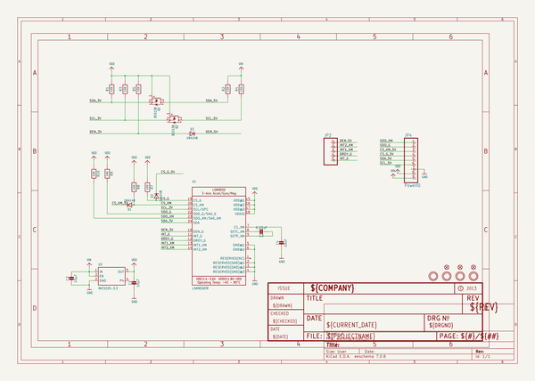
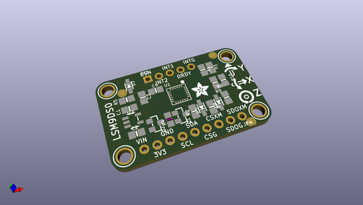
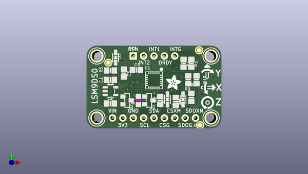
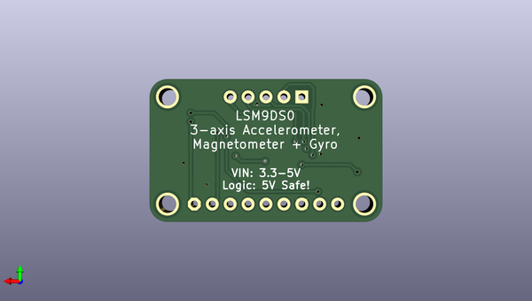

# adafruit_lsm9ds0_pcb
 
## summary 
* id: adafruit_adafruit_lsm9ds0_pcb_adafruit_lsm9ds0_pcb
* user: adafruit
* name: adafruit_lsm9ds0_pcb
* board: adafruit_lsm9ds0_pcb
* repo: https://github.com/adafruit/Adafruit-LSM9DS0-PCB

* src_file_repo_sch: 
* src_file_repo_sch_link: https://github.com/adafruit/Adafruit-LSM9DS0-PCB/tree/master/
* full details link: https://github.com/oomlout/oomlout_oomp_project_bot_v_2/tree/main/projects/adafruit_adafruit_lsm9ds0_pcb_adafruit_lsm9ds0_pcb/current_version/working  

## schematic  
  
[schematic (pdf)](working_schematic.pdf)  

## pcb  
 
  
  
  
[board (pdf)](working.pdf)  

## working_bom
| Id | Designator | Footprint | Quantity | Designation | Supplier and ref |  | None | 
| --- | --- | --- | --- | --- | --- | --- | --- | 
| 1 | U$6,U$7,U$4,U$5 | MOUNTINGHOLE_2.5_PLATED | 4 | MOUNTINGHOLE2.5 |  |  | [''] | 
| 2 | R7,R3,R10,R1,R2,R9,R5,R8 | 0805-NO | 8 | 10K |  |  | [''] | 
| 3 | C1,C2 | 0805-NO | 2 | 10µF |  |  | [''] | 
| 4 | D2,D3,D1 | SOD-323 | 3 | 1N4148 |  |  | [''] | 
| 5 | FID3,FID2,FID1 | FIDUCIAL_1MM | 3 | FIDUCIAL" |  |  | [''] | 
| 6 | C3 | 0805-NO | 1 | 0.22uF |  |  | [''] | 
| 7 | C4 | 0805-NO | 1 | 10uF |  |  | [''] | 
| 8 | U$14 | SYMBOL_GYROXYZ_YREV_10MM | 1 |  |  |  | [''] | 
| 9 | U$23 | ADAFRUIT_3.5MM | 1 |  |  |  | [''] | 
| 10 | JP4 | 1X09_ROUND_70 | 1 | PowerIO |  |  | [''] | 
| 11 | Q2,Q1 | SOT23-WIDE | 2 | BSS138 |  |  | [''] | 
| 12 | JP2 | 1X05_ROUND_70 | 1 |  |  |  | [''] | 
| 13 | R4 | _0805MP | 1 | 10K |  |  | [''] | 
| 14 | U2 | SOT23-5 | 1 | MIC5225-3.3 |  |  | [''] | 
| 15 | U1 | LGA24_4X4MM | 1 | LSM9DS0TR |  |  | [''] | 

## bom_schematic
| Ref | Qnty | Value | Cmp name | Footprint | Description | Vendor | DNP | 
| --- | --- | --- | --- | --- | --- | --- | --- | 
| C1, C2 | 2 | 10µF | CAP_CERAMIC0805-NOOUTLINE | working:0805-NO |  |  |  | 
| C3 | 1 | 0.22uF | CAP_CERAMIC0805-NOOUTLINE | working:0805-NO |  |  |  | 
| C4 | 1 | 10uF | CAP_CERAMIC0805-NOOUTLINE | working:0805-NO |  |  |  | 
| D1, D2, D3 | 3 | 1N4148 | DIODESOD-323 | working:SOD-323 |  |  |  | 
| FID1, FID2, FID3 | 3 | FIDUCIAL"" | FIDUCIAL{dblquote}{dblquote} | working:FIDUCIAL_1MM |  |  |  | 
| JP2 | 1 | HEADER-1X570MIL | HEADER-1X570MIL | working:1X05_ROUND_70 |  |  |  | 
| JP4 | 1 | PowerIO | HEADER-1X970MIL | working:1X09_ROUND_70 |  |  |  | 
| Q1, Q2 | 2 | BSS138 | MOSFET-NWIDE | working:SOT23-WIDE |  |  |  | 
| R1, R2, R3, R5, R7, R8, R9, R10 | 8 | 10K | RESISTOR0805_NOOUTLINE | working:0805-NO |  |  |  | 
| R4 | 1 | 10K | RESISTOR_0805MP | working:_0805MP |  |  |  | 
| U1 | 1 | LSM9DS0TR | LSM9DS0 | working:LGA24_4X4MM |  |  |  | 
| U2 | 1 | MIC5225-3.3 | VREG_SOT23-5 | working:SOT23-5 |  |  |  | 
| U$4, U$5, U$6, U$7 | 4 | MOUNTINGHOLE2.5 | MOUNTINGHOLE2.5 | working:MOUNTINGHOLE_2.5_PLATED |  |  |  | 

## mounting_holes
| x | y | package | value | ref | size | 
| --- | --- | --- | --- | --- | --- | 
| 0.0 | 0.0 | MOUNTINGHOLE_2.5_PLATED | MOUNTINGHOLE2.5 | U$4 | m3 | 
| 27.939999999999998 | 0.0 | MOUNTINGHOLE_2.5_PLATED | MOUNTINGHOLE2.5 | U$5 | m3 | 
| 27.939999999999998 | 15.239999999999995 | MOUNTINGHOLE_2.5_PLATED | MOUNTINGHOLE2.5 | U$6 | m3 | 
| 0.0 | 15.239999999999995 | MOUNTINGHOLE_2.5_PLATED | MOUNTINGHOLE2.5 | U$7 | m3 | 

