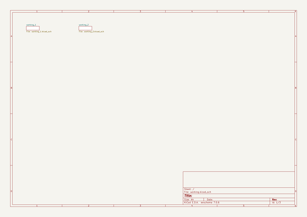
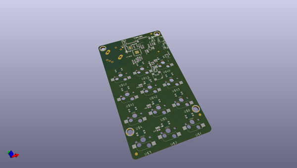
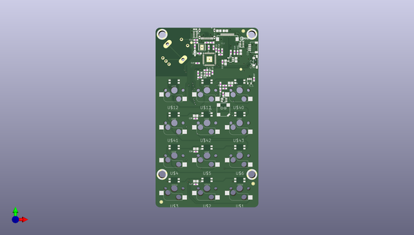
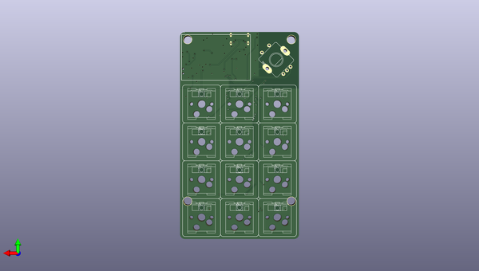

# adafruit_macropad_rp2040_pcb
 
## summary 
* id: adafruit_adafruit_macropad_rp2040_pcb_adafruit_macropad_2040
* user: adafruit
* name: adafruit_macropad_rp2040_pcb
* board: adafruit_macropad_2040
* repo: https://github.com/adafruit/Adafruit-MacroPad-RP2040-PCB

* src_file_repo_sch: 
* src_file_repo_sch_link: https://github.com/adafruit/Adafruit-MacroPad-RP2040-PCB/tree/main/
* full details link: https://github.com/oomlout/oomlout_oomp_project_bot_v_2/tree/main/projects/adafruit_adafruit_macropad_rp2040_pcb_adafruit_macropad_2040/current_version/working  

## schematic  
  
[schematic (pdf)](working_schematic.pdf)  

## pcb  
 
  
  
  
[board (pdf)](working.pdf)  

## working_bom
| Id | Designator | Footprint | Quantity | Designation | Supplier and ref |  | None | 
| --- | --- | --- | --- | --- | --- | --- | --- | 
| 1 | D3 | SOD-323 | 1 | 1N4148 |  |  | [''] | 
| 2 | SW2 | SPST_TACTILE_RA | 1 | RA SW |  |  | [''] | 
| 3 | U$34,U$80,U$35 | FIDUCIAL_1MM | 3 | FIDUCIAL_1MM |  |  | [''] | 
| 4 | C22,C14,C23,C9,C7,C24,C25 | 0805-NO | 7 | 10uF |  |  | [''] | 
| 5 | TP3,TP4,TP2,TP1 | SMT_NUT_3MM | 4 | SEWTAP_SMTNUTM3 |  |  | [''] | 
| 6 | C20,C19 | 0603-NO | 2 | 12pF |  |  | [''] | 
| 7 | C28,C31,C4,C27,C12,C10,C5,C18,C26,C16,C29,C21,C13,C3 | 0603-NO | 14 | 0.1uF |  |  | [''] | 
| 8 | U2 | SOT23-5 | 1 | AP2112K-3.3 |  |  | [''] | 
| 9 | C17,C1,C11,C15,C2 | 0603-NO | 5 | 1uF |  |  | [''] | 
| 10 | R5 | 0603-NO | 1 | 47K |  |  | [''] | 
| 11 | C8,C6 | 0805-NO | 2 | 10µF |  |  | [''] | 
| 12 | U1 | USON8_4X4 | 1 | GD25x16 |  |  | [''] | 
| 13 | C30 | 0603-NO | 1 | 10nF |  |  | [''] | 
| 14 | R1,R14 | RESPACK_4X0603 | 2 | 5.1K |  |  | [''] | 
| 15 | TP6,TP5 | TESTPOINT_ROUND_1.5MM_NO | 2 |  |  |  | [''] | 
| 16 | U$79 | MACROPAD_BOTTOM | 1 |  |  |  | [''] | 
| 17 | R4,R3 | 0603-NO | 2 | 22 |  |  | [''] | 
| 18 | R12 | 0603-NO | 1 | 680K |  |  | [''] | 
| 19 | R8,R6,R11 | 0603-NO | 3 | 1K |  |  | [''] | 
| 20 | L0 | CHIPLED_0603_NOOUTLINE | 1 | RED |  |  | [''] | 
| 21 | CONN1 | JST_SH4 | 1 | STEMMA_I2C_QT |  |  | [''] | 
| 22 | R2 | 0603-NO | 1 | 10k |  |  | [''] | 
| 23 | IC3 | QFN56_7MM_REDUCEDEPAD | 1 | RP2040_QFN56 |  |  | [''] | 
| 24 | Y1 | CRYSTAL_2.5X2 | 1 | 12MHZ |  |  | [''] | 
| 25 | IC2 | SOT23-6 | 1 | PAM8301 |  |  | [''] | 
| 26 | R7,R10 | 0603-NO | 2 | 10K |  |  | [''] | 
| 27 | IC1 | SOT23-5 | 1 | 74HCT1G125DBV |  |  | [''] | 
| 28 | SP2 | BUZZER_SMT_7.5MM | 1 | 7.5mm SPK |  |  | [''] | 
| 29 | U$81 | PCBFEAT-REV-040 | 1 |  |  |  | [''] | 
| 30 | R9 | 0603-NO | 1 | DNP |  |  | [''] | 
| 31 | X1 | USB_C_CUSB31-CFM2AX-01-X | 1 | TYPE C |  |  | [''] | 
| 32 | LED10,LED7,LED2,LED8,LED3,LED6,LED1,LED5,LED11,LED9,LED12,LED4 | NEO3535_REVERSE | 12 | WS2812B_SK6812E |  |  | [''] | 
| 33 | U$78 | MACROPAD_TOP | 1 |  |  |  | [''] | 
| 34 | U$2,U$42,U$43,U$3,U$41,U$5,U$1,U$13,U$12,U$4,U$6,U$40 | KAILH_SOCKET | 12 | SOCKET |  |  | [''] | 
| 35 | SW1 | PEC11+SWITCH | 1 | PEC11 |  |  | [''] | 
| 36 | X2 | ZJY130-2864KSWLG22 | 1 | ZJY130-2864KSWLG22 |  |  | [''] | 

## bom_schematic
no data

