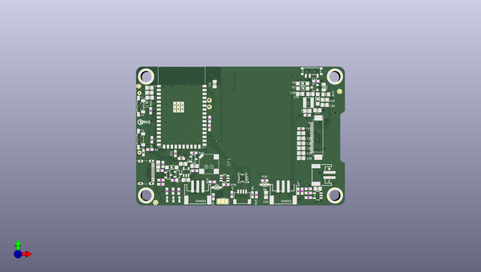

# adafruit_magtag_pcbs
 
## summary 
* id: adafruit_adafruit_magtag_pcbs_adafruit_magtag_2_9in
* user: adafruit
* name: adafruit_magtag_pcbs
* board: adafruit_magtag_2_9in
* repo: https://github.com/adafruit/Adafruit_MagTag_PCBs

* src_file_repo_sch: 
* src_file_repo_sch_link: https://github.com/adafruit/Adafruit_MagTag_PCBs/tree/main/
* full details link: https://github.com/oomlout/oomlout_oomp_project_bot_v_2/tree/main/projects/adafruit_adafruit_magtag_pcbs_adafruit_magtag_2_9in/current_version/working  

## schematic  
  
[schematic (pdf)](working_schematic.pdf) 

## pcb  
 
  
  
  
[board (pdf)](working.pdf)  

## working_bom
| Id | Designator | Footprint | Quantity | Designation | Supplier and ref |  | None | 
| --- | --- | --- | --- | --- | --- | --- | --- | 
| 1 | D2,D5,D3 | SOD-123 | 3 | MBR0530 |  |  | [''] | 
| 2 | R7,R20,R5,R2,R9,R1 | 0603-NO | 6 | 10K |  |  | [''] | 
| 3 | C25,C24,C19,C23,C26,C31,C28,C30,C27 | 0805-NO | 9 | 1uF |  |  | [''] | 
| 4 | R18,R16 | 0603-NO | 2 | 1K |  |  | [''] | 
| 5 | C9 | 0805-NO | 1 | 10uF/10V+ |  |  | [''] | 
| 6 | Q3,Q1 | SOT23-R | 2 | DMG3415U-7 |  |  | [''] | 
| 7 | C6,C14,C12 | 0603-NO | 3 | 1uF |  |  | [''] | 
| 8 | R24,R22,R25,R23 | 0603-NO | 4 | DNP |  |  | [''] | 
| 9 | SJ2 | SOLDERJUMPER_2WAY_OPEN_NOPASTE | 1 |  |  |  | [''] | 
| 10 | ON0 | CHIPLED_0603_NOOUTLINE | 1 | GREEN |  |  | [''] | 
| 11 | U4 | SOT23-5 | 1 | AP2112K-3.3 |  |  | [''] | 
| 12 | TP6,TP1,TP7,TP8 | TESTPOINT_ROUND_1.5MM_NO | 4 |  |  |  | [''] | 
| 13 | C8,C7,C11,C13,C17,C10,C18,C3,C4 | 0805-NO | 9 | 10µF |  |  | [''] | 
| 14 | R11,R17,R10 | 0603-NO | 3 | 1Meg |  |  | [''] | 
| 15 | L1 | INDUCTOR_4X4MM_NR401 | 1 | 10uH |  |  | [''] | 
| 16 | D1,D6 | SOD-323 | 2 | 3.6V |  |  | [''] | 
| 17 | U$15 | PCBFEAT-REV-040 | 1 |  |  |  | [''] | 
| 18 | IC2 | SOT23-6 | 1 | PAM8301 |  |  | [''] | 
| 19 | L0 | CHIPLED_0603_NOOUTLINE | 1 | RED |  |  | [''] | 
| 20 | R14,R12 | 0603-NO | 2 | 100k |  |  | [''] | 
| 21 | IC4 | LGA16_3X3MM | 1 | LIS3DH |  |  | [''] | 
| 22 | C1,C20 | 0805-NO | 2 | 10uF |  |  | [''] | 
| 23 | TP2,TP4,TP5,TP3 | SMT_NUT_3MM | 4 | SEWTAP_SMTNUTM3 |  |  | [''] | 
| 24 | R21 | 0805_10MGAP | 1 | DNP |  |  | [''] | 
| 25 | R27,R15,R26 | 0603-NO | 3 | 100K |  |  | [''] | 
| 26 | Q2 | SOT23-R | 1 | DMG3415 |  |  | [''] | 
| 27 | C21,C5,C15,C16,C2 | 0603-NO | 5 | 0.1uF |  |  | [''] | 
| 28 | R19,R6 | 0603-NO | 2 | 47K |  |  | [''] | 
| 29 | U3 | MODULE_ESP32-S2-WROVER | 1 | ESP32-S2-WROVER |  |  | [''] | 
| 30 | CONN1 | JST_SH4 | 1 | STEMMA_I2C_QT |  |  | [''] | 
| 31 | SW3,SW1 | SPST_TACTILE_RA | 2 | RA_TACT |  |  | [''] | 
| 32 | R13 | 0805_10MGAP | 1 | 0.47ohm |  |  | [''] | 
| 33 | U2 | SOT23-5 | 1 | MCP73831T-2ACI/OT |  |  | [''] | 
| 34 | FID3,FID1,FID2,FID4,FID6,FID5 | FIDUCIAL_1MM | 6 | FIDUCIAL_1MM |  |  | [''] | 
| 35 | JP2 | 1X02_ROUND | 1 | UART |  |  | [''] | 
| 36 | C29 | 0805-NO | 1 | 4.7uF/25V |  |  | [''] | 
| 37 | X4 | USB_C_CUSB31-CFM2AX-01-X | 1 | USB C |  |  | [''] | 
| 38 | SW4 | SPDT_SMT_SSSS811101 | 1 | SPDT R/A |  |  | [''] | 
| 39 | SP1 | BUZZER_SMT_7.5MM | 1 | 7.5mm SPK |  |  | [''] | 
| 40 | X1 | JSTPH2_BATT | 1 | JSTPH |  |  | [''] | 
| 41 | D4 | SOD-123 | 1 | MBR540 |  |  | [''] | 
| 42 | SENSE0,SENSE1 | JSTPH3 | 2 | JST PH 3 |  |  | [''] | 
| 43 | R4 | 0603-NO | 1 | 5.1k |  |  | [''] | 
| 44 | U$70 | MAGTAG_FRONT | 1 |  |  |  | [''] | 
| 45 | R8,R3 | 0603-NO | 2 | 5.1K |  |  | [''] | 
| 46 | Q5 | SOT23-3 | 1 | IRLML0100 |  |  | [''] | 
| 47 | CHG1 | CHIPLED_0603_NOOUTLINE | 1 | ORANGE |  |  | [''] | 
| 48 | LED4,LED3,LED2,LED5 | WS2812B_4020 | 4 | WS2812B_4020 |  |  | [''] | 
| 49 | SW2,SW5,SW6,SW7 | TACTILE_3X6MM | 4 |  |  |  | [''] | 
| 50 | U$69 | MAGTAG_BOTTOM | 1 |  |  |  | [''] | 
| 51 | U1 | ALS-PT19-315C | 1 |  |  |  | [''] | 
| 52 | EINK2 | EINK_290IN | 1 | EINK_24PIN_290IN |  |  | [''] | 

## bom_schematic
| Ref | Qnty | Value | Cmp name | Footprint | Description | Vendor | DNP | 
| --- | --- | --- | --- | --- | --- | --- | --- | 
| C1, C20 | 2 | 10uF | CAP_CERAMIC0805-NOOUTLINE | working:0805-NO |  |  |  | 
| C2, C5, C15, C16, C21 | 5 | 0.1uF | CAP_CERAMIC0603_NO | working:0603-NO |  |  |  | 
| C3, C4, C7, C8, C10, C11, C13, C17, C18 | 9 | 10µF | CAP_CERAMIC0805-NOOUTLINE | working:0805-NO |  |  |  | 
| C6, C12, C14 | 3 | 1uF | CAP_CERAMIC0603_NO | working:0603-NO |  |  |  | 
| C9 | 1 | 10uF/10V+ | CAP_CERAMIC0805-NOOUTLINE | working:0805-NO |  |  |  | 
| C19, C23, C24, C25, C26, C27, C28, C30, C31 | 9 | 1uF | CAP_CERAMIC0805-NOOUTLINE | working:0805-NO |  |  |  | 
| C29 | 1 | 4.7uF/25V | CAP_CERAMIC0805-NOOUTLINE | working:0805-NO |  |  |  | 
| CHG1 | 1 | ORANGE | LED0603_NOOUTLINE | working:CHIPLED_0603_NOOUTLINE |  |  |  | 
| CONN1 | 1 | STEMMA_I2C_QT | STEMMA_I2C_QT | working:JST_SH4 |  |  |  | 
| D1, D6 | 2 | 3.6V | DIODE-ZENERSOD323 | working:SOD-323 |  |  |  | 
| D2, D3, D5 | 3 | MBR0530 | DIODE-SCHOTTKYSOD-123 | working:SOD-123 |  |  |  | 
| D4 | 1 | MBR540 | DIODE-SCHOTTKYSOD-123 | working:SOD-123 |  |  |  | 
| EINK2 | 1 | EINK_24PIN_290IN | EINK_24PIN_290IN | working:EINK_290IN |  |  |  | 
| FID1, FID2, FID3, FID4, FID5, FID6 | 6 | FIDUCIAL_1MM | FIDUCIAL_1MM | working:FIDUCIAL_1MM |  |  |  | 
| IC2 | 1 | PAM8301 | PAM8301 | working:SOT23-6 |  |  |  | 
| IC4 | 1 | LIS3DH | ACCEL_LIS3DHTR | working:LGA16_3X3MM |  |  |  | 
| JP2 | 1 | UART | HEADER-1X2ROUND | working:1X02_ROUND |  |  |  | 
| L0 | 1 | RED | LED0603_NOOUTLINE | working:CHIPLED_0603_NOOUTLINE |  |  |  | 
| L1 | 1 | 10uH | INDUCTORNR401 | working:INDUCTOR_4X4MM_NR401 |  |  |  | 
| LED2, LED3, LED4, LED5 | 4 | WS2812B_4020 | WS2812B_4020 | working:WS2812B_4020 |  |  |  | 
| ON0 | 1 | GREEN | LED0603_NOOUTLINE | working:CHIPLED_0603_NOOUTLINE |  |  |  | 
| Q1, Q3 | 2 | DMG3415U-7 | MOSFET-P | working:SOT23-R |  |  |  | 
| Q2 | 1 | DMG3415 | MOSFET-P | working:SOT23-R |  |  |  | 
| Q5 | 1 | IRLML2060TRPBF | IRLML2060TRPBF | working:SOT23-3 |  |  |  | 
| R1, R2, R5, R7, R9, R20 | 6 | 10K | RESISTOR_0603_NOOUT | working:0603-NO |  |  |  | 
| R3, R8 | 2 | 5.1K | RESISTOR_0603_NOOUT | working:0603-NO |  |  |  | 
| R4 | 1 | 5.1k | RESISTOR_0603_NOOUT | working:0603-NO |  |  |  | 
| R6, R19 | 2 | 47K | RESISTOR_0603_NOOUT | working:0603-NO |  |  |  | 
| R10, R11, R17 | 3 | 1Meg | RESISTOR_0603_NOOUT | working:0603-NO |  |  |  | 
| R12, R14 | 2 | 100k | RESISTOR_0603_NOOUT | working:0603-NO |  |  |  | 
| R13 | 1 | 0.47ohm | RESISTOR0805_10MGAP | working:0805_10MGAP |  |  |  | 
| R15, R26, R27 | 3 | 100K | RESISTOR_0603_NOOUT | working:0603-NO |  |  |  | 
| R16, R18 | 2 | 1K | RESISTOR_0603_NOOUT | working:0603-NO |  |  |  | 
| R21 | 1 | DNP | RESISTOR0805_10MGAP | working:0805_10MGAP |  |  |  | 
| R22, R23, R24, R25 | 4 | DNP | RESISTOR_0603_NOOUT | working:0603-NO |  |  |  | 
| SENSE0, SENSE1 | 2 | JST PH 3 | CON_JST_PH_3PIN | working:JSTPH3 |  |  |  | 
| SJ2 | 1 | SOLDERJUMPER_2WAY | SOLDERJUMPER_2WAY | working:SOLDERJUMPER_2WAY_OPEN_NOPASTE |  |  |  | 
| SP1 | 1 | SPEAKER_7.5MM | SPEAKER_7.5MM | working:BUZZER_SMT_7.5MM |  |  |  | 
| SW1, SW3 | 2 | RA_TACT | SWITCH_SPST_TACT_RA | working:SPST_TACTILE_RA |  |  |  | 
| SW2, SW5, SW6, SW7 | 4 | SWITCH_PUSHBUTTON_3.5X6MM | SWITCH_PUSHBUTTON_3.5X6MM | working:TACTILE_3X6MM |  |  |  | 
| SW4 | 1 | SPDT R/A | SWITCH_SPDT | working:SPDT_SMT_SSSS811101 |  |  |  | 
| TP1, TP6, TP7, TP8 | 4 | TESTPOINTROUND1.5MMNO | TESTPOINTROUND1.5MMNO | working:TESTPOINT_ROUND_1.5MM_NO |  |  |  | 
| TP2, TP3, TP4, TP5 | 4 | SEWTAP_SMTNUTM3 | SEWTAP_SMTNUTM3 | working:SMT_NUT_3MM |  |  |  | 
| U1 | 1 | PHOTOTRANSISTOR_PT19-315C | PHOTOTRANSISTOR_PT19-315C | working:ALS-PT19-315C |  |  |  | 
| U2 | 1 | MCP73831T-2ACI/OT | MCP73831/2 | working:SOT23-5 |  |  |  | 
| U3 | 1 | ESP32-S2-WROVER | ESP32-S2-WROVER | working:MODULE_ESP32-S2-WROVER |  |  |  | 
| U4 | 1 | AP2112K-3.3 | VREG_SOT23-5 | working:SOT23-5 |  |  |  | 
| X1 | 1 | JSTPH | CON_JST_PH_2PIN_BATT | working:JSTPH2_BATT |  |  |  | 
| X4 | 1 | USB C | USB_C | working:USB_C_CUSB31-CFM2AX-01-X |  |  |  | 

