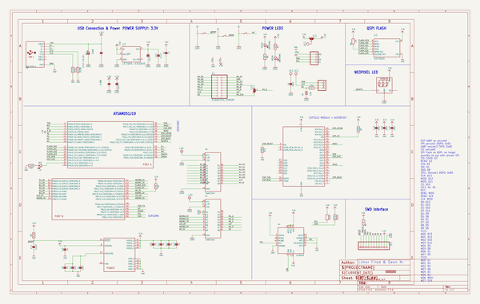
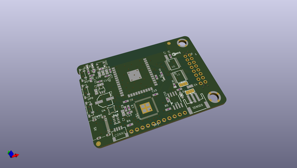
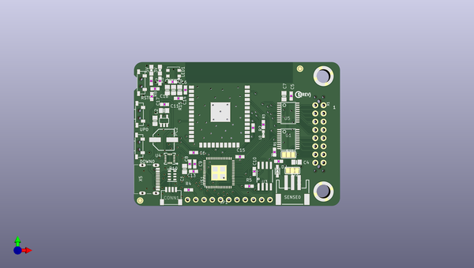
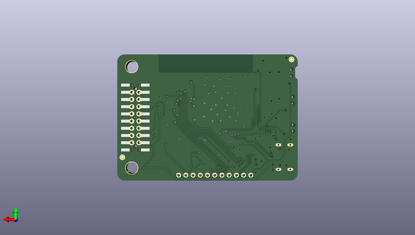

# adafruit_matrixportal_m4_pcb
 
## summary 
* id: adafruit_adafruit_matrixportal_m4_pcb_adafruit_matrixportal_m4
* user: adafruit
* name: adafruit_matrixportal_m4_pcb
* board: adafruit_matrixportal_m4
* repo: https://github.com/adafruit/Adafruit-MatrixPortal-M4-PCB

* src_file_repo_sch: 
* src_file_repo_sch_link: https://github.com/adafruit/Adafruit-MatrixPortal-M4-PCB/tree/main/
* full details link: https://github.com/oomlout/oomlout_oomp_project_bot_v_2/tree/main/projects/adafruit_adafruit_matrixportal_m4_pcb_adafruit_matrixportal_m4/current_version/working  

## schematic  
  
[schematic (pdf)](working_schematic.pdf)  

## pcb  
 
  
  
  
[board (pdf)](working.pdf)  

## working_bom
| Id | Designator | Footprint | Quantity | Designation | Supplier and ref |  | None | 
| --- | --- | --- | --- | --- | --- | --- | --- | 
| 1 | R4,R9 | 0603-NO | 2 | 1K |  |  | [''] | 
| 2 | SENSE0 | JSTPH3 | 1 | JST PH 3 |  |  | [''] | 
| 3 | C3,C7,C2,C4,C19,C1,C18,C20 | 0805-NO | 8 | 10uF |  |  | [''] | 
| 4 | L0 | CHIPLED_0603_NOOUTLINE | 1 | RED |  |  | [''] | 
| 5 | U2 | SOT23-DBV | 1 | AP2112K-3.3 |  |  | [''] | 
| 6 | D2 | SOD-323 | 1 | 3.6V |  |  | [''] | 
| 7 | C16,C6,C15,C11,C8,C10,C14 | 0603-NO | 7 | .1u |  |  | [''] | 
| 8 | C5,C17,C13 | 0603-NO | 3 | 0.1uF |  |  | [''] | 
| 9 | U$44 | PCBFEAT-REV-040 | 1 |  |  |  | [''] | 
| 10 | RST0,UP0,DOWN0 | SPST_TACTILE_RA | 3 | TL3330AF260QG |  |  | [''] | 
| 11 | TP2,TP1 | SMT_NUT_3MM | 2 | SEWTAP_SMTNUTM3 |  |  | [''] | 
| 12 | LED1 | LED3535 | 1 | WS2812B3535 |  |  | [''] | 
| 13 | R15,R5,R1,R2,R6,R7 | 0603-NO | 6 | 10K |  |  | [''] | 
| 14 | U3 | SOIC8_208MIL | 1 | GD25Q16 |  |  | [''] | 
| 15 | CONN1 | JST_SH4 | 1 | STEMMA_I2C_QT |  |  | [''] | 
| 16 | X6 | WROOM32 | 1 | ESP32_WROOM32 |  |  | [''] | 
| 17 | R8,R3 | 0603-NO | 2 | 5.1K |  |  | [''] | 
| 18 | UNK3VON0,UNK5VON0 | CHIPLED_0805_NOOUTLINE | 2 | GREEN |  |  | [''] | 
| 19 | SJ2,SJ1 | SOLDERJUMPER_2WAY_OPEN_NOPASTE | 2 |  |  |  | [''] | 
| 20 | FID2,FID1,FID3,FID4 | FIDUCIAL_1MM | 4 | FIDUCIAL_1MM |  |  | [''] | 
| 21 | JP1 | 1X11_ROUND | 1 |  |  |  | [''] | 
| 22 | U$45 | MATRIXPORTAL_TOP | 1 |  |  |  | [''] | 
| 23 | U$1 | PQFN64-1 | 1 | ATSAMD51J19 |  |  | [''] | 
| 24 | R10 | RESPACK_4X0603 | 1 | 5.1K |  |  | [''] | 
| 25 | PC2 | PANASONIC_D | 1 | 47uF+/6.3V+ |  |  | [''] | 
| 26 | C9 | 0603-NO | 1 | 1uF |  |  | [''] | 
| 27 | U5,U1 | TSSOP20 | 2 | 74AHCT245 |  |  | [''] | 
| 28 | X5 | USB_C_CUSB31-CFM2AX-01-X | 1 | USB TYPE C |  |  | [''] | 
| 29 | U4 | LGA16_3X3MM | 1 | LIS3DHTR |  |  | [''] | 
| 30 | X1 | 2X08_SMTTHM_RGBMATRIX | 1 | RGBMATRIX_THMSMT |  |  | [''] | 
| 31 | U$41 | MATRIXPORTAL_BOT | 1 |  |  |  | [''] | 

## bom_schematic
| Ref | Qnty | Value | Cmp name | Footprint | Description | Vendor | DNP | 
| --- | --- | --- | --- | --- | --- | --- | --- | 
| C1, C2, C3, C4, C7, C18, C19, C20 | 8 | 10uF | CAP_CERAMIC0805-NOOUTLINE | working:0805-NO |  |  |  | 
| C5, C13, C17 | 3 | 0.1uF | CAP_CERAMIC0603_NO | working:0603-NO |  |  |  | 
| C6, C8, C10, C11, C14, C15, C16 | 7 | .1u | CAP_CERAMIC0603_NO | working:0603-NO |  |  |  | 
| C9 | 1 | 1uF | CAP_CERAMIC0603_NO | working:0603-NO |  |  |  | 
| CONN1 | 1 | STEMMA_I2C_QT | STEMMA_I2C_QT | working:JST_SH4 |  |  |  | 
| D2 | 1 | 3.6V | DIODE-ZENERSOD323 | working:SOD-323 |  |  |  | 
| DOWN0 | 1 | TL3330AF260QG | SWITCH_SPST_TACT_RA | working:SPST_TACTILE_RA |  |  |  | 
| FID1, FID2, FID3, FID4 | 4 | FIDUCIAL_1MM | FIDUCIAL_1MM | working:FIDUCIAL_1MM |  |  |  | 
| JP1 | 1 | HEADER-1X11 | HEADER-1X11 | working:1X11_ROUND |  |  |  | 
| L0 | 1 | RED | LED0603_NOOUTLINE | working:CHIPLED_0603_NOOUTLINE |  |  |  | 
| LED1 | 1 | WS2812B3535 | WS2812B3535 | working:LED3535 |  |  |  | 
| PC2 | 1 | 47uF+/6.3V+ | CAP_ELECTROLYTICPANASONIC_D | working:PANASONIC_D |  |  |  | 
| R1, R2, R5, R6, R7, R15 | 6 | 10K | RESISTOR_0603_NOOUT | working:0603-NO |  |  |  | 
| R3, R8 | 2 | 5.1K | RESISTOR_0603_NOOUT | working:0603-NO |  |  |  | 
| R4, R9 | 2 | 1K | RESISTOR_0603_NOOUT | working:0603-NO |  |  |  | 
| R10 | 1 | 5.1K | RESISTOR_4PACK | working:RESPACK_4X0603 |  |  |  | 
| RST0 | 1 | TL3330AF260QG | SWITCH_SPST_TACT_RA | working:SPST_TACTILE_RA |  |  |  | 
| SENSE0 | 1 | JST PH 3 | CON_JST_PH_3PIN | working:JSTPH3 |  |  |  | 
| SJ1, SJ2 | 2 | SOLDERJUMPER_2WAY | SOLDERJUMPER_2WAY | working:SOLDERJUMPER_2WAY_OPEN_NOPASTE |  |  |  | 
| TP1, TP2 | 2 | SEWTAP_SMTNUTM3 | SEWTAP_SMTNUTM3 | working:SMT_NUT_3MM |  |  |  | 
| U1, U5 | 2 | 74AHCT245 | 74LCX245 | working:TSSOP20 |  |  |  | 
| U2 | 1 | LP2985-XXDBVR | LP2985-XXDBVR | working:SOT23-DBV |  |  |  | 
| U3 | 1 | GD25Q16 | SPIFLASH_8PIN208MIL | working:SOIC8_208MIL |  |  |  | 
| U4 | 1 | LIS3DHTR | ACCEL_LIS3DHTR | working:LGA16_3X3MM |  |  |  | 
| U$1 | 1 | ATSAMD51J | ATSAMD51J | working:PQFN64-1 |  |  |  | 
| UNK3VON0 | 1 | GREEN | LED0805_NOOUTLINE | working:CHIPLED_0805_NOOUTLINE |  |  |  | 
| UNK5VON0 | 1 | GREEN | LED0805_NOOUTLINE | working:CHIPLED_0805_NOOUTLINE |  |  |  | 
| UP0 | 1 | TL3330AF260QG | SWITCH_SPST_TACT_RA | working:SPST_TACTILE_RA |  |  |  | 
| X1 | 1 | RGBMATRIX_THMSMT | RGBMATRIX_THMSMT | working:2X08_SMTTHM_RGBMATRIX |  |  |  | 
| X5 | 1 | USB TYPE C | USB_C | working:USB_C_CUSB31-CFM2AX-01-X |  |  |  | 
| X6 | 1 | ESP32_WROOM32 | ESP32_WROOM32 | working:WROOM32 |  |  |  | 

