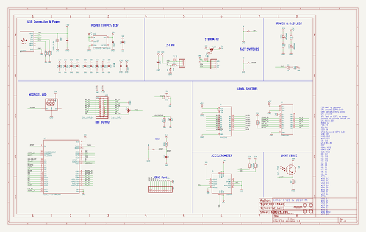
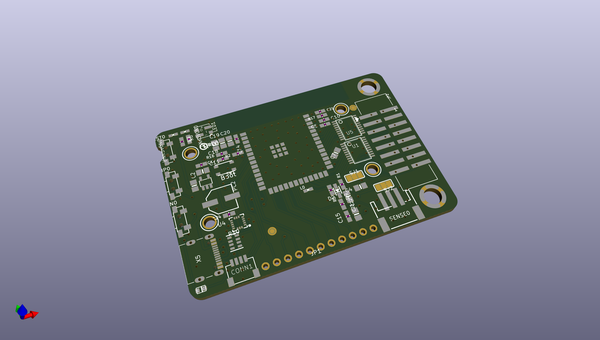
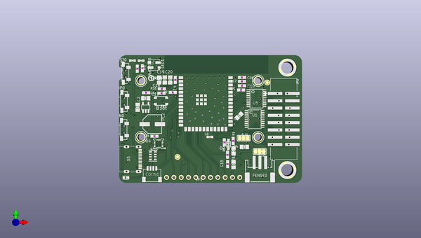
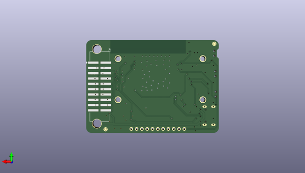

# adafruit_matrixportal_s3_pcb
 
## summary 
* id: adafruit_adafruit_matrixportal_s3_pcb_adafruit_matrixportal_s3
* user: adafruit
* name: adafruit_matrixportal_s3_pcb
* board: adafruit_matrixportal_s3
* repo: https://github.com/adafruit/Adafruit-MatrixPortal-S3-PCB

* src_file_repo_sch: 
* src_file_repo_sch_link: https://github.com/adafruit/Adafruit-MatrixPortal-S3-PCB/tree/main/
* full details link: https://github.com/oomlout/oomlout_oomp_project_bot_v_2/tree/main/projects/adafruit_adafruit_matrixportal_s3_pcb_adafruit_matrixportal_s3/current_version/working  

## schematic  
  
[schematic (pdf)](working_schematic.pdf) 

## pcb  
 
  
  
  
[board (pdf)](working.pdf)  

## working_bom
| Id | Designator | Footprint | Quantity | Designation | Supplier and ref |  | None | 
| --- | --- | --- | --- | --- | --- | --- | --- | 
| 1 | SW1 | BTN_RKB2_4.6X2.8 | 1 | KMR2 |  |  | [''] | 
| 2 | C10,C14,C5,C15,C11 | 0603-NO | 5 | 0.1uF |  |  | [''] | 
| 3 | D2 | SOD-323 | 1 | 3.6V |  |  | [''] | 
| 4 | SJ1,SJ2 | SOLDERJUMPER_2WAY_OPEN_NOPASTE | 2 |  |  |  | [''] | 
| 5 | C23,C2,C18,C22,C7,C20,C19,C4,C3 | 0805-NO | 9 | 10uF |  |  | [''] | 
| 6 | U$25 | S3_MATRIXPORTAL_TOP | 1 |  |  |  | [''] | 
| 7 | UNK3VON0,UNK5VON0 | CHIPLED_0603_NOOUTLINE | 2 | GREEN |  |  | [''] | 
| 8 | CONN1 | JST_SH4 | 1 | STEMMA_I2C_QT |  |  | [''] | 
| 9 | C21,C24,C17 | 0603-NO | 3 | 1uF |  |  | [''] | 
| 10 | R10 | RESPACK_4X0603 | 1 | 5.1K Pack |  |  | [''] | 
| 11 | R16,R3,R1,R2,R7,R6 | 0603-NO | 6 | 10K |  |  | [''] | 
| 12 | SENSE0 | JSTPH3 | 1 | JST PH 3 |  |  | [''] | 
| 13 | LED1 | LED3535_FULLPADS | 1 | WS2812B_3535FULL |  |  | [''] | 
| 14 | U3 | S3-WROOM32 | 1 | ESP32-S3-WROOM |  |  | [''] | 
| 15 | U$44 | PCBFEAT-REV-040 | 1 |  |  |  | [''] | 
| 16 | L0 | CHIPLED_0603_NOOUTLINE | 1 | RED |  |  | [''] | 
| 17 | FID2,FID1,FID3,FID4 | FIDUCIAL_1MM | 4 | FIDUCIAL_1MM |  |  | [''] | 
| 18 | JP1 | 1X11_ROUND | 1 |  |  |  | [''] | 
| 19 | U$14,U$22,U$24,U$19 | MOUNTINGHOLE_2.5_PLATED | 4 | MOUNTINGHOLE2.5 |  |  | [''] | 
| 20 | U1,U5 | TSSOP20 | 2 | 74AHCT245 |  |  | [''] | 
| 21 | UP0,DOWN0,RST0 | SPST_TACTILE_RA | 3 | TL3330AF260QG |  |  | [''] | 
| 22 | TP2,TP1 | SMT_NUT_3MM | 2 | SEWTAP_SMTNUTM3 |  |  | [''] | 
| 23 | R9 | 0603-NO | 1 | 1K |  |  | [''] | 
| 24 | U6 | ALS-PT19-315C | 1 | ALS-PT19 |  |  | [''] | 
| 25 | PC2 | PANASONIC_D | 1 | 100uF/6.3V |  |  | [''] | 
| 26 | U2 | SOT23-DBV | 1 | AP2112K-3.3 |  |  | [''] | 
| 27 | R17 | 0603-NO | 1 | 1Meg |  |  | [''] | 
| 28 | U4 | LGA16_3X3MM | 1 | LIS3DHTR |  |  | [''] | 
| 29 | JP2 | 2X08_SHROUDEDSMT | 1 | 2x8_SMT_IDC |  |  | [''] | 
| 30 | X5 | USB_C_CUSB31-CFM2AX-01-X | 1 | USB TYPE C |  |  | [''] | 
| 31 | U$26 | S3_MATRIXPORTAL_BOT | 1 |  |  |  | [''] | 
| 32 | JP3 | 2X10_SMT_FEMALE | 1 | 2x10_SMT_F |  |  | [''] | 

## bom_schematic
| Ref | Qnty | Value | Cmp name | Footprint | Description | Vendor | DNP | 
| --- | --- | --- | --- | --- | --- | --- | --- | 
| C2, C3, C4, C7, C18, C19, C20, C22, C23 | 9 | 10uF | CAP_CERAMIC0805-NOOUTLINE | working:0805-NO |  |  |  | 
| C5, C10, C11, C14, C15 | 5 | 0.1uF | CAP_CERAMIC0603_NO | working:0603-NO |  |  |  | 
| C17, C21, C24 | 3 | 1uF | CAP_CERAMIC0603_NO | working:0603-NO |  |  |  | 
| CONN1 | 1 | STEMMA_I2C_QT | STEMMA_I2C_QT | working:JST_SH4 |  |  |  | 
| D2 | 1 | 3.6V | DIODE-ZENERSOD323 | working:SOD-323 |  |  |  | 
| DOWN0 | 1 | TL3330AF260QG | SWITCH_SPST_MNT_TACT_RA | working:SPST_TACTILE_RA |  |  |  | 
| FID1, FID2, FID3, FID4 | 4 | FIDUCIAL_1MM | FIDUCIAL_1MM | working:FIDUCIAL_1MM |  |  |  | 
| JP1 | 1 | HEADER-1X11 | HEADER-1X11 | working:1X11_ROUND |  |  |  | 
| JP2 | 1 | 2x8_SMT_IDC | HEADER-2X8_SHROUDEDSMT | working:2X08_SHROUDEDSMT |  |  |  | 
| JP3 | 1 | 2x10_SMT_F | HEADER-2X10SMT_FEMALE | working:2X10_SMT_FEMALE |  |  |  | 
| L0 | 1 | RED | LED0603_NOOUTLINE | working:CHIPLED_0603_NOOUTLINE |  |  |  | 
| LED1 | 1 | WS2812B_3535FULL | WS2812B_3535FULL | working:LED3535_FULLPADS |  |  |  | 
| PC2 | 1 | 100uF/6.3V | CAP_ELECTROLYTICPANASONIC_D | working:PANASONIC_D |  |  |  | 
| R1, R2, R3, R6, R7, R16 | 6 | 10K | RESISTOR_0603_NOOUT | working:0603-NO |  |  |  | 
| R9 | 1 | 1K | RESISTOR_0603_NOOUT | working:0603-NO |  |  |  | 
| R10 | 1 | 5.1K Pack | RESISTOR_4PACK | working:RESPACK_4X0603 |  |  |  | 
| R17 | 1 | 1Meg | RESISTOR_0603_NOOUT | working:0603-NO |  |  |  | 
| RST0 | 1 | TL3330AF260QG | SWITCH_SPST_MNT_TACT_RA | working:SPST_TACTILE_RA |  |  |  | 
| SENSE0 | 1 | JST PH 3 | CON_JST_PH_3PIN | working:JSTPH3 |  |  |  | 
| SJ1, SJ2 | 2 | SOLDERJUMPER_2WAY | SOLDERJUMPER_2WAY | working:SOLDERJUMPER_2WAY_OPEN_NOPASTE |  |  |  | 
| SW1 | 1 | KMR2 | SWITCH_TACT_SMT_RKB2 | working:BTN_RKB2_4.6X2.8 |  |  |  | 
| TP1, TP2 | 2 | SEWTAP_SMTNUTM3 | SEWTAP_SMTNUTM3 | working:SMT_NUT_3MM |  |  |  | 
| U1, U5 | 2 | 74AHCT245 | 74LCX245_TSSOP20 | working:TSSOP20 |  |  |  | 
| U2 | 1 | LP2985-XXDBVR | LP2985-XXDBVR | working:SOT23-DBV |  |  |  | 
| U3 | 1 | ESP32-S3-WROOM | ESP32-S3-WROOM | working:S3-WROOM32 |  |  |  | 
| U4 | 1 | LIS3DHTR | ACCEL_LIS3DHTR | working:LGA16_3X3MM |  |  |  | 
| U6 | 1 | ALS-PT19 | PHOTOTRANSISTOR_PT19-315C | working:ALS-PT19-315C |  |  |  | 
| U$14, U$19, U$22, U$24 | 4 | MOUNTINGHOLE2.5 | MOUNTINGHOLE2.5 | working:MOUNTINGHOLE_2.5_PLATED |  |  |  | 
| UNK3VON0 | 1 | GREEN | LED0603_NOOUTLINE | working:CHIPLED_0603_NOOUTLINE |  |  |  | 
| UNK5VON0 | 1 | GREEN | LED0603_NOOUTLINE | working:CHIPLED_0603_NOOUTLINE |  |  |  | 
| UP0 | 1 | TL3330AF260QG | SWITCH_SPST_MNT_TACT_RA | working:SPST_TACTILE_RA |  |  |  | 
| X5 | 1 | USB TYPE C | USB_C | working:USB_C_CUSB31-CFM2AX-01-X |  |  |  | 

## mounting_holes
| x | y | package | value | ref | size | 
| --- | --- | --- | --- | --- | --- | 
| 0.0 | 0.0 | MOUNTINGHOLE_2.5_PLATED | MOUNTINGHOLE2.5 | U$14 | m3 | 
| 0.0 | 19.69 | MOUNTINGHOLE_2.5_PLATED | MOUNTINGHOLE2.5 | U$19 | m3 | 
| 40.64 | 19.69 | MOUNTINGHOLE_2.5_PLATED | MOUNTINGHOLE2.5 | U$22 | m3 | 
| 40.64 | 0.0 | MOUNTINGHOLE_2.5_PLATED | MOUNTINGHOLE2.5 | U$24 | m3 | 

