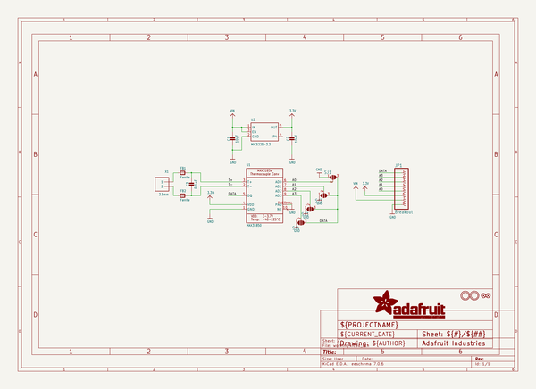
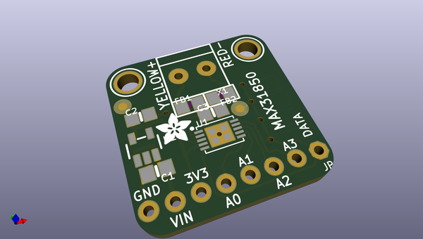
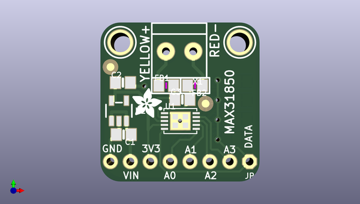
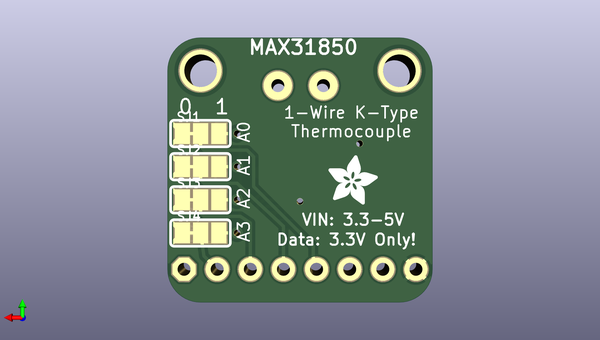

# adafruit_max31850_thermocouple_breakout_board
 
## summary 
* id: adafruit_adafruit_max31850_thermocouple_breakout_board_adafruit_max31850
* user: adafruit
* name: adafruit_max31850_thermocouple_breakout_board
* board: adafruit_max31850
* repo: https://github.com/adafruit/Adafruit-MAX31850-thermocouple-breakout-board

* src_file_repo_sch: 
* src_file_repo_sch_link: https://github.com/adafruit/Adafruit-MAX31850-thermocouple-breakout-board/tree/master/
* full details link: https://github.com/oomlout/oomlout_oomp_project_bot_v_2/tree/main/projects/adafruit_adafruit_max31850_thermocouple_breakout_board_adafruit_max31850/current_version/working  

## schematic  
  
[schematic (pdf)](working_schematic.pdf)  

## pcb  
 
  
  
  
[board (pdf)](working.pdf)  

## working_bom
| Id | Designator | Footprint | Quantity | Designation | Supplier and ref |  | None | 
| --- | --- | --- | --- | --- | --- | --- | --- | 
| 1 | FB2,FB1 | 0805 | 2 | Ferrite |  |  | [''] | 
| 2 | C1,C2 | 0805-NO | 2 | 10uF |  |  | [''] | 
| 3 | X1 | TERMBLOCK_1X2-3.5MM | 1 | 3.5mm |  |  | [''] | 
| 4 | U2 | SOT23-5 | 1 | MIC5225-3.3 |  |  | [''] | 
| 5 | JP1 | 1X08_ROUND_70 | 1 | Breakout |  |  | [''] | 
| 6 | FID2,FID1 | FIDUCIAL_1MM | 2 | FIDUCIAL" |  |  | [''] | 
| 7 | U$9,U$8 | MOUNTINGHOLE_2.5_PLATED | 2 | MOUNTINGHOLE2.5 |  |  | [''] | 
| 8 | U$19,U$18 | ADAFRUIT_3.5MM | 2 |  |  |  | [''] | 
| 9 | C3 | 0805-NO | 1 | 0.1uF |  |  | [''] | 
| 10 | U1 | TDFN10_3X4MM | 1 | MAX31850 |  |  | [''] | 
| 11 | SJ3,SJ4,SJ2,SJ1 | SOLDERJUMPER_2WAY_OPEN_NOPASTE | 4 |  |  |  | [''] | 

## bom_schematic
| Ref | Qnty | Value | Cmp name | Footprint | Description | Vendor | DNP | 
| --- | --- | --- | --- | --- | --- | --- | --- | 
| C1, C2 | 2 | 10uF | CAP_CERAMIC0805-NOOUTLINE | working:0805-NO |  |  |  | 
| C3 | 1 | 0.1uF | CAP_CERAMIC0805-NOOUTLINE | working:0805-NO |  |  |  | 
| FB1, FB2 | 2 | Ferrite | FERRITE0805 | working:0805 |  |  |  | 
| FID1, FID2 | 2 | FIDUCIAL"" | FIDUCIAL{dblquote}{dblquote} | working:FIDUCIAL_1MM |  |  |  | 
| JP1 | 1 | Breakout | HEADER-1X870MIL | working:1X08_ROUND_70 |  |  |  | 
| SJ1, SJ2, SJ3, SJ4 | 4 | SOLDERJUMPER_2WAY | SOLDERJUMPER_2WAY | working:SOLDERJUMPER_2WAY_OPEN_NOPASTE |  |  |  | 
| U1 | 1 | MAX31850 | MAX3185X | working:TDFN10_3X4MM |  |  |  | 
| U2 | 1 | MIC5225-3.3 | VREG_SOT23-5 | working:SOT23-5 |  |  |  | 
| U$8, U$9 | 2 | MOUNTINGHOLE2.5 | MOUNTINGHOLE2.5 | working:MOUNTINGHOLE_2.5_PLATED |  |  |  | 
| X1 | 1 | 3.5mm | TERMBLOCK_1X2 | working:TERMBLOCK_1X2-3.5MM |  |  |  | 

## mounting_holes
| x | y | package | value | ref | size | 
| --- | --- | --- | --- | --- | --- | 
| 15.240000000000009 | 0.0 | MOUNTINGHOLE_2.5_PLATED | MOUNTINGHOLE2.5 | U$8 | m3 | 
| 0.0 | 0.0 | MOUNTINGHOLE_2.5_PLATED | MOUNTINGHOLE2.5 | U$9 | m3 | 

