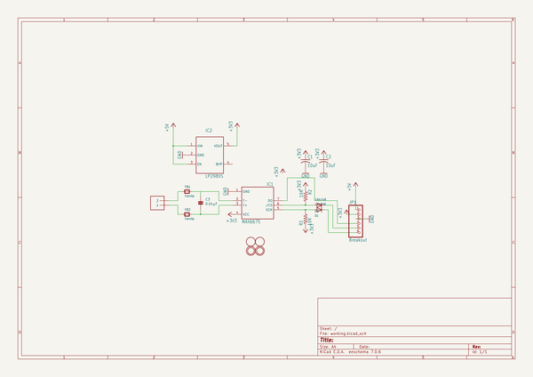
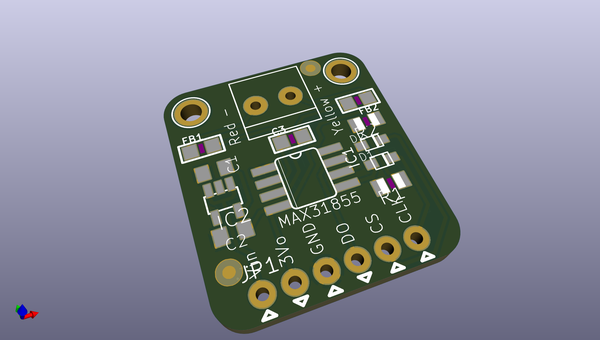
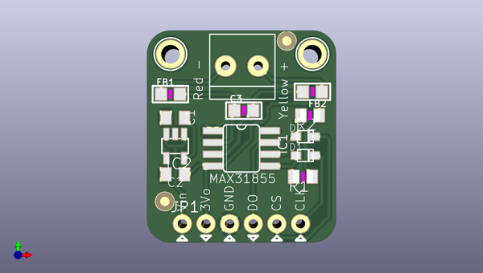
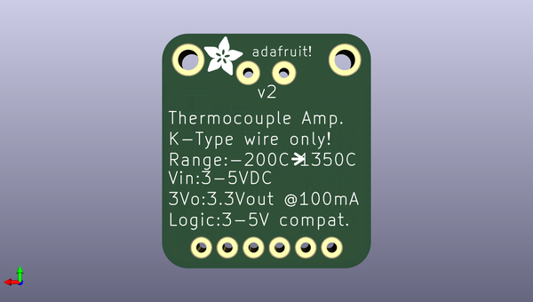

# adafruit_max31855_breakout_board
 
## summary 
* id: adafruit_adafruit_max31855_breakout_board_adafruit_max31855
* user: adafruit
* name: adafruit_max31855_breakout_board
* board: adafruit_max31855
* repo: https://github.com/adafruit/Adafruit-MAX31855-breakout-board

* src_file_repo_sch: 
* src_file_repo_sch_link: https://github.com/adafruit/Adafruit-MAX31855-breakout-board/tree/master/
* full details link: https://github.com/oomlout/oomlout_oomp_project_bot_v_2/tree/main/projects/adafruit_adafruit_max31855_breakout_board_adafruit_max31855/current_version/working  

## schematic  
  
[schematic (pdf)](working_schematic.pdf)  

## pcb  
 
  
  
  
[board (pdf)](working.pdf)  

## working_bom
| Id | Designator | Footprint | Quantity | Designation | Supplier and ref |  | None | 
| --- | --- | --- | --- | --- | --- | --- | --- | 
| 1 | D1 | SOD-323F | 1 | 1n4148 |  |  | [''] | 
| 2 | U$5,U$4 | MOUNTINGHOLE_2.0_PLATED | 2 | MOUNTINGHOLE2.0 |  |  | [''] | 
| 3 | C3 | _0805 | 1 | 0.01µF |  |  | [''] | 
| 4 | R2,R1 | R0805 | 2 | 10K |  |  | [''] | 
| 5 | U$1,U$2 | FIDUCIAL_1MM | 2 | FIDUCIAL |  |  | [''] | 
| 6 | JP1 | 1X06_ROUND_76 | 1 | Breakout |  |  | [''] | 
| 7 | J1 | 1X2-3.5MM | 1 | 1X2-3.5MM |  |  | [''] | 
| 8 | D2 | SOD-323F | 1 | 1N4148 |  |  | [''] | 
| 9 | FB2,FB1 | _0805 | 2 | Ferrite |  |  | [''] | 
| 10 | C2,C1 | C0805K | 2 | 10uF |  |  | [''] | 
| 11 | IC1 | SO08 | 1 | MAX31855 |  |  | [''] | 
| 12 | IC2 | SOT23-5L | 1 | LP298XS |  |  | [''] | 
| 13 | U$6 | ADAFRUIT_3.5MM | 1 |  |  |  | [''] | 

## bom_schematic
| Ref | Qnty | Value | Cmp name | Footprint | Description | Vendor | DNP | 
| --- | --- | --- | --- | --- | --- | --- | --- | 
| C1, C2 | 2 | 10uF | C-USC0805K | working:C0805K |  |  |  | 
| C3 | 1 | 0.01µF | CAP_CERAMIC_0805 | working:_0805 |  |  |  | 
| D1 | 1 | 1n4148 | DIODESOD-323F | working:SOD-323F |  |  |  | 
| D2 | 1 | 1N4148 | DIODESOD-323F | working:SOD-323F |  |  |  | 
| FB1, FB2 | 2 | Ferrite | FERRITE_0805 | working:_0805 |  |  |  | 
| IC1 | 1 | MAX6675 | MAX6675 | working:SO08 |  |  |  | 
| IC2 | 1 | LP298XS | LP298XS | working:SOT23-5L |  |  |  | 
| J1 | 1 | 1X2-3.5MM | 1X2-3.5MM | working:1X2-3.5MM |  |  |  | 
| JP1 | 1 | Breakout | HEADER-1X676MIL | working:1X06_ROUND_76 |  |  |  | 
| R1, R2 | 2 | 10K | R-US_R0805 | working:R0805 |  |  |  | 
| U$1, U$2 | 2 | FIDUCIAL | FIDUCIAL | working:FIDUCIAL_1MM |  |  |  | 
| U$4, U$5 | 2 | MOUNTINGHOLE2.0 | MOUNTINGHOLE2.0 | working:MOUNTINGHOLE_2.0_PLATED |  |  |  | 

## mounting_holes
| x | y | package | value | ref | size | 
| --- | --- | --- | --- | --- | --- | 
| 15.240000000000009 | 0.0 | MOUNTINGHOLE_2.0_PLATED | MOUNTINGHOLE2.0 | U$4 | m3 | 
| 0.0 | 0.0 | MOUNTINGHOLE_2.0_PLATED | MOUNTINGHOLE2.0 | U$5 | m3 | 

