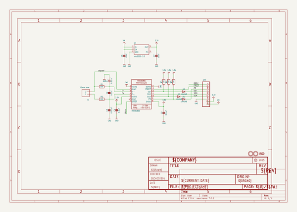
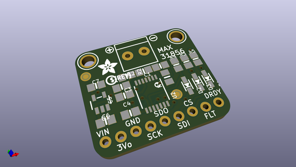
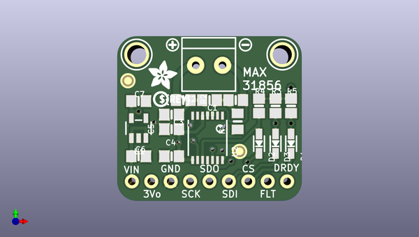
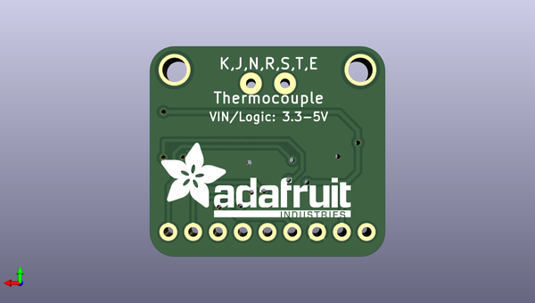

# adafruit_max31856_pcb
 
## summary 
* id: adafruit_adafruit_max31856_pcb_adafruit_max31856
* user: adafruit
* name: adafruit_max31856_pcb
* board: adafruit_max31856
* repo: https://github.com/adafruit/Adafruit-MAX31856-PCB

* src_file_repo_sch: 
* src_file_repo_sch_link: https://github.com/adafruit/Adafruit-MAX31856-PCB/tree/master/
* full details link: https://github.com/oomlout/oomlout_oomp_project_bot_v_2/tree/main/projects/adafruit_adafruit_max31856_pcb_adafruit_max31856/current_version/working  

## schematic  
  
[schematic (pdf)](working_schematic.pdf) 

## pcb  
 
  
  
  
[board (pdf)](working.pdf)  

## working_bom
| Id | Designator | Footprint | Quantity | Designation | Supplier and ref |  | None | 
| --- | --- | --- | --- | --- | --- | --- | --- | 
| 1 | D2,D1,D3 | SOD-323 | 3 | 1N4148 |  |  | [''] | 
| 2 | R2,R1 | 0805-NO | 2 | 100 |  |  | [''] | 
| 3 | C1 | 0805_10MGAP | 1 | 0.01uF |  |  | [''] | 
| 4 | U$13,U$14 | MOUNTINGHOLE_2.5_PLATED | 2 | MOUNTINGHOLE2.5 |  |  | [''] | 
| 5 | C3 | 0805-NO | 1 | 0.01uF |  |  | [''] | 
| 6 | U2 | TSSOP14 | 1 | MAX31856 |  |  | [''] | 
| 7 | R5,R3,R4 | 0805-NO | 3 | 10K |  |  | [''] | 
| 8 | JP1 | 1X09_ROUND_70 | 1 |  |  |  | [''] | 
| 9 | X1 | TERMBLOCK_1X2-3.5MM | 1 | 3.5mm term |  |  | [''] | 
| 10 | U$23 | SYMBOL_PLUS | 1 |  |  |  | [''] | 
| 11 | FID2,FID1 | FIDUCIAL_1MM | 2 | FIDUCIAL" |  |  | [''] | 
| 12 | U$1 | PCBFEAT-REV-040 | 1 |  |  |  | [''] | 
| 13 | C7,C6 | 0805-NO | 2 | 10uF |  |  | [''] | 
| 14 | C2,C4,C5 | 0805-NO | 3 | 0.1uF |  |  | [''] | 
| 15 | U$24 | SYMBOL_MINUS | 1 |  |  |  | [''] | 
| 16 | U$25 | ADAFRUIT_3.5MM | 1 |  |  |  | [''] | 
| 17 | U1 | SOT23-5 | 1 | mic5225-3.3 |  |  | [''] | 
| 18 | U$26 | ADAFRUIT_TEXT_20MM | 1 |  |  |  | [''] | 

## bom_schematic
| Ref | Qnty | Value | Cmp name | Footprint | Description | Vendor | DNP | 
| --- | --- | --- | --- | --- | --- | --- | --- | 
| C1 | 1 | 0.01uF | CAP_CERAMIC0805_10MGAP | working:0805_10MGAP |  |  |  | 
| C2, C4, C5 | 3 | 0.1uF | CAP_CERAMIC0805-NOOUTLINE | working:0805-NO |  |  |  | 
| C3 | 1 | 0.01uF | CAP_CERAMIC0805-NOOUTLINE | working:0805-NO |  |  |  | 
| C6, C7 | 2 | 10uF | CAP_CERAMIC0805-NOOUTLINE | working:0805-NO |  |  |  | 
| D1, D2, D3 | 3 | 1N4148 | DIODESOD-323 | working:SOD-323 |  |  |  | 
| FID1, FID2 | 2 | FIDUCIAL"" | FIDUCIAL{dblquote}{dblquote} | working:FIDUCIAL_1MM |  |  |  | 
| JP1 | 1 | HEADER-1X970MIL | HEADER-1X970MIL | working:1X09_ROUND_70 |  |  |  | 
| R1, R2 | 2 | 100 | RESISTOR0805_NOOUTLINE | working:0805-NO |  |  |  | 
| R3, R4, R5 | 3 | 10K | RESISTOR0805_NOOUTLINE | working:0805-NO |  |  |  | 
| U1 | 1 | mic5225-3.3 | VREG_SOT23-5 | working:SOT23-5 |  |  |  | 
| U2 | 1 | MAX31856 | MAX31856 | working:TSSOP14 |  |  |  | 
| U$13, U$14 | 2 | MOUNTINGHOLE2.5 | MOUNTINGHOLE2.5 | working:MOUNTINGHOLE_2.5_PLATED |  |  |  | 
| X1 | 1 | 3.5mm term | TERMBLOCK_1X2 | working:TERMBLOCK_1X2-3.5MM |  |  |  | 

## mounting_holes
| x | y | package | value | ref | size | 
| --- | --- | --- | --- | --- | --- | 
| 0.0 | 0.0 | MOUNTINGHOLE_2.5_PLATED | MOUNTINGHOLE2.5 | U$13 | m3 | 
| 19.05 | 0.0 | MOUNTINGHOLE_2.5_PLATED | MOUNTINGHOLE2.5 | U$14 | m3 | 

