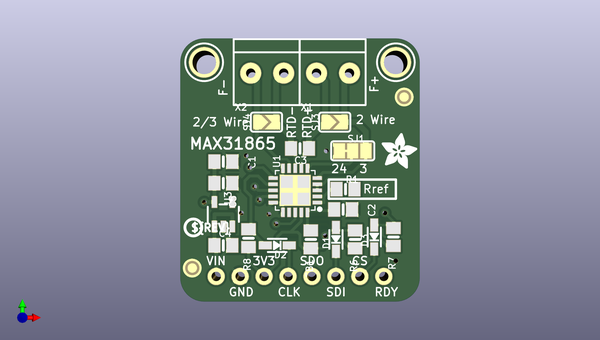

# adafruit_max31865_pcb
 
## summary 
* id: adafruit_adafruit_max31865_pcb_adafruit_max31865
* user: adafruit
* name: adafruit_max31865_pcb
* board: adafruit_max31865
* repo: https://github.com/adafruit/Adafruit-MAX31865-PCB

* src_file_repo_sch: 
* src_file_repo_sch_link: https://github.com/adafruit/Adafruit-MAX31865-PCB/tree/master/
* full details link: https://github.com/oomlout/oomlout_oomp_project_bot_v_2/tree/main/projects/adafruit_adafruit_max31865_pcb_adafruit_max31865/current_version/working  

## schematic  
  
[schematic (pdf)](working_schematic.pdf)  

## pcb  
 
  
  
  
[board (pdf)](working.pdf)  

## working_bom
| Id | Designator | Footprint | Quantity | Designation | Supplier and ref |  | None | 
| --- | --- | --- | --- | --- | --- | --- | --- | 
| 1 | FID1,FID2 | FIDUCIAL_1MM | 2 | FIDUCIAL" |  |  | [''] | 
| 2 | D3,D1,D2 | SOD-323 | 3 | 1N4148 |  |  | [''] | 
| 3 | U1 | QFN20_4MM_0.65MM | 1 | MAX31865 |  |  | [''] | 
| 4 | C4,C5 | 0805-NO | 2 | 10uF |  |  | [''] | 
| 5 | U$18,U$19 | MOUNTINGHOLE_2.5_PLATED | 2 | MOUNTINGHOLE2.5 |  |  | [''] | 
| 6 | U$8 | PCBFEAT-REV-040 | 1 |  |  |  | [''] | 
| 7 | X1,X2 | TERMBLOCK_1X2-3.5MM | 2 | 3.5mm |  |  | [''] | 
| 8 | FB1 | 0805-NO | 1 |  |  |  | [''] | 
| 9 | SJ3,SJ4 | SOLDERJUMPER_ARROW_NOPASTE | 2 |  |  |  | [''] | 
| 10 | R1 | 0805-NO | 1 | 430Ω / 4300Ω 0.1% |  |  | [''] | 
| 11 | C1,C2 | 0805-NO | 2 | 0.1uF |  |  | [''] | 
| 12 | JP1 | 1X08_ROUND_70 | 1 |  |  |  | [''] | 
| 13 | C3 | 0805-NO | 1 | 100nF |  |  | [''] | 
| 14 | SJ1 | SOLDERJUMPER_2WAY_OPEN_NOPASTE | 1 |  |  |  | [''] | 
| 15 | R6,R7,R8 | 0805-NO | 3 | 10K |  |  | [''] | 
| 16 | U3 | SOT23-5 | 1 | MIC5225-3.3 |  |  | [''] | 
| 17 | U$16 | ADAFRUIT_3.5MM | 1 |  |  |  | [''] | 
| 18 | U$21,U$20 | ADAFRUIT_5MM | 2 |  |  |  | [''] | 

## bom_schematic
| Ref | Qnty | Value | Cmp name | Footprint | Description | Vendor | DNP | 
| --- | --- | --- | --- | --- | --- | --- | --- | 
| C1, C2 | 2 | 0.1uF | CAP_CERAMIC0805-NOOUTLINE | working:0805-NO |  |  |  | 
| C3 | 1 | 100nF | CAP_CERAMIC0805-NOOUTLINE | working:0805-NO |  |  |  | 
| C4, C5 | 2 | 10uF | CAP_CERAMIC0805-NOOUTLINE | working:0805-NO |  |  |  | 
| D1, D2, D3 | 3 | 1N4148 | DIODESOD-323 | working:SOD-323 |  |  |  | 
| FB1 | 1 | FERRITE-0805NO | FERRITE-0805NO | working:0805-NO |  |  |  | 
| FID1, FID2 | 2 | FIDUCIAL"" | FIDUCIAL{dblquote}{dblquote} | working:FIDUCIAL_1MM |  |  |  | 
| JP1 | 1 | HEADER-1X870MIL | HEADER-1X870MIL | working:1X08_ROUND_70 |  |  |  | 
| R1 | 1 | 430Ω / 4300Ω 0.1% | RESISTOR0805_NOOUTLINE | working:0805-NO |  |  |  | 
| R6, R7, R8 | 3 | 10K | RESISTOR0805_NOOUTLINE | working:0805-NO |  |  |  | 
| SJ1 | 1 | SOLDERJUMPER_2WAY | SOLDERJUMPER_2WAY | working:SOLDERJUMPER_2WAY_OPEN_NOPASTE |  |  |  | 
| SJ3, SJ4 | 2 | SOLDERJUMPER | SOLDERJUMPER | working:SOLDERJUMPER_ARROW_NOPASTE |  |  |  | 
| U1 | 1 | MAX31865 | TEMP_MAX31865 | working:QFN20_4MM_0.65MM |  |  |  | 
| U3 | 1 | MIC5225-3.3 | VREG_SOT23-5 | working:SOT23-5 |  |  |  | 
| U$18, U$19 | 2 | MOUNTINGHOLE2.5 | MOUNTINGHOLE2.5 | working:MOUNTINGHOLE_2.5_PLATED |  |  |  | 
| X1, X2 | 2 | 3.5mm | TERMBLOCK_1X2 | working:TERMBLOCK_1X2-3.5MM |  |  |  | 

