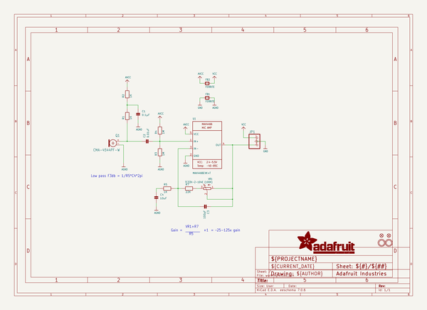
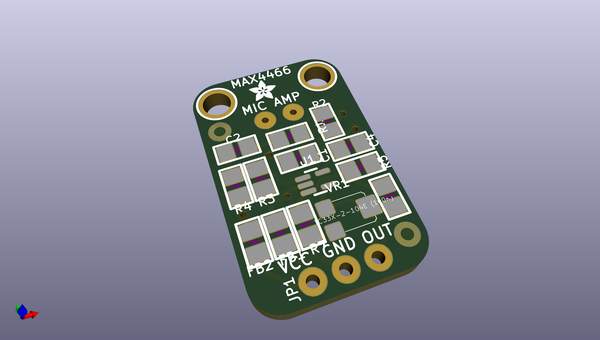
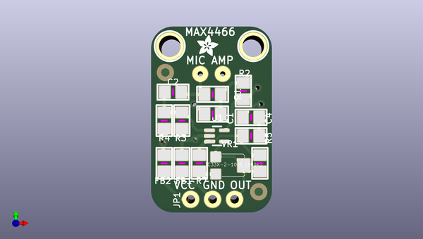
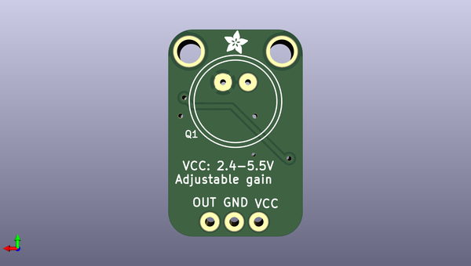

# adafruit_max4466_electret_mic_amplifier_pcbs
 
## summary 
* id: adafruit_adafruit_max4466_electret_mic_amplifier_pcbs_adafruit_max4466_mic_amp
* user: adafruit
* name: adafruit_max4466_electret_mic_amplifier_pcbs
* board: adafruit_max4466_mic_amp
* repo: https://github.com/adafruit/Adafruit-MAX4466-Electret-Mic-Amplifier-PCBs

* src_file_repo_sch: 
* src_file_repo_sch_link: https://github.com/adafruit/Adafruit-MAX4466-Electret-Mic-Amplifier-PCBs/tree/master/
* full details link: https://github.com/oomlout/oomlout_oomp_project_bot_v_2/tree/main/projects/adafruit_adafruit_max4466_electret_mic_amplifier_pcbs_adafruit_max4466_mic_amp/current_version/working  

## schematic  
  
[schematic (pdf)](working_schematic.pdf)  

## pcb  
 
  
  
  
[board (pdf)](working.pdf)  

## working_bom
| Id | Designator | Footprint | Quantity | Designation | Supplier and ref |  | None | 
| --- | --- | --- | --- | --- | --- | --- | --- | 
| 1 | C1 | 0805 | 1 | 0.1µF |  |  | [''] | 
| 2 | FB1,FB2 | 0805 | 2 | FERRITE |  |  | [''] | 
| 3 | U$11,U$14 | MOUNTINGHOLE_2.5_PLATED | 2 | MOUNTINGHOLE2.5 |  |  | [''] | 
| 4 | R3,R4 | 0805 | 2 | 1M |  |  | [''] | 
| 5 | VR1 | TRIMPOT_BOURNS_TC33X-2 | 1 | TC33X-2-104E (100K) |  |  | [''] | 
| 6 | U$16,U$17 | ADAFRUIT_2.5MM | 2 |  |  |  | [''] | 
| 7 | R5,R2,R1 | 0805 | 3 | 1K |  |  | [''] | 
| 8 | U1 | SC70-5 | 1 | MAX4466EXK+T |  |  | [''] | 
| 9 | JP1 | 1X03_ROUND_76 | 1 |  |  |  | [''] | 
| 10 | FID2,FID1 | FIDUCIAL_1MM | 2 | FIDUCIAL" |  |  | [''] | 
| 11 | R7 | 0805 | 1 | 22K |  |  | [''] | 
| 12 | C3 | 0805 | 1 | 100pF |  |  | [''] | 
| 13 | C4 | 0805 | 1 | 10uF |  |  | [''] | 
| 14 | C2 | 0805 | 1 | 0.01uF |  |  | [''] | 
| 15 | Q1 | ELECTRET_9.7 | 1 | CMA-4544PF-W |  |  | [''] | 

## bom_schematic
| Ref | Qnty | Value | Cmp name | Footprint | Description | Vendor | DNP | 
| --- | --- | --- | --- | --- | --- | --- | --- | 
| C1 | 1 | 0.1µF | CAP_CERAMIC0805 | working:0805 |  |  |  | 
| C2 | 1 | 0.01uF | CAP_CERAMIC0805 | working:0805 |  |  |  | 
| C3 | 1 | 100pF | CAP_CERAMIC0805 | working:0805 |  |  |  | 
| C4 | 1 | 10uF | CAP_CERAMIC0805 | working:0805 |  |  |  | 
| FB1, FB2 | 2 | FERRITE | FERRITE0805 | working:0805 |  |  |  | 
| FID1, FID2 | 2 | FIDUCIAL"" | FIDUCIAL{dblquote}{dblquote} | working:FIDUCIAL_1MM |  |  |  | 
| JP1 | 1 | HEADER-1X376MIL | HEADER-1X376MIL | working:1X03_ROUND_76 |  |  |  | 
| Q1 | 1 | CMA-4544PF-W | ELECTRET | working:ELECTRET_9.7 |  |  |  | 
| R1, R2, R5 | 3 | 1K | RESISTOR0805 | working:0805 |  |  |  | 
| R3, R4 | 2 | 1M | RESISTOR0805 | working:0805 |  |  |  | 
| R7 | 1 | 22K | RESISTOR0805 | working:0805 |  |  |  | 
| U1 | 1 | MAX4466EXK+T | MAX4466{dblquote}{dblquote} | working:SC70-5 |  |  |  | 
| U$11, U$14 | 2 | MOUNTINGHOLE2.5 | MOUNTINGHOLE2.5 | working:MOUNTINGHOLE_2.5_PLATED |  |  |  | 
| VR1 | 1 | TC33X-2-104E (100K) | TRIMPOTTC33X-2 | working:TRIMPOT_BOURNS_TC33X-2 |  |  |  | 

## mounting_holes
| x | y | package | value | ref | size | 
| --- | --- | --- | --- | --- | --- | 
| 0.0 | 0.0 | MOUNTINGHOLE_2.5_PLATED | MOUNTINGHOLE2.5 | U$11 | m3 | 
| 9.652000000000015 | 0.0 | MOUNTINGHOLE_2.5_PLATED | MOUNTINGHOLE2.5 | U$14 | m3 | 

