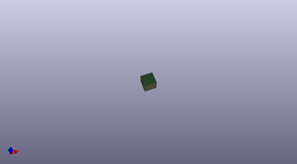

# adafruit_max9744_amplifier_pcb
 
## summary 
* id: adafruit_adafruit_max9744_amplifier_pcb_adafruit_max9744
* user: adafruit
* name: adafruit_max9744_amplifier_pcb
* board: adafruit_max9744
* repo: https://github.com/adafruit/Adafruit-MAX9744-Amplifier-PCB

* src_file_repo_sch: 
* src_file_repo_sch_link: https://github.com/adafruit/Adafruit-MAX9744-Amplifier-PCB/tree/master/
* full details link: https://github.com/oomlout/oomlout_oomp_project_bot_v_2/tree/main/projects/adafruit_adafruit_max9744_amplifier_pcb_adafruit_max9744/current_version/working  

## schematic  
  
[schematic (pdf)](working_schematic.pdf)  

## pcb  
 
  
  
  
[board (pdf)](working.pdf)  

## bom_schematic
| Ref | Qnty | Value | Cmp name | Footprint | Description | Vendor | DNP | 
| --- | --- | --- | --- | --- | --- | --- | --- | 
| C1 | 1 | 330µF | CAP_ELECTROLYTICPTH_3.5MMGRID_8MMDIA | working:CELEC_3.5MM_8MM |  |  |  | 
| C2, C3, C4 | 3 | 10µF | CAP_CERAMIC0805-NOOUTLINE | working:0805-NO |  |  |  | 
| C5 | 1 | 2.2µF | CAP_CERAMIC0805-NOOUTLINE | working:0805-NO |  |  |  | 
| C6, C8, C10, C11, C13, C15 | 6 | 0.1µF | CAP_CERAMIC0805-NOOUTLINE | working:0805-NO |  |  |  | 
| C7, C9, C16, C17 | 4 | 470pF | CAP_CERAMIC0805-NOOUTLINE | working:0805-NO |  |  |  | 
| C22, C23 | 2 | 0.47µF | CAP_CERAMIC0805-NOOUTLINE | working:0805-NO |  |  |  | 
| CN1 | 1 | 2.1mm | DCBARRELSMT_CORRECT | working:DCJACK_2MM_SMT |  |  |  | 
| D1, D2, D3, D4 | 4 | 1N4148 | DIODESOD-323 | working:SOD-323 |  |  |  | 
| FB1, FB2, FB3, FB4, FB5 | 5 | MPZ2012S221A | FERRITE_0805 | working:_0805 |  |  |  | 
| FID1, FID2 | 2 | FIDUCIAL"" | FIDUCIAL{dblquote}{dblquote} | working:FIDUCIAL_1MM |  |  |  | 
| J1 | 1 | 3.5mm | TERMBLOCK_1X2 | working:TERMBLOCK_1X2-3.5MM |  |  |  | 
| J2 | 1 | SPKRIGHT | TERMBLOCK_1X2 | working:TERMBLOCK_1X2-3.5MM |  |  |  | 
| J3 | 1 | SPKLEFT | TERMBLOCK_1X2 | working:TERMBLOCK_1X2-3.5MM |  |  |  | 
| JP2 | 1 | HEADER-1X14 | HEADER-1X14 | working:1X14_ROUND70 |  |  |  | 
| Q1 | 1 | AOD417 | MOSFET-PTO252 | working:TO252 |  |  |  | 
| Q2, Q4 | 2 | BSS138 | MOSFET-NWIDE | working:SOT23-WIDE |  |  |  | 
| Q3 | 1 | BS138 | MOSFET-NWIDE | working:SOT23-WIDE |  |  |  | 
| R1, R3, R4, R5, R12 | 5 | 10K | RESISTOR0805_NOOUTLINE | working:0805-NO |  |  |  | 
| R2, R10, R11, R14, R15 | 5 | 10K | RESISTOR_0805MP | working:_0805MP |  |  |  | 
| R6, R7, R8, R9 | 4 | 20K | RESISTOR0805_NOOUTLINE | working:0805-NO |  |  |  | 
| SJ1, SJ3, SJ4, SJ5 | 4 | SOLDERJUMPER | SOLDERJUMPER | working:SOLDERJUMPER_ARROW_NOPASTE |  |  |  | 
| U1 | 1 | MAX9744 | AUDIOAMP_MAX9744 | working:TQFN44_7MM |  |  |  | 
| U2 | 1 | MIC5225-3.3 | VREG_SOT23-5 | working:SOT23-5 |  |  |  | 
| U$29, U$38, U$39, U$40 | 4 | MOUNTINGHOLE2.5_THICK | MOUNTINGHOLE2.5_THICK | working:MOUNTINGHOLE_2.5_PLATED_THICK |  |  |  | 
| VR1 | 1 | Must be <1Kohm | TRIMPOT100MIL | working:TRIMPOT_100MILPTH |  |  |  | 
| X1 | 1 | 3.5mm | TERMBLOCK_1X3 | working:TERMBLOCK_1X3-3.5MM |  |  |  | 
| X2 | 1 | 3.5mm | AUDIO_3.5MMJACK | working:4UCONN_19269 |  |  |  | 

