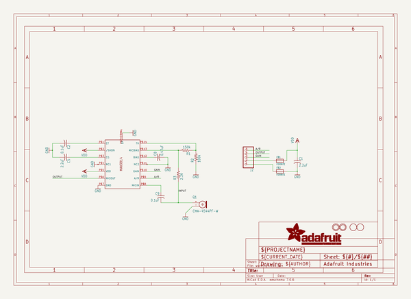

# adafruit_max9814_agc_microphone_pcb
 
## summary 
* id: adafruit_adafruit_max9814_agc_microphone_pcb_adafruit_max9814
* user: adafruit
* name: adafruit_max9814_agc_microphone_pcb
* board: adafruit_max9814
* repo: https://github.com/adafruit/Adafruit-MAX9814-AGC-Microphone-PCB

* src_file_repo_sch: 
* src_file_repo_sch_link: https://github.com/adafruit/Adafruit-MAX9814-AGC-Microphone-PCB/tree/master/
* full details link: https://github.com/oomlout/oomlout_oomp_project_bot_v_2/tree/main/projects/adafruit_adafruit_max9814_agc_microphone_pcb_adafruit_max9814/current_version/working  

## schematic  
  
[schematic (pdf)](working_schematic.pdf) 

## pcb  
 
  
  
  
[board (pdf)](working.pdf)  

## bom_schematic
| Ref | Qnty | Value | Cmp name | Footprint | Description | Vendor | DNP | 
| --- | --- | --- | --- | --- | --- | --- | --- | 
| C1, C5 | 2 | 2.2uF | C-USC0805K | working:C0805K |  |  |  | 
| C2, C9 | 2 | 0.1uF | C-USC0805K | working:C0805K |  |  |  | 
| C8 | 1 | 0.47uF | C-USC0805K | working:C0805K |  |  |  | 
| FB1, FB2 | 2 | FERRITE | FERRITE0805 | working:0805 |  |  |  | 
| J2 | 1 | HEADER-1X576MIL | HEADER-1X576MIL | working:1X05_ROUND_76 |  |  |  | 
| Q1 | 1 | CMA-4544PF-W | ELECTRET | working:9.7ELECTRET |  |  |  | 
| R1 | 1 | 150k | R-US_R0805 | working:R0805 |  |  |  | 
| R2 | 1 | 100k | R-US_R0805 | working:R0805 |  |  |  | 
| R3 | 1 | 2.2K | R-US_R0805 | working:R0805 |  |  |  | 
| U$1 | 1 | MAX9814TDFN14 | MAX9814TDFN14 | working:TDFN14_3X3MM |  |  |  | 
| U$2, U$3 | 2 | FIDUCIAL | FIDUCIAL | working:FIDUCIAL_1MM |  |  |  | 
| U$4, U$5 | 2 | MOUNTINGHOLE2.0 | MOUNTINGHOLE2.0 | working:MOUNTINGHOLE_2.0_PLATED |  |  |  | 

