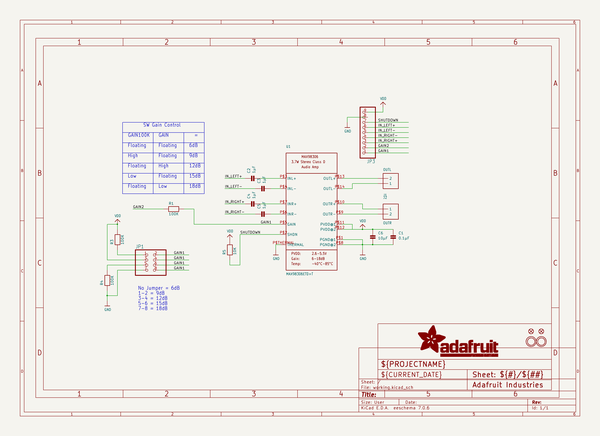
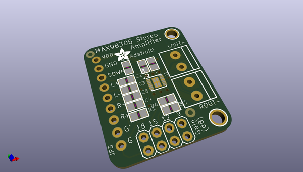
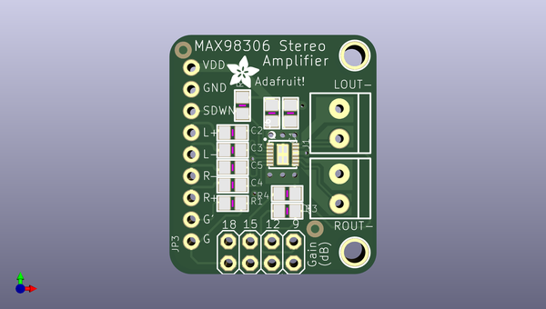
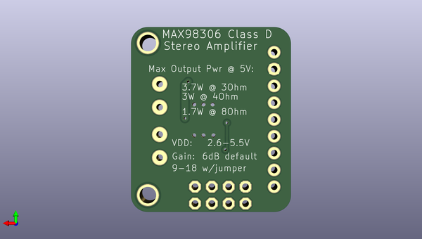

# adafruit_max98306_class_d_amp_pcb
 
## summary 
* id: adafruit_adafruit_max98306_class_d_amp_pcb_adafruit_max98306
* user: adafruit
* name: adafruit_max98306_class_d_amp_pcb
* board: adafruit_max98306
* repo: https://github.com/adafruit/Adafruit-MAX98306-Class-D-Amp-PCB

* src_file_repo_sch: 
* src_file_repo_sch_link: https://github.com/adafruit/Adafruit-MAX98306-Class-D-Amp-PCB/tree/master/
* full details link: https://github.com/oomlout/oomlout_oomp_project_bot_v_2/tree/main/projects/adafruit_adafruit_max98306_class_d_amp_pcb_adafruit_max98306/current_version/working  

## schematic  
  
[schematic (pdf)](working_schematic.pdf)  

## pcb  
 
  
  
  
[board (pdf)](working.pdf)  

## working_bom
| Id | Designator | Footprint | Quantity | Designation | Supplier and ref |  | None | 
| --- | --- | --- | --- | --- | --- | --- | --- | 
| 1 | U$7,U$6 | MOUNTINGHOLE_2.5_PLATED | 2 | MOUNTINGHOLE2.5 |  |  | [''] | 
| 2 | C3,C2,C4,C5 | 0805 | 4 | 1µF |  |  | [''] | 
| 3 | JP1 | 2X04 | 1 |  |  |  | [''] | 
| 4 | U$10 | ADAFRUIT_3.5MM | 1 |  |  |  | [''] | 
| 5 | R5 | 0805 | 1 | 10K |  |  | [''] | 
| 6 | R4,R3,R1 | 0805 | 3 | 100K |  |  | [''] | 
| 7 | FID2,FID1 | FIDUCIAL_1MM | 2 | FIDUCIAL" |  |  | [''] | 
| 8 | J1 | TERMBLOCK_1X2-3.5MM | 1 | OUTL |  |  | [''] | 
| 9 | C6 | 0805 | 1 | 10µF |  |  | [''] | 
| 10 | U1 | TDFN14_3X3MM | 1 | MAX98306ETD+T |  |  | [''] | 
| 11 | J2 | TERMBLOCK_1X2-3.5MM | 1 | OUTR |  |  | [''] | 
| 12 | JP3 | 1X09_ROUND_70 | 1 |  |  |  | [''] | 
| 13 | C1 | 0805 | 1 | 0.1µF |  |  | [''] | 

## bom_schematic
| Ref | Qnty | Value | Cmp name | Footprint | Description | Vendor | DNP | 
| --- | --- | --- | --- | --- | --- | --- | --- | 
| C1 | 1 | 0.1µF | CAP_CERAMIC0805 | working:0805 |  |  |  | 
| C2, C3, C4, C5 | 4 | 1µF | CAP_CERAMIC0805 | working:0805 |  |  |  | 
| C6 | 1 | 10µF | CAP_CERAMIC0805 | working:0805 |  |  |  | 
| FID1, FID2 | 2 | FIDUCIAL"" | FIDUCIAL{dblquote}{dblquote} | working:FIDUCIAL_1MM |  |  |  | 
| J1 | 1 | OUTL | TERMBLOCK_1X2 | working:TERMBLOCK_1X2-3.5MM |  |  |  | 
| J2 | 1 | OUTR | TERMBLOCK_1X2 | working:TERMBLOCK_1X2-3.5MM |  |  |  | 
| JP1 | 1 | PINHD-2X4 | PINHD-2X4 | working:2X04 |  |  |  | 
| JP3 | 1 | HEADER-1X970MIL | HEADER-1X970MIL | working:1X09_ROUND_70 |  |  |  | 
| R1, R3, R4 | 3 | 100K | RESISTOR0805 | working:0805 |  |  |  | 
| R5 | 1 | 10K | RESISTOR0805 | working:0805 |  |  |  | 
| U1 | 1 | MAX98306ETD+T | AUDIOAMP_MAX98306 | working:TDFN14_3X3MM |  |  |  | 
| U$6, U$7 | 2 | MOUNTINGHOLE2.5 | MOUNTINGHOLE2.5 | working:MOUNTINGHOLE_2.5_PLATED |  |  |  | 

## mounting_holes
| x | y | package | value | ref | size | 
| --- | --- | --- | --- | --- | --- | 
| 0.0 | 0.0 | MOUNTINGHOLE_2.5_PLATED | MOUNTINGHOLE2.5 | U$6 | m3 | 
| 0.0 | 22.986999999999995 | MOUNTINGHOLE_2.5_PLATED | MOUNTINGHOLE2.5 | U$7 | m3 | 

