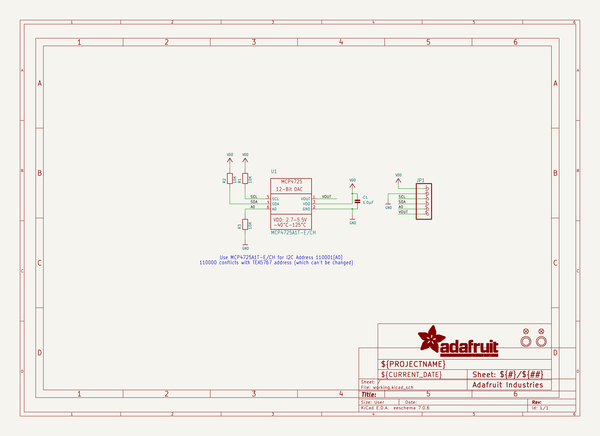
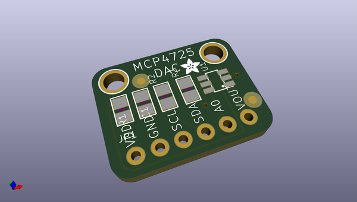
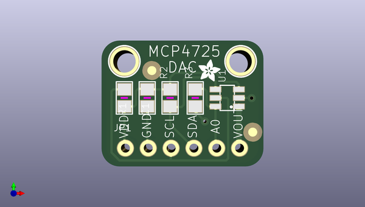
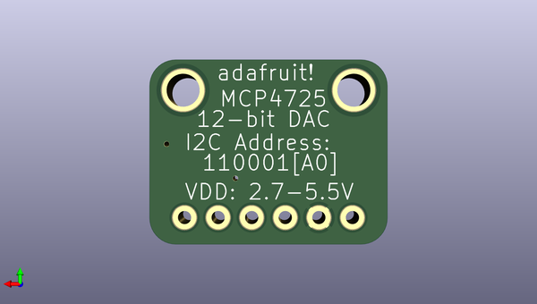

# adafruit_mcp4725_pcb
 
## summary 
* id: adafruit_adafruit_mcp4725_pcb_adafruit_mcp4725_qt
* user: adafruit
* name: adafruit_mcp4725_pcb
* board: adafruit_mcp4725_qt
* repo: https://github.com/adafruit/Adafruit-MCP4725-PCB

* src_file_repo_sch: 
* src_file_repo_sch_link: https://github.com/adafruit/Adafruit-MCP4725-PCB/tree/master/
* full details link: https://github.com/oomlout/oomlout_oomp_project_bot_v_2/tree/main/projects/adafruit_adafruit_mcp4725_pcb_adafruit_mcp4725_qt/current_version/working  

## schematic  
  
[schematic (pdf)](working_schematic.pdf) 

## pcb  
 
  
  
  
[board (pdf)](working.pdf)  

## working_bom
| Id | Designator | Footprint | Quantity | Designation | Supplier and ref |  | None | 
| --- | --- | --- | --- | --- | --- | --- | --- | 
| 1 | R1,R3,R2 | 0805 | 3 | 10K |  |  | [''] | 
| 2 | U$11 | ADAFRUIT_2.5MM | 1 |  |  |  | [''] | 
| 3 | U$8,U$7 | MOUNTINGHOLE_2.5_PLATED | 2 | MOUNTINGHOLE2.5 |  |  | [''] | 
| 4 | FID1,FID2 | FIDUCIAL_1MM | 2 | FIDUCIAL" |  |  | [''] | 
| 5 | C1 | 0805 | 1 | 1.0µF |  |  | [''] | 
| 6 | JP1 | 1X06_ROUND_70 | 1 |  |  |  | [''] | 
| 7 | U1 | SOT23-6 | 1 | MCP4725A1T-E/CH |  |  | [''] | 

## bom_schematic
| Ref | Qnty | Value | Cmp name | Footprint | Description | Vendor | DNP | 
| --- | --- | --- | --- | --- | --- | --- | --- | 
| C1 | 1 | 1.0µF | CAP_CERAMIC0805 | working:0805 |  |  |  | 
| FID1, FID2 | 2 | FIDUCIAL"" | FIDUCIAL{dblquote}{dblquote} | working:FIDUCIAL_1MM |  |  |  | 
| JP1 | 1 | HEADER-1X670MIL | HEADER-1X670MIL | working:1X06_ROUND_70 |  |  |  | 
| R1, R2, R3 | 3 | 10K | RESISTOR0805 | working:0805 |  |  |  | 
| U1 | 1 | MCP4725A1T-E/CH | DAC_MCP4725 | working:SOT23-6 |  |  |  | 
| U$7, U$8 | 2 | MOUNTINGHOLE2.5 | MOUNTINGHOLE2.5 | working:MOUNTINGHOLE_2.5_PLATED |  |  |  | 

## mounting_holes
| x | y | package | value | ref | size | 
| --- | --- | --- | --- | --- | --- | 
| 0.0 | 0.0 | MOUNTINGHOLE_2.5_PLATED | MOUNTINGHOLE2.5 | U$7 | m3 | 
| 12.92 | 0.0 | MOUNTINGHOLE_2.5_PLATED | MOUNTINGHOLE2.5 | U$8 | m3 | 

