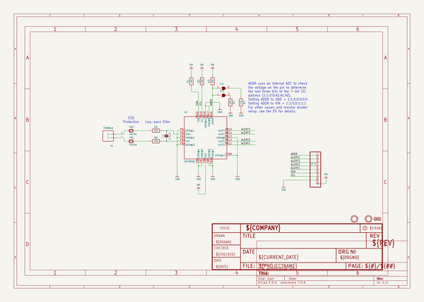

# adafruit_mcp9600_pcb
 
## summary 
* id: adafruit_adafruit_mcp9600_pcb_adafruit_mcp9600
* user: adafruit
* name: adafruit_mcp9600_pcb
* board: adafruit_mcp9600
* repo: https://github.com/adafruit/Adafruit-MCP9600-PCB

* src_file_repo_sch: 
* src_file_repo_sch_link: https://github.com/adafruit/Adafruit-MCP9600-PCB/tree/master/
* full details link: https://github.com/oomlout/oomlout_oomp_project_bot_v_2/tree/main/projects/adafruit_adafruit_mcp9600_pcb_adafruit_mcp9600/current_version/working  

## schematic  
  
[schematic (pdf)](working_schematic.pdf) 

## pcb  
 
  
  
  
[board (pdf)](working.pdf)  

## bom_schematic
| Ref | Qnty | Value | Cmp name | Footprint | Description | Vendor | DNP | 
| --- | --- | --- | --- | --- | --- | --- | --- | 
| C1 | 1 | 0.1uF | CAP_CERAMIC0603_NO | working:0603-NO |  |  |  | 
| FB1, FB2 | 2 | Ferrite | FERRITE-0805NO | working:0805-NO |  |  |  | 
| FID1, FID2 | 2 | FIDUCIAL_1MM | FIDUCIAL_1MM | working:FIDUCIAL_1MM |  |  |  | 
| JP3 | 1 | HEADER-1X970MIL | HEADER-1X970MIL | working:1X09_ROUND_70 |  |  |  | 
| R1, R2, R3 | 3 | 10K | RESISTOR_0603_NOOUT | working:0603-NO |  |  |  | 
| R4 | 1 | 22K | RESISTOR_0603_NOOUT | working:0603-NO |  |  |  | 
| R5, R6 | 2 | 100 | RESISTOR_0603_NOOUT | working:0603-NO |  |  |  | 
| R7 | 1 | 47K | RESISTOR_0603_NOOUT | working:0603-NO |  |  |  | 
| SJ1, SJ2 | 2 | SOLDERJUMPER | SOLDERJUMPER | working:SOLDERJUMPER_ARROW_NOPASTE |  |  |  | 
| U1 | 1 | MCP9600 | MCP9600 | working:VQFN20_5MM |  |  |  | 
| U$1, U$3 | 2 | MOUNTINGHOLE2.5 | MOUNTINGHOLE2.5 | working:MOUNTINGHOLE_2.5_PLATED |  |  |  | 
| X1 | 1 | TERMBLK | TERMBLOCK_1X2_3.5MM | working:TERMBLOCK_1X2-3.5MM |  |  |  | 

