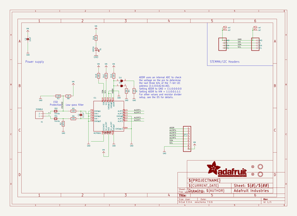
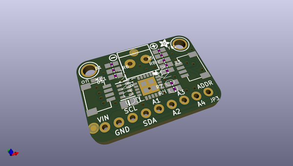
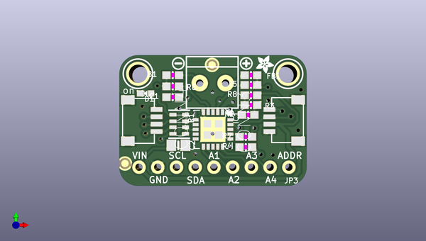
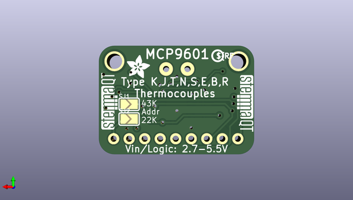

# adafruit_mcp9601_pcb
 
## summary 
* id: adafruit_adafruit_mcp9601_pcb_adafruit_mcp9601
* user: adafruit
* name: adafruit_mcp9601_pcb
* board: adafruit_mcp9601
* repo: https://github.com/adafruit/Adafruit-MCP9601-PCB

* src_file_repo_sch: 
* src_file_repo_sch_link: https://github.com/adafruit/Adafruit-MCP9601-PCB/tree/main/
* full details link: https://github.com/oomlout/oomlout_oomp_project_bot_v_2/tree/main/projects/adafruit_adafruit_mcp9601_pcb_adafruit_mcp9601/current_version/working  

## schematic  
  
[schematic (pdf)](working_schematic.pdf)  

## pcb  
 
  
  
  
[board (pdf)](working.pdf)  

## working_bom
| Id | Designator | Footprint | Quantity | Designation | Supplier and ref |  | None | 
| --- | --- | --- | --- | --- | --- | --- | --- | 
| 1 | U$16 | ADAFRUIT_2.5MM | 1 |  |  |  | [''] | 
| 2 | FID3,FID4 | FIDUCIAL_1MM | 2 | FIDUCIAL_1MM |  |  | [''] | 
| 3 | D1 | CHIPLED_0603_NOOUTLINE | 1 | GREEN |  |  | [''] | 
| 4 | CONN4,CONN3 | JST_SH4 | 2 | STEMMA_I2C_QT |  |  | [''] | 
| 5 | U$18 | SYMBOL_MINUS | 1 |  |  |  | [''] | 
| 6 | FB1,FB2 | 0603-NO | 2 | Ferrite |  |  | [''] | 
| 7 | R3 | 0603-NO | 1 | 2.5M |  |  | [''] | 
| 8 | U$17 | SYMBOL_PLUS | 1 |  |  |  | [''] | 
| 9 | R2 | 0603-NO | 1 | 487K |  |  | [''] | 
| 10 | U$33,U$34 | MOUNTINGHOLE_2.5_PLATED | 2 | MOUNTINGHOLE2.5 |  |  | [''] | 
| 11 | R6,R5 | 0603-NO | 2 | 100 |  |  | [''] | 
| 12 | R7 | 0603-NO | 1 | 47K |  |  | [''] | 
| 13 | IC1 | VQFN20_5MM | 1 | MCP9601 |  |  | [''] | 
| 14 | C1 | 0603-NO | 1 | 0.1uF |  |  | [''] | 
| 15 | JP3 | 1X09_ROUND_70 | 1 |  |  |  | [''] | 
| 16 | C2 | 0805-NO | 1 | 10uF |  |  | [''] | 
| 17 | X1 | TERMBLOCK_1X2-3.5MM | 1 | TERMBLK |  |  | [''] | 
| 18 | R8 | 0603-NO | 1 | 2M |  |  | [''] | 
| 19 | R4 | 0603-NO | 1 | 22K |  |  | [''] | 
| 20 | R1 | RESPACK_4X0603 | 1 | 10K |  |  | [''] | 
| 21 | U$20 | ADAFRUIT_3.5MM | 1 |  |  |  | [''] | 
| 22 | SJ2,SJ1 | SOLDERJUMPER_ARROW_NOPASTE | 2 |  |  |  | [''] | 
| 23 | U$41,U$42 | STEMMAQT | 2 |  |  |  | [''] | 
| 24 | U$40 | PCBFEAT-REV-040 | 1 |  |  |  | [''] | 

## bom_schematic
| Ref | Qnty | Value | Cmp name | Footprint | Description | Vendor | DNP | 
| --- | --- | --- | --- | --- | --- | --- | --- | 
| C1 | 1 | 0.1uF | CAP_CERAMIC0603_NO | working:0603-NO |  |  |  | 
| C2 | 1 | 10uF | CAP_CERAMIC0805-NOOUTLINE | working:0805-NO |  |  |  | 
| CONN3, CONN4 | 2 | STEMMA_I2C_QT | STEMMA_I2C_QT | working:JST_SH4 |  |  |  | 
| D1 | 1 | GREEN | LED0603_NOOUTLINE | working:CHIPLED_0603_NOOUTLINE |  |  |  | 
| FB1, FB2 | 2 | Ferrite | FERRITE-0603NO | working:0603-NO |  |  |  | 
| FID3, FID4 | 2 | FIDUCIAL_1MM | FIDUCIAL_1MM | working:FIDUCIAL_1MM |  |  |  | 
| IC1 | 1 | MCP9601 | MCP9601 | working:VQFN20_5MM |  |  |  | 
| JP3 | 1 | HEADER-1X970MIL | HEADER-1X970MIL | working:1X09_ROUND_70 |  |  |  | 
| R1 | 1 | 10K | RESISTOR_4PACK | working:RESPACK_4X0603 |  |  |  | 
| R2 | 1 | 487K | RESISTOR_0603_NOOUT | working:0603-NO |  |  |  | 
| R3 | 1 | 2.5M | RESISTOR_0603_NOOUT | working:0603-NO |  |  |  | 
| R4 | 1 | 22K | RESISTOR_0603_NOOUT | working:0603-NO |  |  |  | 
| R5, R6 | 2 | 100 | RESISTOR_0603_NOOUT | working:0603-NO |  |  |  | 
| R7 | 1 | 47K | RESISTOR_0603_NOOUT | working:0603-NO |  |  |  | 
| R8 | 1 | 2M | RESISTOR_0603_NOOUT | working:0603-NO |  |  |  | 
| SJ1, SJ2 | 2 | SOLDERJUMPER | SOLDERJUMPER | working:SOLDERJUMPER_ARROW_NOPASTE |  |  |  | 
| U$33, U$34 | 2 | MOUNTINGHOLE2.5 | MOUNTINGHOLE2.5 | working:MOUNTINGHOLE_2.5_PLATED |  |  |  | 
| X1 | 1 | TERMBLK | TERMBLOCK_1X2_3.5MM | working:TERMBLOCK_1X2-3.5MM |  |  |  | 

## mounting_holes
| x | y | package | value | ref | size | 
| --- | --- | --- | --- | --- | --- | 
| 0.0 | 0.0 | MOUNTINGHOLE_2.5_PLATED | MOUNTINGHOLE2.5 | U$33 | m3 | 
| 20.319999999999993 | 0.0 | MOUNTINGHOLE_2.5_PLATED | MOUNTINGHOLE2.5 | U$34 | m3 | 

