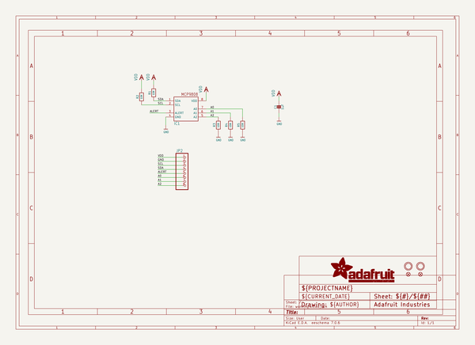
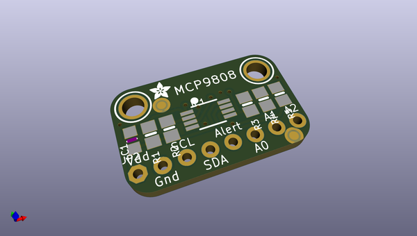
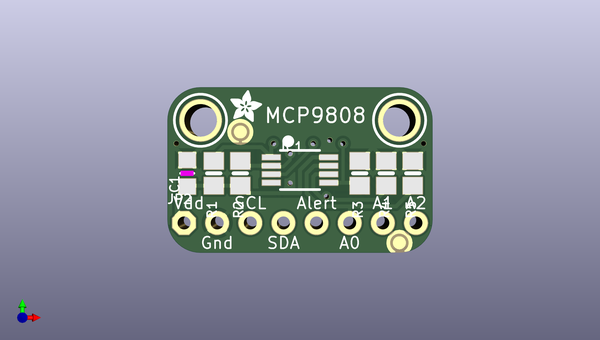
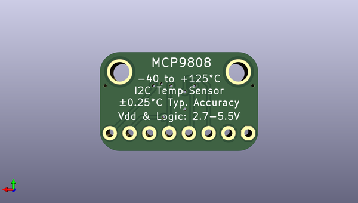

# adafruit_mcp9808_breakout_pcb
 
## summary 
* id: adafruit_adafruit_mcp9808_breakout_pcb_adafruit_mcp9808_breakout
* user: adafruit
* name: adafruit_mcp9808_breakout_pcb
* board: adafruit_mcp9808_breakout
* repo: https://github.com/adafruit/Adafruit-MCP9808-Breakout-PCB

* src_file_repo_sch: 
* src_file_repo_sch_link: https://github.com/adafruit/Adafruit-MCP9808-Breakout-PCB/tree/master/
* full details link: https://github.com/oomlout/oomlout_oomp_project_bot_v_2/tree/main/projects/adafruit_adafruit_mcp9808_breakout_pcb_adafruit_mcp9808_breakout/current_version/working  

## schematic  
  
[schematic (pdf)](working_schematic.pdf) 

## pcb  
 
  
  
  
[board (pdf)](working.pdf)  

## working_bom
| Id | Designator | Footprint | Quantity | Designation | Supplier and ref |  | None | 
| --- | --- | --- | --- | --- | --- | --- | --- | 
| 1 | R4,R1,R3,R5,R2 | 0805-NO | 5 | 10K |  |  | [''] | 
| 2 | C1 | _0805MP | 1 | 1uF |  |  | [''] | 
| 3 | U$5,U$3 | MOUNTINGHOLE_2.5_PLATED | 2 | MOUNTINGHOLE2.5 |  |  | [''] | 
| 4 | FID1,FID2 | FIDUCIAL_1MM | 2 | FIDUCIAL" |  |  | [''] | 
| 5 | IC1 | MSOP8_0.65MM | 1 | MCP9808-E/MS |  |  | [''] | 
| 6 | JP2 | 1X08_ROUND_70 | 1 |  |  |  | [''] | 
| 7 | U$4 | ADAFRUIT_2.5MM | 1 |  |  |  | [''] | 

## bom_schematic
| Ref | Qnty | Value | Cmp name | Footprint | Description | Vendor | DNP | 
| --- | --- | --- | --- | --- | --- | --- | --- | 
| C1 | 1 | 1uF | CAP_CERAMIC_0805MP | working:_0805MP |  |  |  | 
| FID1, FID2 | 2 | FIDUCIAL"" | FIDUCIAL{dblquote}{dblquote} | working:FIDUCIAL_1MM |  |  |  | 
| IC1 | 1 | MCP9808-E/MS | MCP9808-E/MS | working:MSOP8_0.65MM |  |  |  | 
| JP2 | 1 | HEADER-1X870MIL | HEADER-1X870MIL | working:1X08_ROUND_70 |  |  |  | 
| R1, R2, R3, R4, R5 | 5 | 10K | RESISTOR0805_NOOUTLINE | working:0805-NO |  |  |  | 
| U$3, U$5 | 2 | MOUNTINGHOLE2.5 | MOUNTINGHOLE2.5 | working:MOUNTINGHOLE_2.5_PLATED |  |  |  | 

## mounting_holes
| x | y | package | value | ref | size | 
| --- | --- | --- | --- | --- | --- | 
| 0.0 | 0.0 | MOUNTINGHOLE_2.5_PLATED | MOUNTINGHOLE2.5 | U$3 | m3 | 
| 15.24 | 0.0 | MOUNTINGHOLE_2.5_PLATED | MOUNTINGHOLE2.5 | U$5 | m3 | 

