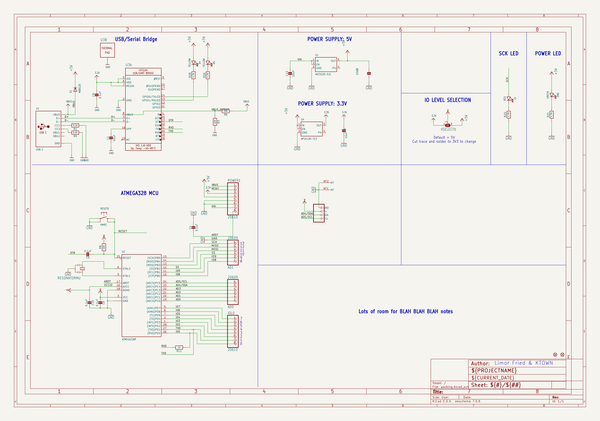
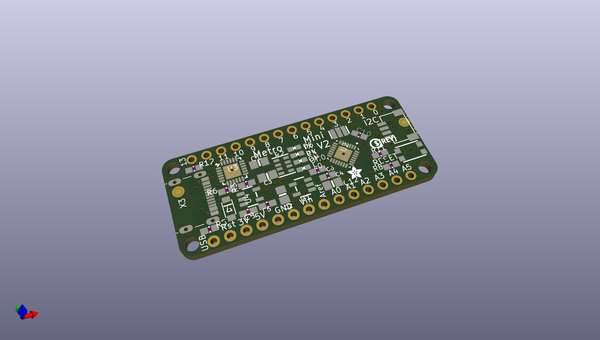
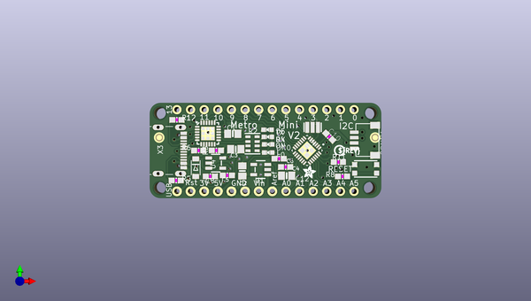
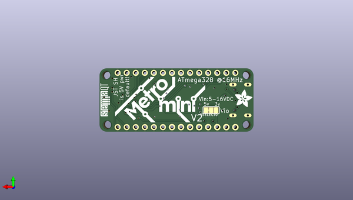

# adafruit_metro_328_pcb
 
## summary 
* id: adafruit_adafruit_metro_328_pcb_metro_thm_ldo_rev_b
* user: adafruit
* name: adafruit_metro_328_pcb
* board: metro_thm_ldo_rev_b
* repo: https://github.com/adafruit/Adafruit-METRO-328-PCB

* src_file_repo_sch: 
* src_file_repo_sch_link: https://github.com/adafruit/Adafruit-METRO-328-PCB/tree/master/
* full details link: https://github.com/oomlout/oomlout_oomp_project_bot_v_2/tree/main/projects/adafruit_adafruit_metro_328_pcb_metro_thm_ldo_rev_b/current_version/working  

## schematic  
  
[schematic (pdf)](working_schematic.pdf) 

## pcb  
 
  
  
  
[board (pdf)](working.pdf)  

## working_bom
| Id | Designator | Footprint | Quantity | Designation | Supplier and ref |  | None | 
| --- | --- | --- | --- | --- | --- | --- | --- | 
| 1 | D1 | SOD-123FL | 1 | MBR120 |  |  | [''] | 
| 2 | AD0,AD1 | 1X06_ROUND | 2 | 20609 |  |  | [''] | 
| 3 | @HOLE3,@HOLE2,@HOLE1,@HOLE0 |  | 4 |  |  |  | [''] | 
| 4 | R11 | 0603-NO | 1 | 1K |  |  | [''] | 
| 5 | C1,C2,C12,C3 | 0805-NO | 4 | 10uF |  |  | [''] | 
| 6 | U$4 | PCBFEAT-REV-040 | 1 |  |  |  | [''] | 
| 7 | U3 | QFN24_4MM_SMSC | 1 | CP210x |  |  | [''] | 
| 8 | U4 | SOT23-5 | 1 | AP2112K-3.3 |  |  | [''] | 
| 9 | R2 | RESPACK_4X0603 | 1 | 4.7K |  |  | [''] | 
| 10 | R8,R6 | 0603-NO | 2 | 10K |  |  | [''] | 
| 11 | C4,C8,C6,C10,C5 | 0603-NO | 5 | 0.1uF |  |  | [''] | 
| 12 | CONN1 | JST_SH4 | 1 | STEMMA_I2C_QT |  |  | [''] | 
| 13 | R1,R5 | 0603-NO | 2 | 5.1K |  |  | [''] | 
| 14 | U2 | QFN28_4MM_.45MM | 1 | ATMEGA328P |  |  | [''] | 
| 15 | X3 | USB_C_CUSB31-CFM2AX-01-X | 1 | USB C |  |  | [''] | 
| 16 | D4,D5 | CHIPLED_0603_NOOUTLINE | 2 | YELLOW |  |  | [''] | 
| 17 | RESET0 | BTN_KMR2_4.6X2.8 | 1 | KMR2 |  |  | [''] | 
| 18 | U$5 | ADAFRUIT_2.5MM | 1 |  |  |  | [''] | 
| 19 | FD1,FD2 | FIDUCIAL_1MM | 2 | FIDUCIAL_1MM |  |  | [''] | 
| 20 | ON0 | CHIPLED_0603_NOOUTLINE | 1 | GREEN |  |  | [''] | 
| 21 | L0 | CHIPLED_0603_NOOUTLINE | 1 | RED |  |  | [''] | 
| 22 | Y2 | RESONATOR | 1 | CSTCE16M0V53-R0 16MHZ |  |  | [''] | 
| 23 | POWER1 | 1X08_ROUND_70 | 1 | 20610 |  |  | [''] | 
| 24 | IOL0 | 1X08_ROUND | 1 | 20610 |  |  | [''] | 
| 25 | U1 | SOT23-5 | 1 | MIC5225-5.0 |  |  | [''] | 
| 26 | R3 | 0603-NO | 1 | 22K |  |  | [''] | 
| 27 | U$10 | ADAFRUIT_5MM | 1 |  |  |  | [''] | 
| 28 | U$6 | STEMMAQT | 1 |  |  |  | [''] | 
| 29 | U$7 | METROMINI_SILK | 1 |  |  |  | [''] | 
| 30 | VSELECT0 | SOLDERJUMPER_2WAY_OPEN_NOPASTE | 1 |  |  |  | [''] | 

## bom_schematic
| Ref | Qnty | Value | Cmp name | Footprint | Description | Vendor | DNP | 
| --- | --- | --- | --- | --- | --- | --- | --- | 
| AD0, AD1 | 2 | 20609 | HEADER-1X6ROUND | working:1X06_ROUND |  |  |  | 
| C1, C2, C3, C12 | 4 | 10uF | CAP_CERAMIC0805-NOOUTLINE | working:0805-NO |  |  |  | 
| C4, C5, C6, C8, C10 | 5 | 0.1uF | CAP_CERAMIC0603_NO | working:0603-NO |  |  |  | 
| CONN1 | 1 | STEMMA_I2C_QT | STEMMA_I2C_QT | working:JST_SH4 |  |  |  | 
| D1 | 1 | MBR120 | DIODE_MINISOD123 | working:SOD-123FL |  |  |  | 
| D4, D5 | 2 | YELLOW | LED0603_NOOUTLINE | working:CHIPLED_0603_NOOUTLINE |  |  |  | 
| FD1, FD2 | 2 | FIDUCIAL_1MM | FIDUCIAL_1MM | working:FIDUCIAL_1MM |  |  |  | 
| IOL0 | 1 | 20610 | HEADER-1X8ROUND | working:1X08_ROUND |  |  |  | 
| L0 | 1 | RED | LED0603_NOOUTLINE | working:CHIPLED_0603_NOOUTLINE |  |  |  | 
| ON0 | 1 | GREEN | LED0603_NOOUTLINE | working:CHIPLED_0603_NOOUTLINE |  |  |  | 
| POWER1 | 1 | 20610 | HEADER-1X870MIL | working:1X08_ROUND_70 |  |  |  | 
| R1, R5 | 2 | 5.1K | RESISTOR_0603_NOOUT | working:0603-NO |  |  |  | 
| R2 | 1 | 4.7K | RESISTOR_4PACK | working:RESPACK_4X0603 |  |  |  | 
| R3 | 1 | 22K | RESISTOR_0603_NOOUT | working:0603-NO |  |  |  | 
| R6, R8 | 2 | 10K | RESISTOR_0603_NOOUT | working:0603-NO |  |  |  | 
| R11 | 1 | 1K | RESISTOR_0603_NOOUT | working:0603-NO |  |  |  | 
| RESET0 | 1 | KMR2 | SWITCH_TACT_SMT4.6X2.8 | working:BTN_KMR2_4.6X2.8 |  |  |  | 
| U1 | 1 | MIC5225-5.0 | VREG_SOT23-5 | working:SOT23-5 |  |  |  | 
| U2 | 1 | ATMEGA328P | ATMEGA328P-MM | working:QFN28_4MM_.45MM |  |  |  | 
| U3 | 1 | CP210x | CP2104 | working:QFN24_4MM_SMSC |  |  |  | 
| U4 | 1 | AP2112K-3.3 | VREG_SOT23-5 | working:SOT23-5 |  |  |  | 
| VSELECT0 | 1 | SOLDERJUMPER_2WAY | SOLDERJUMPER_2WAY | working:SOLDERJUMPER_2WAY_OPEN_NOPASTE |  |  |  | 
| X3 | 1 | USB C | USB_C | working:USB_C_CUSB31-CFM2AX-01-X |  |  |  | 
| Y2 | 1 | RESONATORMU | RESONATORMU | working:RESONATOR |  |  |  | 

