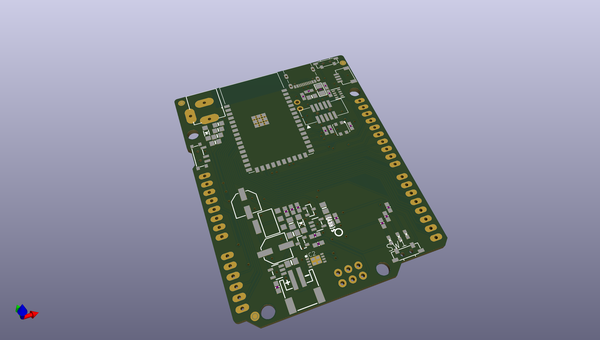
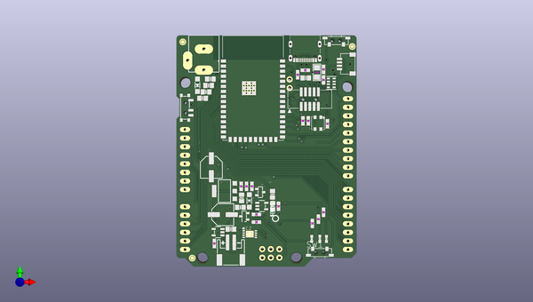

# adafruit_metro_esp32_s2_pcb
 
## summary 
* id: adafruit_adafruit_metro_esp32_s2_pcb_adafruit_metro_esp32_s2
* user: adafruit
* name: adafruit_metro_esp32_s2_pcb
* board: adafruit_metro_esp32_s2
* repo: https://github.com/adafruit/Adafruit-Metro-ESP32-S2-PCB

* src_file_repo_sch: 
* src_file_repo_sch_link: https://github.com/adafruit/Adafruit-Metro-ESP32-S2-PCB/tree/master/
* full details link: https://github.com/oomlout/oomlout_oomp_project_bot_v_2/tree/main/projects/adafruit_adafruit_metro_esp32_s2_pcb_adafruit_metro_esp32_s2/current_version/working  

## schematic  
  
[schematic (pdf)](working_schematic.pdf)  

## pcb  
 
  
  
  
[board (pdf)](working.pdf)  

## working_bom
| Id | Designator | Footprint | Quantity | Designation | Supplier and ref |  | None | 
| --- | --- | --- | --- | --- | --- | --- | --- | 
| 1 | IOL0,POWER0 | 1X08_OVALWAVE | 2 | 20610 |  |  | [''] | 
| 2 | @HOLE3,@HOLE0,@HOLE2,@HOLE1 |  | 4 |  |  |  | [''] | 
| 3 | C4,C13,C7,C10,C18,C17,C11,C8 | 0805-NO | 8 | 10µF |  |  | [''] | 
| 4 | C1,C3 | 0805-NO | 2 | 10uF |  |  | [''] | 
| 5 | U3 | MODULE_ESP32-S2-WROVER | 1 | ESP32-S2-WROVER |  |  | [''] | 
| 6 | D1,D4 | SOD-123 | 2 | MBR540 |  |  | [''] | 
| 7 | CHG1 | CHIPLED_0603_NOOUTLINE | 1 | ORANGE |  |  | [''] | 
| 8 | R15,R12,R16 | 0603-NO | 3 | 100K |  |  | [''] | 
| 9 | R2,R9,R6 | 0603-NO | 3 | 10K |  |  | [''] | 
| 10 | X5 | DCJACK_2MM_PTH | 1 | 2.1mm |  |  | [''] | 
| 11 | C5,C2,C12,C15 | 0603-NO | 4 | 0.1uF |  |  | [''] | 
| 12 | U$15 | PCBFEAT-REV-040 | 1 |  |  |  | [''] | 
| 13 | ON0 | CHIPLED_0603_NOOUTLINE | 1 | GREEN |  |  | [''] | 
| 14 | Q2,Q1 | SOT23-R | 2 | DMG3415U-7 |  |  | [''] | 
| 15 | X4 | USB_C_CUSB31-CFM2AX-01-X | 1 | USB C |  |  | [''] | 
| 16 | PC2 | PANASONIC_D | 1 | 47uF+/6.3V+ |  |  | [''] | 
| 17 | C14,C6 | 0603-NO | 2 | 1uF |  |  | [''] | 
| 18 | SW4 | SPDT_SMT_SSSS811101 | 1 | SPDT R/A |  |  | [''] | 
| 19 | SW1,SW3 | SPST_TACTILE_RA | 2 | RA_TACT |  |  | [''] | 
| 20 | FD2,FD1,FD3 | FIDUCIAL_1MM | 3 | FIDUCIAL_1MM |  |  | [''] | 
| 21 | LED1 | LED3535 | 1 | WS2812B3535 |  |  | [''] | 
| 22 | CONN1 | JST_SH4 | 1 | STEMMA_I2C_QT |  |  | [''] | 
| 23 | U1 | SOT223-R | 1 | NCP1117ST50T3G |  |  | [''] | 
| 24 | X1 | JSTPH2_BATT | 1 | JSTPH |  |  | [''] | 
| 25 | U$52 | ESP32S2_TOP | 1 |  |  |  | [''] | 
| 26 | U4 | SOT23-5 | 1 | AP2112(3.3V) |  |  | [''] | 
| 27 | IOH0 | 1X10_OVALWAVE | 1 | 20611 |  |  | [''] | 
| 28 | ICSP0 | 2X03_ROUND_70MIL | 1 | 3x2 M |  |  | [''] | 
| 29 | R14 | 0603-NO | 1 | 100k |  |  | [''] | 
| 30 | R3,R8 | 0603-NO | 2 | 5.1K |  |  | [''] | 
| 31 | X2 | 2X05_1.27MM_BOX_POSTS | 1 | 4u20317 |  |  | [''] | 
| 32 | U2 | SOT23-5 | 1 | MCP73831T-2ACI/OT |  |  | [''] | 
| 33 | L0 | CHIPLED_0603_NOOUTLINE | 1 | RED |  |  | [''] | 
| 34 | JP2 | 1X02_ROUND | 1 | UART |  |  | [''] | 
| 35 | PC1 | PANASONIC_D | 1 | 47uF/25V |  |  | [''] | 
| 36 | F2 | 1206 | 1 | 500mA |  |  | [''] | 
| 37 | R17 | 0603-NO | 1 | 1Meg |  |  | [''] | 
| 38 | R4 | 0603-NO | 1 | 2.2K |  |  | [''] | 
| 39 | AD0 | 1X06_OVALWAVE | 1 | 20609 |  |  | [''] | 
| 40 | R1 | RESPACK_4X0603 | 1 | 10K |  |  | [''] | 
| 41 | IC2 | WDFN8_3X4_0.65 | 1 | LC709203F |  |  | [''] | 
| 42 | U$53 | ESP32S2_BOT | 1 |  |  |  | [''] | 
| 43 | SJ1 | SOLDERJUMPER_CLOSEDWIRE | 1 |  |  |  | [''] | 
| 44 | TP1 | TESTPOINT_ROUND_1.5MM_NO | 1 |  |  |  | [''] | 

## bom_schematic
| Ref | Qnty | Value | Cmp name | Footprint | Description | Vendor | DNP | 
| --- | --- | --- | --- | --- | --- | --- | --- | 
| AD0 | 1 | 20609 | HEADER-1X6OVALWAVE | working:1X06_OVALWAVE |  |  |  | 
| C1, C3 | 2 | 10uF | CAP_CERAMIC0805-NOOUTLINE | working:0805-NO |  |  |  | 
| C2, C5, C12, C15 | 4 | 0.1uF | CAP_CERAMIC0603_NO | working:0603-NO |  |  |  | 
| C4, C7, C8, C10, C11, C13, C17, C18 | 8 | 10µF | CAP_CERAMIC0805-NOOUTLINE | working:0805-NO |  |  |  | 
| C6, C14 | 2 | 1uF | CAP_CERAMIC0603_NO | working:0603-NO |  |  |  | 
| CHG1 | 1 | ORANGE | LED0603_NOOUTLINE | working:CHIPLED_0603_NOOUTLINE |  |  |  | 
| CONN1 | 1 | STEMMA_I2C_QT | STEMMA_I2C_QT | working:JST_SH4 |  |  |  | 
| D1, D4 | 2 | MBR540 | DIODE-SCHOTTKYSOD-123 | working:SOD-123 |  |  |  | 
| F2 | 1 | 500mA | PTC1206 | working:1206 |  |  |  | 
| FD1, FD2, FD3 | 3 | FIDUCIAL_1MM | FIDUCIAL_1MM | working:FIDUCIAL_1MM |  |  |  | 
| IC2 | 1 | LC709203F | LC709203F | working:WDFN8_3X4_0.65 |  |  |  | 
| ICSP0 | 1 | 3x2 M | HEADER-2X3 | working:2X03_ROUND_70MIL |  |  |  | 
| IOH0 | 1 | 20611 | HEADER-1X10OVALWAVE | working:1X10_OVALWAVE |  |  |  | 
| IOL0 | 1 | 20610 | HEADER-1X8OVALWAVE | working:1X08_OVALWAVE |  |  |  | 
| JP2 | 1 | UART | HEADER-1X2ROUND | working:1X02_ROUND |  |  |  | 
| L0 | 1 | RED | LED0603_NOOUTLINE | working:CHIPLED_0603_NOOUTLINE |  |  |  | 
| LED1 | 1 | WS2812B3535 | WS2812B3535 | working:LED3535 |  |  |  | 
| ON0 | 1 | GREEN | LED0603_NOOUTLINE | working:CHIPLED_0603_NOOUTLINE |  |  |  | 
| PC1 | 1 | 47uF/25V | CAP_ELECTROLYTICPANASONIC_D | working:PANASONIC_D |  |  |  | 
| PC2 | 1 | 47uF+/6.3V+ | CAP_ELECTROLYTICPANASONIC_D | working:PANASONIC_D |  |  |  | 
| POWER0 | 1 | 20610 | HEADER-1X8OVALWAVE | working:1X08_OVALWAVE |  |  |  | 
| Q1, Q2 | 2 | DMG3415U-7 | MOSFET-P | working:SOT23-R |  |  |  | 
| R1 | 1 | 10K | RESISTOR_4PACK | working:RESPACK_4X0603 |  |  |  | 
| R2, R6, R9 | 3 | 10K | RESISTOR_0603_NOOUT | working:0603-NO |  |  |  | 
| R3, R8 | 2 | 5.1K | RESISTOR_0603_NOOUT | working:0603-NO |  |  |  | 
| R4 | 1 | 2.2K | RESISTOR_0603_NOOUT | working:0603-NO |  |  |  | 
| R12, R15, R16 | 3 | 100K | RESISTOR_0603_NOOUT | working:0603-NO |  |  |  | 
| R14 | 1 | 100k | RESISTOR_0603_NOOUT | working:0603-NO |  |  |  | 
| R17 | 1 | 1Meg | RESISTOR_0603_NOOUT | working:0603-NO |  |  |  | 
| SJ1 | 1 | SOLDERJUMPER_CLOSED | SOLDERJUMPER_CLOSED | working:SOLDERJUMPER_CLOSEDWIRE |  |  |  | 
| SW1, SW3 | 2 | RA_TACT | SWITCH_SPST_TACT_RA | working:SPST_TACTILE_RA |  |  |  | 
| SW4 | 1 | SPDT R/A | SWITCH_SPDT | working:SPDT_SMT_SSSS811101 |  |  |  | 
| TP1 | 1 | TESTPOINTROUND1.5MMNO | TESTPOINTROUND1.5MMNO | working:TESTPOINT_ROUND_1.5MM_NO |  |  |  | 
| U1 | 1 | NCP1117ST50T3G | LM1117SOT223-REFLOW | working:SOT223-R |  |  |  | 
| U2 | 1 | MCP73831T-2ACI/OT | MCP73831/2 | working:SOT23-5 |  |  |  | 
| U3 | 1 | ESP32-S2-WROVER | ESP32-S2-WROVER | working:MODULE_ESP32-S2-WROVER |  |  |  | 
| U4 | 1 | AP2112(3.3V) | VREG_SOT23-5 | working:SOT23-5 |  |  |  | 
| X1 | 1 | JSTPH | CON_JST_PH_2PIN_BATT | working:JSTPH2_BATT |  |  |  | 
| X2 | 1 | 4u20317 | JTAG-CORTEXBOXPOSTS | working:2X05_1.27MM_BOX_POSTS |  |  |  | 
| X4 | 1 | USB C | USB_C | working:USB_C_CUSB31-CFM2AX-01-X |  |  |  | 
| X5 | 1 | 2.1mm | DCBARRELPTH | working:DCJACK_2MM_PTH |  |  |  | 

