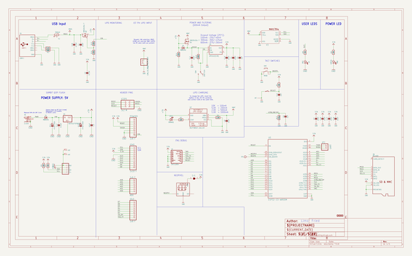

# adafruit_metro_esp32_s3_pcb
 
## summary 
* id: adafruit_adafruit_metro_esp32_s3_pcb_adafruit_metro_esp32_s3
* user: adafruit
* name: adafruit_metro_esp32_s3_pcb
* board: adafruit_metro_esp32_s3
* repo: https://github.com/adafruit/Adafruit-Metro-ESP32-S3-PCB

* src_file_repo_sch: 
* src_file_repo_sch_link: https://github.com/adafruit/Adafruit-Metro-ESP32-S3-PCB/tree/main/
* full details link: https://github.com/oomlout/oomlout_oomp_project_bot_v_2/tree/main/projects/adafruit_adafruit_metro_esp32_s3_pcb_adafruit_metro_esp32_s3/current_version/working  

## schematic  
  
[schematic (pdf)](working_schematic.pdf) 

## pcb  
 
  
  
  
[board (pdf)](working.pdf)  

## working_bom
| Id | Designator | Footprint | Quantity | Designation | Supplier and ref |  | None | 
| --- | --- | --- | --- | --- | --- | --- | --- | 
| 1 | Q2,Q1 | SOT23-R | 2 | DMG3415U-7 |  |  | [''] | 
| 2 | C15,C2,C12 | 0603-NO | 3 | 0.1uF |  |  | [''] | 
| 3 | R5,R6,R2,R7,R9,R1 | 0603-NO | 6 | 10K |  |  | [''] | 
| 4 | X3 | TDFN8_2X2MM | 1 | MAX17048/T |  |  | [''] | 
| 5 | C3,C17,C7,C13,C11,C4,C18,C10,C1,C8 | 0805-NO | 10 | 10uF |  |  | [''] | 
| 6 | X5 | DCJACK_2MM_PTH | 1 | 2.1mm |  |  | [''] | 
| 7 | SW1 | BTN_RKB2_4.6X2.8 | 1 | RKB2 |  |  | [''] | 
| 8 | U4 | SOT23-5 | 1 | AP2112(3.3V) |  |  | [''] | 
| 9 | @HOLE2,@HOLE0,@HOLE3,@HOLE1 |  | 4 |  |  |  | [''] | 
| 10 | JP2 | 1X02_ROUND | 1 | UART |  |  | [''] | 
| 11 | L0 | CHIPLED_0603_NOOUTLINE | 1 | RED |  |  | [''] | 
| 12 | SW4 | SPDT_SMT_SSSS811101 | 1 | SPDT R/A |  |  | [''] | 
| 13 | R17 | 0603-NO | 1 | 1Meg |  |  | [''] | 
| 14 | U2 | SOT23-5 | 1 | MCP73831T-2ACI/OT |  |  | [''] | 
| 15 | U1 | SOT223-R | 1 | NCP1117ST50T3G |  |  | [''] | 
| 16 | R12,R15,R16,R14 | 0603-NO | 4 | 100K |  |  | [''] | 
| 17 | ON0 | CHIPLED_0603_NOOUTLINE | 1 | GREEN |  |  | [''] | 
| 18 | U5 | S3-WROOM32 | 1 | ESP32-S3-WROOM |  |  | [''] | 
| 19 | R8,R3 | 0603-NO | 2 | 5.1K |  |  | [''] | 
| 20 | IOH0 | 1X10_OVALWAVE | 1 | 1x10 F |  |  | [''] | 
| 21 | R4 | 0603-NO | 1 | 2.2K |  |  | [''] | 
| 22 | FD1,FD2,FD3 | FIDUCIAL_1MM | 3 | FIDUCIAL_1MM |  |  | [''] | 
| 23 | X1 | JSTPH2_BATT | 1 | JSTPH |  |  | [''] | 
| 24 | CHG1 | CHIPLED_0603_NOOUTLINE | 1 | ORANGE |  |  | [''] | 
| 25 | PC2,PC1 | PANASONIC_D | 2 | 47uF/25V |  |  | [''] | 
| 26 | X6 | MOLEX_104031-0811 | 1 | MicroSD |  |  | [''] | 
| 27 | POWER0,IOL0 | 1X08_OVALWAVE | 2 | 1x8 F |  |  | [''] | 
| 28 | AD0 | 1X06_OVALWAVE | 1 | 1x6 F |  |  | [''] | 
| 29 | C14,C5,C6 | 0603-NO | 3 | 1uF |  |  | [''] | 
| 30 | SW3 | SPST_TACTILE_RA | 1 | RA_TACT |  |  | [''] | 
| 31 | CONN1 | JST_SH4 | 1 | STEMMA_I2C_QT |  |  | [''] | 
| 32 | F2 | 0805-NO | 1 | 500mA |  |  | [''] | 
| 33 | X2 | 2X05_1.27MM_BOX_POSTS | 1 | 2x5 0.05in |  |  | [''] | 
| 34 | D1,D4 | SOD-123 | 2 | MBR540 |  |  | [''] | 
| 35 | U$15 | PCBFEAT-REV-040 | 1 |  |  |  | [''] | 
| 36 | ICSP0 | 2X03_ROUND_70MIL | 1 | 3x2 M |  |  | [''] | 
| 37 | U$52 | METROS3_TOP | 1 |  |  |  | [''] | 
| 38 | X4 | USB_C_CUSB31-CFM2AX-01-X | 1 | USB C |  |  | [''] | 
| 39 | LED1 | LED3535_FULLPADS | 1 | WS2812B_3535FULL |  |  | [''] | 
| 40 | TP1 | TESTPOINT_ROUND_1.5MM_NO | 1 |  |  |  | [''] | 
| 41 | U$58 | METROS3_BOT | 1 |  |  |  | [''] | 
| 42 | SJ1 | SOLDERJUMPER_CLOSEDWIRE | 1 |  |  |  | [''] | 

## bom_schematic
| Ref | Qnty | Value | Cmp name | Footprint | Description | Vendor | DNP | 
| --- | --- | --- | --- | --- | --- | --- | --- | 
| AD0 | 1 | 1x6 F | HEADER-1X6OVALWAVE | working:1X06_OVALWAVE |  |  |  | 
| C1, C3, C4, C7, C8, C10, C11, C13, C17, C18 | 10 | 10uF | CAP_CERAMIC0805-NOOUTLINE | working:0805-NO |  |  |  | 
| C2, C12, C15 | 3 | 0.1uF | CAP_CERAMIC0603_NO | working:0603-NO |  |  |  | 
| C5, C6, C14 | 3 | 1uF | CAP_CERAMIC0603_NO | working:0603-NO |  |  |  | 
| CHG1 | 1 | ORANGE | LED0603_NOOUTLINE | working:CHIPLED_0603_NOOUTLINE |  |  |  | 
| CONN1 | 1 | STEMMA_I2C_QT | STEMMA_I2C_QT | working:JST_SH4 |  |  |  | 
| D1, D4 | 2 | MBR540 | DIODE-SCHOTTKYSOD-123 | working:SOD-123 |  |  |  | 
| F2 | 1 | 500mA | PTC_0805 | working:0805-NO |  |  |  | 
| FD1, FD2, FD3 | 3 | FIDUCIAL_1MM | FIDUCIAL_1MM | working:FIDUCIAL_1MM |  |  |  | 
| ICSP0 | 1 | 3x2 M | HEADER-2X3 | working:2X03_ROUND_70MIL |  |  |  | 
| IOH0 | 1 | 1x10 F | HEADER-1X10OVALWAVE | working:1X10_OVALWAVE |  |  |  | 
| IOL0 | 1 | 1x8 F | HEADER-1X8OVALWAVE | working:1X08_OVALWAVE |  |  |  | 
| JP2 | 1 | UART | HEADER-1X2ROUND | working:1X02_ROUND |  |  |  | 
| L0 | 1 | RED | LED0603_NOOUTLINE | working:CHIPLED_0603_NOOUTLINE |  |  |  | 
| LED1 | 1 | WS2812B_3535FULL | WS2812B_3535FULL | working:LED3535_FULLPADS |  |  |  | 
| ON0 | 1 | GREEN | LED0603_NOOUTLINE | working:CHIPLED_0603_NOOUTLINE |  |  |  | 
| PC1, PC2 | 2 | 47uF/25V | CAP_ELECTROLYTICPANASONIC_D | working:PANASONIC_D |  |  |  | 
| POWER0 | 1 | 1x8 F | HEADER-1X8OVALWAVE | working:1X08_OVALWAVE |  |  |  | 
| Q1, Q2 | 2 | DMG3415U-7 | MOSFET-P | working:SOT23-R |  |  |  | 
| R1, R2, R5, R6, R7, R9 | 6 | 10K | RESISTOR_0603_NOOUT | working:0603-NO |  |  |  | 
| R3, R8 | 2 | 5.1K | RESISTOR_0603_NOOUT | working:0603-NO |  |  |  | 
| R4 | 1 | 2.2K | RESISTOR_0603_NOOUT | working:0603-NO |  |  |  | 
| R12, R14, R15, R16 | 4 | 100K | RESISTOR_0603_NOOUT | working:0603-NO |  |  |  | 
| R17 | 1 | 1Meg | RESISTOR_0603_NOOUT | working:0603-NO |  |  |  | 
| SJ1 | 1 | SOLDERJUMPER_CLOSED | SOLDERJUMPER_CLOSED | working:SOLDERJUMPER_CLOSEDWIRE |  |  |  | 
| SW1 | 1 | RKB2 | SWITCH_TACT_SMT_RKB2 | working:BTN_RKB2_4.6X2.8 |  |  |  | 
| SW3 | 1 | RA_TACT | SWITCH_SPST_MNT_TACT_RA | working:SPST_TACTILE_RA |  |  |  | 
| SW4 | 1 | SPDT R/A | SWITCH_SPDT | working:SPDT_SMT_SSSS811101 |  |  |  | 
| TP1 | 1 | TESTPOINTROUND1.5MMNO | TESTPOINTROUND1.5MMNO | working:TESTPOINT_ROUND_1.5MM_NO |  |  |  | 
| U1 | 1 | NCP1117ST50T3G | LM1117SOT223-REFLOW | working:SOT223-R |  |  |  | 
| U2 | 1 | MCP73831T-2ACI/OT | MCP73831/2 | working:SOT23-5 |  |  |  | 
| U4 | 1 | AP2112(3.3V) | VREG_SOT23-5 | working:SOT23-5 |  |  |  | 
| U5 | 1 | ESP32-S3-WROOM | ESP32-S3-WROOM | working:S3-WROOM32 |  |  |  | 
| X1 | 1 | CON_JST_PH_2PIN_MT_BATT | CON_JST_PH_2PIN_MT_BATT | working:JSTPH2_BATT |  |  |  | 
| X2 | 1 | 2x5 0.05in | JTAG-CORTEXBOXPOSTS | working:2X05_1.27MM_BOX_POSTS |  |  |  | 
| X3 | 1 | MAX17048/T | MAX17048/T | working:TDFN8_2X2MM |  |  |  | 
| X4 | 1 | USB C | USB_C | working:USB_C_CUSB31-CFM2AX-01-X |  |  |  | 
| X5 | 1 | 2.1mm | DCBARRELPTH | working:DCJACK_2MM_PTH |  |  |  | 
| X6 | 1 | MicroSD | MICROSD104031-0811 | working:MOLEX_104031-0811 |  |  |  | 

