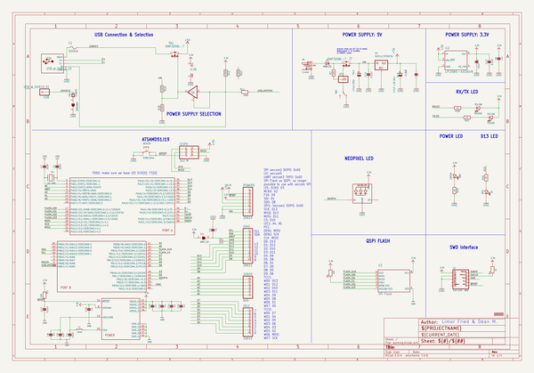
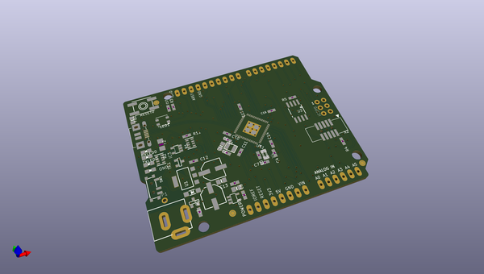
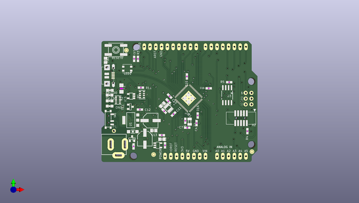
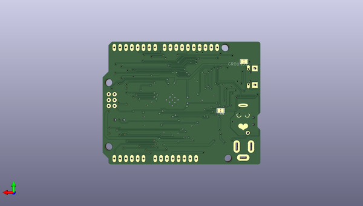

# adafruit_metro_m4_express_pcb
 
## summary 
* id: adafruit_adafruit_metro_m4_express_pcb_adafruit_metro_m4_express
* user: adafruit
* name: adafruit_metro_m4_express_pcb
* board: adafruit_metro_m4_express
* repo: https://github.com/adafruit/Adafruit-Metro-M4-Express-PCB

* src_file_repo_sch: 
* src_file_repo_sch_link: https://github.com/adafruit/Adafruit-Metro-M4-Express-PCB/tree/master/
* full details link: https://github.com/oomlout/oomlout_oomp_project_bot_v_2/tree/main/projects/adafruit_adafruit_metro_m4_express_pcb_adafruit_metro_m4_express/current_version/working  

## schematic  
  
[schematic (pdf)](working_schematic.pdf) 

## pcb  
 
  
  
  
[board (pdf)](working.pdf)  

## working_bom
| Id | Designator | Footprint | Quantity | Designation | Supplier and ref |  | None | 
| --- | --- | --- | --- | --- | --- | --- | --- | 
| 1 | L1 | INDUCTOR_1007 | 1 | 10uH |  |  | [''] | 
| 2 | C16,C14,C8,C6,C11,C15,C4,C10 | 0603-NO | 8 | .1u |  |  | [''] | 
| 3 | @HOLE3,@HOLE0,@HOLE2,@HOLE1 |  | 4 |  |  |  | [''] | 
| 4 | ON0 | CHIPLED_0805_NOOUTLINE | 1 | GREEN |  |  | [''] | 
| 5 | IC3 | SOT23-5 | 1 | 74LVC1G125D |  |  | [''] | 
| 6 | SW1 | SPDT_SMT_SSSS811101 | 1 |  |  |  | [''] | 
| 7 | JP1 | 1X01_ROUND | 1 |  |  |  | [''] | 
| 8 | C3,C1 | 0805-NO | 2 | 10uF |  |  | [''] | 
| 9 | R1 | RESPACK_4X0603 | 1 | 100K |  |  | [''] | 
| 10 | RXLED0,TXLED0 | CHIPLED_0805_NOOUTLINE | 2 | YELLOW |  |  | [''] | 
| 11 | FD1,FD3,FD2 | FIDUCIAL_1MM | 3 | FIDUCIAL_1MM |  |  | [''] | 
| 12 | RESET0 | EVQ-Q2 | 1 | EVQQ 6mm |  |  | [''] | 
| 13 | C12,C13,C17 | 0603-NO | 3 | 0.1uF |  |  | [''] | 
| 14 | C7,C5 | 0603-NO | 2 | 22pF |  |  | [''] | 
| 15 | TR1,T2 | SOT-23 | 2 | DMP3098L-7 |  |  | [''] | 
| 16 | ICSP0 | 2X03_ROUND_70MIL | 1 | 3x2 M |  |  | [''] | 
| 17 | R11 | 0603-NO | 1 | 330R |  |  | [''] | 
| 18 | D1 | SOD-123 | 1 | MBR120 |  |  | [''] | 
| 19 | X2 | 2X05_1.27MM_BOX_POSTS | 1 | 2x5 0.05 SWD" |  |  | [''] | 
| 20 | FB2 | 0805-NO | 1 | FERRITE |  |  | [''] | 
| 21 | AD0 | 1X06_OVALWAVE | 1 | 20609 |  |  | [''] | 
| 22 | LED1 | LED3535 | 1 | WS2812B3535 |  |  | [''] | 
| 23 | U2 | SOT23-DBV | 1 | AP2112K-3.3 |  |  | [''] | 
| 24 | X3 | 4UCONN_20329_V2 | 1 | 20329 |  |  | [''] | 
| 25 | PC2 | PANASONIC_D | 1 | 47uF+/6.3V+ |  |  | [''] | 
| 26 | X4 | XTAL3215 | 1 | 32.768 |  |  | [''] | 
| 27 | F2 | R1206 | 1 | 500mA |  |  | [''] | 
| 28 | U$23 | METROM4_REVF_TOP | 1 |  |  |  | [''] | 
| 29 | IOH0 | 1X10_OVALWAVE | 1 | 20611 |  |  | [''] | 
| 30 | PC1 | PANASONIC_D | 1 | 47uF/25V |  |  | [''] | 
| 31 | R3,R5,R7 | 0603-NO | 3 | 10K |  |  | [''] | 
| 32 | U3 | SOIC8_208MIL | 1 | SPI Flash |  |  | [''] | 
| 33 | X5 | DCJACK_2MM_PTH | 1 | 2.1mm |  |  | [''] | 
| 34 | C9 | 0603-NO | 1 | 1uF |  |  | [''] | 
| 35 | U$1 | PQFN64-1 | 1 | ATSAMD51J |  |  | [''] | 
| 36 | U1 | SOT223-R | 1 | NCP1117ST50T3G |  |  | [''] | 
| 37 | R2 | RESPACK_4X0603 | 1 | 1K |  |  | [''] | 
| 38 | C2 | 0805-NO | 1 | 0.1uF |  |  | [''] | 
| 39 | IOL0,POWER0 | 1X08_OVALWAVE | 2 | 20610 |  |  | [''] | 
| 40 | R4 | 0603-NO | 1 | 1K |  |  | [''] | 
| 41 | L0 | CHIPLED_0805_NOOUTLINE | 1 | RED |  |  | [''] | 
| 42 | U$27 | METROM4_REVF_BOT | 1 |  |  |  | [''] | 
| 43 | GROUND1 | SOLDERJUMPER_CLOSEDWIRE | 1 |  |  |  | [''] | 
| 44 | SJ1 | SOLDERJUMPER_CLOSEDWIRE | 1 | AREF_3V |  |  | [''] | 

## bom_schematic
| Ref | Qnty | Value | Cmp name | Footprint | Description | Vendor | DNP | 
| --- | --- | --- | --- | --- | --- | --- | --- | 
| AD0 | 1 | 20609 | HEADER-1X6OVALWAVE | working:1X06_OVALWAVE |  |  |  | 
| C1, C3 | 2 | 10uF | CAP_CERAMIC0805-NOOUTLINE | working:0805-NO |  |  |  | 
| C2 | 1 | 0.1uF | CAP_CERAMIC0805-NOOUTLINE | working:0805-NO |  |  |  | 
| C4, C6, C8, C10, C11, C14, C15, C16 | 8 | .1u | CAP_CERAMIC0603_NO | working:0603-NO |  |  |  | 
| C5, C7 | 2 | 22pF | CAP_CERAMIC0603_NO | working:0603-NO |  |  |  | 
| C9 | 1 | 1uF | CAP_CERAMIC0603_NO | working:0603-NO |  |  |  | 
| C12, C13, C17 | 3 | 0.1uF | CAP_CERAMIC0603_NO | working:0603-NO |  |  |  | 
| D1 | 1 | MBR120 | DIODE-SCHOTTKYSOD-123 | working:SOD-123 |  |  |  | 
| F2 | 1 | 500mA | PTCFUSE-1206 | working:R1206 |  |  |  | 
| FB2 | 1 | FERRITE | FERRITE-0805NO | working:0805-NO |  |  |  | 
| FD1, FD2, FD3 | 3 | FIDUCIAL_1MM | FIDUCIAL_1MM | working:FIDUCIAL_1MM |  |  |  | 
| GROUND1 | 1 | SOLDERJUMPERCLOSED | SOLDERJUMPERCLOSED | working:SOLDERJUMPER_CLOSEDWIRE |  |  |  | 
| IC3 | 1 | 741G125DBV | 741G125DBV | working:SOT23-5 |  |  |  | 
| ICSP0 | 1 | 3x2 M | HEADER-2X3 | working:2X03_ROUND_70MIL |  |  |  | 
| IOH0 | 1 | 20611 | HEADER-1X10OVALWAVE | working:1X10_OVALWAVE |  |  |  | 
| IOL0 | 1 | 20610 | HEADER-1X8OVALWAVE | working:1X08_OVALWAVE |  |  |  | 
| JP1 | 1 | HEADER-1X1ROUND | HEADER-1X1ROUND | working:1X01_ROUND |  |  |  | 
| L0 | 1 | RED | LED0805_NOOUTLINE | working:CHIPLED_0805_NOOUTLINE |  |  |  | 
| L1 | 1 | 10uH | INDUCTOR | working:INDUCTOR_1007 |  |  |  | 
| LED1 | 1 | WS2812B3535 | WS2812B3535 | working:LED3535 |  |  |  | 
| ON0 | 1 | GREEN | LED0805_NOOUTLINE | working:CHIPLED_0805_NOOUTLINE |  |  |  | 
| PC1 | 1 | 47uF/25V | CAP_ELECTROLYTICPANASONIC_D | working:PANASONIC_D |  |  |  | 
| PC2 | 1 | 47uF+/6.3V+ | CAP_ELECTROLYTICPANASONIC_D | working:PANASONIC_D |  |  |  | 
| POWER0 | 1 | 20610 | HEADER-1X8OVALWAVE | working:1X08_OVALWAVE |  |  |  | 
| R1 | 1 | 100K | RESISTOR_4PACK | working:RESPACK_4X0603 |  |  |  | 
| R2 | 1 | 1K | RESISTOR_4PACK | working:RESPACK_4X0603 |  |  |  | 
| R3, R5, R7 | 3 | 10K | RESISTOR_0603_NOOUT | working:0603-NO |  |  |  | 
| R4 | 1 | 1K | RESISTOR_0603_NOOUT | working:0603-NO |  |  |  | 
| R11 | 1 | 330R | RESISTOR_0603_NOOUT | working:0603-NO |  |  |  | 
| RESET0 | 1 | EVQQ 6mm | SWITCH_TACT_SMT | working:EVQ-Q2 |  |  |  | 
| RXLED0 | 1 | YELLOW | LED0805_NOOUTLINE | working:CHIPLED_0805_NOOUTLINE |  |  |  | 
| SJ1 | 1 | AREF_3V | SOLDERJUMPERCLOSED | working:SOLDERJUMPER_CLOSEDWIRE |  |  |  | 
| SW1 | 1 | SWITCH_SPDT | SWITCH_SPDT | working:SPDT_SMT_SSSS811101 |  |  |  | 
| T2 | 1 | DMP3098L-7 | PMOSSOT23 | working:SOT-23 |  |  |  | 
| TR1 | 1 | DMP3098L-7 | 0297_PMV48XP | working:SOT-23 |  |  |  | 
| TXLED0 | 1 | YELLOW | LED0805_NOOUTLINE | working:CHIPLED_0805_NOOUTLINE |  |  |  | 
| U1 | 1 | NCP1117ST50T3G | LM1117SOT223-REFLOW | working:SOT223-R |  |  |  | 
| U2 | 1 | LP2985-XXDBVR | LP2985-XXDBVR | working:SOT23-DBV |  |  |  | 
| U3 | 1 | SPI Flash | SPIFLASH_SOIC8208MIL | working:SOIC8_208MIL |  |  |  | 
| U$1 | 1 | ATSAMD51J | ATSAMD51J | working:PQFN64-1 |  |  |  | 
| X2 | 1 | 2x5 0.05" SWD | JTAG-CORTEXBOXPOSTS | working:2X05_1.27MM_BOX_POSTS |  |  |  | 
| X3 | 1 | USB_W_SHIELD_V2 | USB_W_SHIELD_V2 | working:4UCONN_20329_V2 |  |  |  | 
| X4 | 1 | 32.768 | XTAL-3.2X1.5 | working:XTAL3215 |  |  |  | 
| X5 | 1 | 2.1mm | DCBARRELPTH | working:DCJACK_2MM_PTH |  |  |  | 

