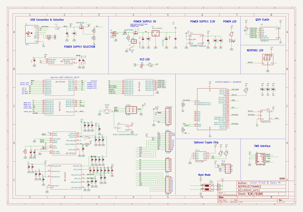
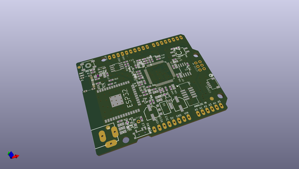
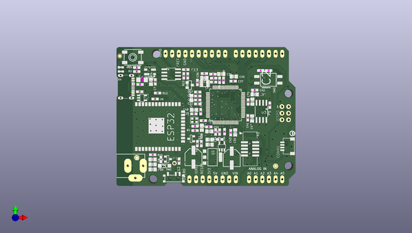
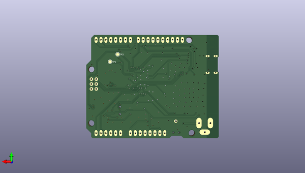

# adafruit_metro_m7_with_airlift_pcb
 
## summary 
* id: adafruit_adafruit_metro_m7_with_airlift_pcb_adafruit_metro_m7_imx_rt1011_with_airlift
* user: adafruit
* name: adafruit_metro_m7_with_airlift_pcb
* board: adafruit_metro_m7_imx_rt1011_with_airlift
* repo: https://github.com/adafruit/Adafruit-Metro-M7-with-AirLift-PCB

* src_file_repo_sch: 
* src_file_repo_sch_link: https://github.com/adafruit/Adafruit-Metro-M7-with-AirLift-PCB/tree/main/
* full details link: https://github.com/oomlout/oomlout_oomp_project_bot_v_2/tree/main/projects/adafruit_adafruit_metro_m7_with_airlift_pcb_adafruit_metro_m7_imx_rt1011_with_airlift/current_version/working  

## schematic  
  
[schematic (pdf)](working_schematic.pdf) 

## pcb  
 
  
  
  
[board (pdf)](working.pdf)  

## working_bom
| Id | Designator | Footprint | Quantity | Designation | Supplier and ref |  | None | 
| --- | --- | --- | --- | --- | --- | --- | --- | 
| 1 | U$18 | METROM7_RT1011AIR_TOP | 1 |  |  |  | [''] | 
| 2 | R5,R13,R7,R12,R15,R9,R10 | 0603-NO | 7 | 10K |  |  | [''] | 
| 3 | R11,R17,R8,R3,R14,R2 | 0603-NO | 6 | 5.1K |  |  | [''] | 
| 4 | X2 | 2X05_1.27MM_BOX_POSTS | 1 | 2x5 0.05 SWD" |  |  | [''] | 
| 5 | C46,C40,C47,C21,C39,C19,C31,C20,C2,C55,C18,C51,C3,C5,C48,C45 | 0805-NO | 16 | 10uF |  |  | [''] | 
| 6 | D1 | SOD-123 | 1 | MBR120 |  |  | [''] | 
| 7 | C58,C33,C50,C53,C57,C52,C38,C56,C49 | 0603-NO | 9 | 0.22uF |  |  | [''] | 
| 8 | U3 | SOIC8_208MIL | 1 | W25Q64JV |  |  | [''] | 
| 9 | TR1,T2 | SOT-23 | 2 | DMP3098L-7 |  |  | [''] | 
| 10 | FD2,FD3,FD1 | FIDUCIAL_1MM | 3 | FIDUCIAL_1MM |  |  | [''] | 
| 11 | @HOLE3,@HOLE0,@HOLE1,@HOLE2 |  | 4 |  |  |  | [''] | 
| 12 | JP1 | 1X01_ROUND | 1 |  |  |  | [''] | 
| 13 | IC4 | SOT23-WIDE | 1 | RESET_SUPERVISORAPX80X_SA |  |  | [''] | 
| 14 | C26,C25 | 0603-NO | 2 | 16pF |  |  | [''] | 
| 15 | LED1 | LED3535_FULLPADS | 1 | WS2812B_3535FULL |  |  | [''] | 
| 16 | C34 | 0805-NO | 1 | 22uF |  |  | [''] | 
| 17 | PC1,PC2 | PANASONIC_D | 2 | 47uF/25V |  |  | [''] | 
| 18 | IC1 | SOT23-5L | 1 | 74AHC1G125 |  |  | [''] | 
| 19 | C6,C12,C37,C13,C35,C41,C43,C22,C32,C7 | 0603-NO | 10 | 0.1uF |  |  | [''] | 
| 20 | U$11 | PCBFEAT-REV-040 | 1 |  |  |  | [''] | 
| 21 | R16,R1 | 0603-NO | 2 | 100K |  |  | [''] | 
| 22 | R4 | 0603-NO | 1 | 2.2M |  |  | [''] | 
| 23 | C30,C54,C36,C42,C44,C29 | 0603-NO | 6 | 1uF |  |  | [''] | 
| 24 | POWER0,IOL0 | 1X08_OVALWAVE | 2 | 1x8F |  |  | [''] | 
| 25 | L2 | INDUCTOR_1007 | 1 | 4.7uH |  |  | [''] | 
| 26 | Y1 | CRYSTAL_2.5X2 | 1 | 24MHz 10pF |  |  | [''] | 
| 27 | IOH0 | 1X10_OVALWAVE | 1 | 1x10F |  |  | [''] | 
| 28 | X5 | DCJACK_2MM_PTH | 1 | 2.1mm |  |  | [''] | 
| 29 | R6 | 0603-NO | 1 | 30K |  |  | [''] | 
| 30 | U1 | SOT223-R | 1 | NCP1117ST50T3G |  |  | [''] | 
| 31 | RESET0 | EVQ-Q2_SMALLER | 1 | 6x6mm |  |  | [''] | 
| 32 | L0 | CHIPLED_0603_NOOUTLINE | 1 | RED |  |  | [''] | 
| 33 | X4 | USB_C_CUSB31-CFM2AX-01-X | 1 | USB C |  |  | [''] | 
| 34 | ICSP0 | 2X03_ROUND_70MIL | 1 | 2x3M |  |  | [''] | 
| 35 | ECC1 | SOIC8 | 1 | ATECC108 |  |  | [''] | 
| 36 | AD0 | 1X06_OVALWAVE | 1 | 1x6F |  |  | [''] | 
| 37 | F2 | R1206 | 1 | FUSE |  |  | [''] | 
| 38 | ON0 | CHIPLED_0603_NOOUTLINE | 1 | GREEN |  |  | [''] | 
| 39 | U2 | SOT23-DBV | 1 | AP2112K-3.3 |  |  | [''] | 
| 40 | CONN1 | JST_SH4 | 1 | STEMMA_I2C_QT |  |  | [''] | 
| 41 | X6 | WROOM32 | 1 | ESP32_WROOM32 |  |  | [''] | 
| 42 | SW2 | DIPSWITCH_2PIN | 1 | DIP2 |  |  | [''] | 
| 43 | IC2 | QFP50P1400X1400X160-80N | 1 | IMX_RT1010 |  |  | [''] | 
| 44 | SW1 | SPDT_SMT_SSSS811101 | 1 | SPDT_RA |  |  | [''] | 
| 45 | U$12 | METROM7_RT1011AIR_BOT | 1 |  |  |  | [''] | 
| 46 | TP2,TP1 | TESTPOINT_ROUND_1.5MM | 2 |  |  |  | [''] | 

## bom_schematic
| Ref | Qnty | Value | Cmp name | Footprint | Description | Vendor | DNP | 
| --- | --- | --- | --- | --- | --- | --- | --- | 
| AD0 | 1 | 1x6F | HEADER-1X6OVALWAVE | working:1X06_OVALWAVE |  |  |  | 
| C2, C3, C5, C18, C19, C20, C21, C31, C39, C40, C45, C46, C47, C48, C51, C55 | 16 | 10uF | CAP_CERAMIC0805-NOOUTLINE | working:0805-NO |  |  |  | 
| C6, C7, C12, C13, C22, C32, C35, C37, C41, C43 | 10 | 0.1uF | CAP_CERAMIC0603_NO | working:0603-NO |  |  |  | 
| C25, C26 | 2 | 16pF | CAP_CERAMIC0603_NO | working:0603-NO |  |  |  | 
| C29, C30, C36, C42, C44, C54 | 6 | 1uF | CAP_CERAMIC0603_NO | working:0603-NO |  |  |  | 
| C33, C38, C49, C50, C52, C53, C56, C57, C58 | 9 | 0.22uF | CAP_CERAMIC0603_NO | working:0603-NO |  |  |  | 
| C34 | 1 | 22uF | CAP_CERAMIC0805-NOOUTLINE | working:0805-NO |  |  |  | 
| CONN1 | 1 | STEMMA_I2C_QT | STEMMA_I2C_QT | working:JST_SH4 |  |  |  | 
| D1 | 1 | MBR120 | DIODE-SCHOTTKYSOD-123 | working:SOD-123 |  |  |  | 
| ECC1 | 1 | ATECC108 | ATECC108 | working:SOIC8 |  |  |  | 
| F2 | 1 | FUSE | PTCFUSE-1206 | working:R1206 |  |  |  | 
| FD1, FD2, FD3 | 3 | FIDUCIAL_1MM | FIDUCIAL_1MM | working:FIDUCIAL_1MM |  |  |  | 
| IC1 | 1 | 74AHC1G125 | 74AHC1G125 | working:SOT23-5L |  |  |  | 
| IC2 | 1 | IMX_RT1010 | IMX_RT1010 | working:QFP50P1400X1400X160-80N |  |  |  | 
| IC4 | 1 | RESET_SUPERVISORAPX80X_SA | RESET_SUPERVISORAPX80X_SA | working:SOT23-WIDE |  |  |  | 
| ICSP0 | 1 | 2x3M | HEADER-2X3 | working:2X03_ROUND_70MIL |  |  |  | 
| IOH0 | 1 | 1x10F | HEADER-1X10OVALWAVE | working:1X10_OVALWAVE |  |  |  | 
| IOL0 | 1 | 1x8F | HEADER-1X8OVALWAVE | working:1X08_OVALWAVE |  |  |  | 
| JP1 | 1 | HEADER-1X1ROUND | HEADER-1X1ROUND | working:1X01_ROUND |  |  |  | 
| L0 | 1 | RED | LED0603_NOOUTLINE | working:CHIPLED_0603_NOOUTLINE |  |  |  | 
| L2 | 1 | 4.7uH | INDUCTOR | working:INDUCTOR_1007 |  |  |  | 
| LED1 | 1 | WS2812B_3535FULL | WS2812B_3535FULL | working:LED3535_FULLPADS |  |  |  | 
| ON0 | 1 | GREEN | LED0603_NOOUTLINE | working:CHIPLED_0603_NOOUTLINE |  |  |  | 
| PC1, PC2 | 2 | 47uF/25V | CAP_ELECTROLYTICPANASONIC_D | working:PANASONIC_D |  |  |  | 
| POWER0 | 1 | 1x8F | HEADER-1X8OVALWAVE | working:1X08_OVALWAVE |  |  |  | 
| R1, R16 | 2 | 100K | RESISTOR_0603_NOOUT | working:0603-NO |  |  |  | 
| R2, R3, R8, R11, R14, R17 | 6 | 5.1K | RESISTOR_0603_NOOUT | working:0603-NO |  |  |  | 
| R4 | 1 | 2.2M | RESISTOR_0603_NOOUT | working:0603-NO |  |  |  | 
| R5, R7, R9, R10, R12, R13, R15 | 7 | 10K | RESISTOR_0603_NOOUT | working:0603-NO |  |  |  | 
| R6 | 1 | 30K | RESISTOR_0603_NOOUT | working:0603-NO |  |  |  | 
| RESET0 | 1 | 6x6mm | SWITCH_TACT_SMT_EVQQ2_SMALL | working:EVQ-Q2_SMALLER |  |  |  | 
| SW1 | 1 | SPDT_RA | SWITCH_SPDT | working:SPDT_SMT_SSSS811101 |  |  |  | 
| SW2 | 1 | DIP2 | DIPSWITCH_2PIN | working:DIPSWITCH_2PIN |  |  |  | 
| T2 | 1 | DMP3098L-7 | PMOSSOT23 | working:SOT-23 |  |  |  | 
| TP1, TP2 | 2 | TESTPOINTROUND1.5MM | TESTPOINTROUND1.5MM | working:TESTPOINT_ROUND_1.5MM |  |  |  | 
| TR1 | 1 | DMP3098L-7 | 0297_PMV48XP | working:SOT-23 |  |  |  | 
| U1 | 1 | NCP1117ST50T3G | LM1117SOT223-REFLOW | working:SOT223-R |  |  |  | 
| U2 | 1 | LP2985-XXDBVR | LP2985-XXDBVR | working:SOT23-DBV |  |  |  | 
| U3 | 1 | W25Q64JV | SPIFLASH_8PIN208MIL | working:SOIC8_208MIL |  |  |  | 
| X2 | 1 | 2x5 0.05" SWD | JTAG-CORTEXBOXPOSTS | working:2X05_1.27MM_BOX_POSTS |  |  |  | 
| X4 | 1 | USB C | USB_C | working:USB_C_CUSB31-CFM2AX-01-X |  |  |  | 
| X5 | 1 | 2.1mm | DCBARRELPTH | working:DCJACK_2MM_PTH |  |  |  | 
| X6 | 1 | ESP32_WROOM32 | ESP32_WROOM32 | working:WROOM32 |  |  |  | 
| Y1 | 1 | 24MHz 10pF | CRYSTAL2.5X2.0 | working:CRYSTAL_2.5X2 |  |  |  | 

