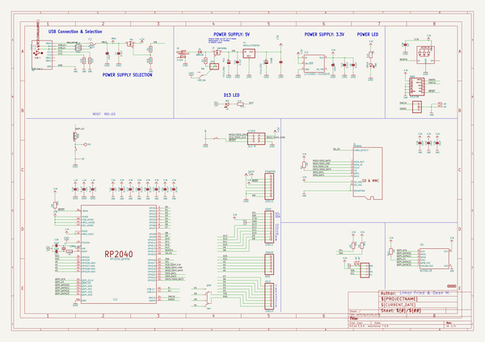
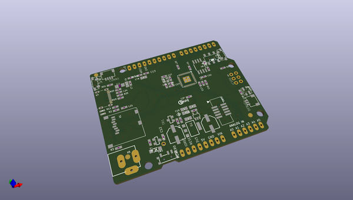
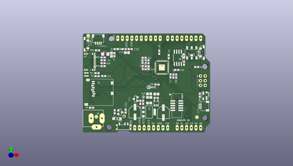
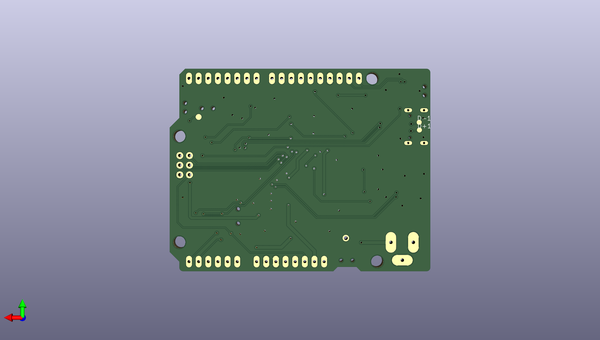

# adafruit_metro_rp2040_pcb
 
## summary 
* id: adafruit_adafruit_metro_rp2040_pcb_adafruit_metro_rp2040
* user: adafruit
* name: adafruit_metro_rp2040_pcb
* board: adafruit_metro_rp2040
* repo: https://github.com/adafruit/Adafruit-Metro-RP2040-PCB

* src_file_repo_sch: 
* src_file_repo_sch_link: https://github.com/adafruit/Adafruit-Metro-RP2040-PCB/tree/main/
* full details link: https://github.com/oomlout/oomlout_oomp_project_bot_v_2/tree/main/projects/adafruit_adafruit_metro_rp2040_pcb_adafruit_metro_rp2040/current_version/working  

## schematic  
  
[schematic (pdf)](working_schematic.pdf) 

## pcb  
 
  
  
  
[board (pdf)](working.pdf)  

## working_bom
| Id | Designator | Footprint | Quantity | Designation | Supplier and ref |  | None | 
| --- | --- | --- | --- | --- | --- | --- | --- | 
| 1 | JP1 | 1X01_ROUND | 1 |  |  |  | [''] | 
| 2 | ICSP0 | 2X03_ROUND_70MIL | 1 | 3x2 M |  |  | [''] | 
| 3 | R17,R7,R13,R21,R3,R10 | 0603-NO | 6 | 10K |  |  | [''] | 
| 4 | R24,R25 | 0603-NO | 2 | 22 ohm |  |  | [''] | 
| 5 | FD2,FD1,FD3 | FIDUCIAL_1MM | 3 | FIDUCIAL_1MM |  |  | [''] | 
| 6 | C3,C20,C18,C2,C19,C5 | 0805-NO | 6 | 10uF |  |  | [''] | 
| 7 | DEBUG0 | JST_SH3 | 1 | JST_SH3 |  |  | [''] | 
| 8 | SW4 | EG1390 | 1 | DPDT |  |  | [''] | 
| 9 | C11,C16,C28 | 0603-NO | 3 | 1uF |  |  | [''] | 
| 10 | U$11 | PCBFEAT-REV-040 | 1 |  |  |  | [''] | 
| 11 | D1 | SOD-123 | 1 | MBR120 |  |  | [''] | 
| 12 | @HOLE1,@HOLE2,@HOLE0,@HOLE3 |  | 4 |  |  |  | [''] | 
| 13 | CONN1 | JST_SH4 | 1 | STEMMA_I2C_QT |  |  | [''] | 
| 14 | R2,R20,R19,R11 | 0603-NO | 4 | 5.1K |  |  | [''] | 
| 15 | SW2,SW3 | SPST_TACTILE_RA | 2 | SW_RA |  |  | [''] | 
| 16 | POWER0,IOL0 | 1X08_OVALWAVE | 2 | 20610 |  |  | [''] | 
| 17 | C15,C7,C17,C24,C13,C6,C12,C25,C23,C21,C22,C14,C10 | 0603-NO | 13 | 0.1uF |  |  | [''] | 
| 18 | ON0 | CHIPLED_0603_NOOUTLINE | 1 | GREEN |  |  | [''] | 
| 19 | U2 | SOT23-DBV | 1 | AP2112K-3.3 |  |  | [''] | 
| 20 | U1 | SOT223-R | 1 | NCP1117ST50T3G |  |  | [''] | 
| 21 | C26,C27 | 0603-NO | 2 | 22pF |  |  | [''] | 
| 22 | T2,TR1 | SOT23-WIDE | 2 | DMP3098L |  |  | [''] | 
| 23 | R1,R16 | 0603-NO | 2 | 100K |  |  | [''] | 
| 24 | X5 | DCJACK_2MM_PTH | 1 | 2.1mm |  |  | [''] | 
| 25 | SW1 | SPDT_SMT_SSSS811101 | 1 | SPDT_RA |  |  | [''] | 
| 26 | F2 | R1206 | 1 | FUSE |  |  | [''] | 
| 27 | LED2 | LED3535_FULLPADS | 1 | WS2812B_3535FULL |  |  | [''] | 
| 28 | Y1 | CRYSTAL_2.5X2 | 1 | 12MHz_12pF |  |  | [''] | 
| 29 | IC2 | QFN56_7MM_REDUCEDEPAD | 1 | RP2040_QFN56 |  |  | [''] | 
| 30 | SWD0 | 2X05_1.27MM_BOX_POSTS | 1 | 2x5_0.5IN |  |  | [''] | 
| 31 | PC2,PC1 | PANASONIC_D | 2 | 47uF/25V |  |  | [''] | 
| 32 | R23,R26 | 0603-NO | 2 | 1K |  |  | [''] | 
| 33 | U$29 | METRO_RP2040_TOP | 1 |  |  |  | [''] | 
| 34 | L0 | CHIPLED_0603_NOOUTLINE | 1 | RED |  |  | [''] | 
| 35 | AD0 | 1X06_OVALWAVE | 1 | 20609 |  |  | [''] | 
| 36 | U6 | SOIC8_208MIL | 1 | W25Q128 |  |  | [''] | 
| 37 | X1 | MICROSD | 1 | MICROSD |  |  | [''] | 
| 38 | X3 | USB_C_CUSB31-CFM2AX-01-X | 1 | USB Type C |  |  | [''] | 
| 39 | IOH0 | 1X10_OVALWAVE | 1 | 20611 |  |  | [''] | 
| 40 | U$15 | METRO_RP2040_BOT | 1 |  |  |  | [''] | 
| 41 | D+1,D-1 | B1,27 | 2 | TPB1,27 |  |  | [''] | 
| 42 | TP1 | TESTPOINT_ROUND_1.5MM_NO | 1 |  |  |  | [''] | 

## bom_schematic
| Ref | Qnty | Value | Cmp name | Footprint | Description | Vendor | DNP | 
| --- | --- | --- | --- | --- | --- | --- | --- | 
| AD0 | 1 | 20609 | HEADER-1X6OVALWAVE | working:1X06_OVALWAVE |  |  |  | 
| C2, C3, C5, C18, C19, C20 | 6 | 10uF | CAP_CERAMIC0805-NOOUTLINE | working:0805-NO |  |  |  | 
| C6, C7, C10, C12, C13, C14, C15, C17, C21, C22, C23, C24, C25 | 13 | 0.1uF | CAP_CERAMIC0603_NO | working:0603-NO |  |  |  | 
| C11, C16, C28 | 3 | 1uF | CAP_CERAMIC0603_NO | working:0603-NO |  |  |  | 
| C26, C27 | 2 | 22pF | CAP_CERAMIC0603_NO | working:0603-NO |  |  |  | 
| CONN1 | 1 | STEMMA_I2C_QT | STEMMA_I2C_QT | working:JST_SH4 |  |  |  | 
| D1 | 1 | MBR120 | DIODE-SCHOTTKYSOD-123 | working:SOD-123 |  |  |  | 
| D+1 | 1 | TPB1,27 | TPB1,27 | working:B1,27 |  |  |  | 
| D-1 | 1 | TPB1,27 | TPB1,27 | working:B1,27 |  |  |  | 
| DEBUG0 | 1 | JST_SH3 | CON_JST_SH_3PINSH | working:JST_SH3 |  |  |  | 
| F2 | 1 | FUSE | PTCFUSE-1206 | working:R1206 |  |  |  | 
| FD1, FD2, FD3 | 3 | FIDUCIAL_1MM | FIDUCIAL_1MM | working:FIDUCIAL_1MM |  |  |  | 
| IC2 | 1 | RP2040_QFN56 | RP2040_QFN56 | working:QFN56_7MM_REDUCEDEPAD |  |  |  | 
| ICSP0 | 1 | 3x2 M | HEADER-2X3 | working:2X03_ROUND_70MIL |  |  |  | 
| IOH0 | 1 | 20611 | HEADER-1X10OVALWAVE | working:1X10_OVALWAVE |  |  |  | 
| IOL0 | 1 | 20610 | HEADER-1X8OVALWAVE | working:1X08_OVALWAVE |  |  |  | 
| JP1 | 1 | HEADER-1X1ROUND | HEADER-1X1ROUND | working:1X01_ROUND |  |  |  | 
| L0 | 1 | RED | LED0603_NOOUTLINE | working:CHIPLED_0603_NOOUTLINE |  |  |  | 
| LED2 | 1 | WS2812B_3535FULL | WS2812B_3535FULL | working:LED3535_FULLPADS |  |  |  | 
| ON0 | 1 | GREEN | LED0603_NOOUTLINE | working:CHIPLED_0603_NOOUTLINE |  |  |  | 
| PC1, PC2 | 2 | 47uF/25V | CAP_ELECTROLYTICPANASONIC_D | working:PANASONIC_D |  |  |  | 
| POWER0 | 1 | 20610 | HEADER-1X8OVALWAVE | working:1X08_OVALWAVE |  |  |  | 
| R1, R16 | 2 | 100K | RESISTOR_0603_NOOUT | working:0603-NO |  |  |  | 
| R2, R11, R19, R20 | 4 | 5.1K | RESISTOR_0603_NOOUT | working:0603-NO |  |  |  | 
| R3, R7, R10, R13, R17, R21 | 6 | 10K | RESISTOR_0603_NOOUT | working:0603-NO |  |  |  | 
| R23, R26 | 2 | 1K | RESISTOR_0603_NOOUT | working:0603-NO |  |  |  | 
| R24, R25 | 2 | 22 ohm | RESISTOR_0603_NOOUT | working:0603-NO |  |  |  | 
| SW1 | 1 | SPDT_RA | SWITCH_SPDT | working:SPDT_SMT_SSSS811101 |  |  |  | 
| SW2, SW3 | 2 | SW_RA | SWITCH_SPST_MNT_TACT_RA | working:SPST_TACTILE_RA |  |  |  | 
| SW4 | 1 | DPDT | SWITCH_DPDTEG1390 | working:EG1390 |  |  |  | 
| SWD0 | 1 | 2x5_0.5IN | JTAG-CORTEXBOXPOSTS | working:2X05_1.27MM_BOX_POSTS |  |  |  | 
| T2 | 1 | DMP3098L | MOSFET-PWIDE | working:SOT23-WIDE |  |  |  | 
| TP1 | 1 | TESTPOINTROUND1.5MMNO | TESTPOINTROUND1.5MMNO | working:TESTPOINT_ROUND_1.5MM_NO |  |  |  | 
| TR1 | 1 | DMP3098L | MOSFET-PWIDE | working:SOT23-WIDE |  |  |  | 
| U1 | 1 | NCP1117ST50T3G | LM1117SOT223-REFLOW | working:SOT223-R |  |  |  | 
| U2 | 1 | LP2985-XXDBVR | LP2985-XXDBVR | working:SOT23-DBV |  |  |  | 
| U6 | 1 | W25Q128 | SPIFLASH_8PIN208MIL | working:SOIC8_208MIL |  |  |  | 
| X1 | 1 | MICROSD | MICROSD | working:MICROSD |  |  |  | 
| X3 | 1 | USB Type C | USB_C | working:USB_C_CUSB31-CFM2AX-01-X |  |  |  | 
| X5 | 1 | 2.1mm | DCBARRELPTH | working:DCJACK_2MM_PTH |  |  |  | 
| Y1 | 1 | 12MHz_12pF | CRYSTAL2.5X2.0 | working:CRYSTAL_2.5X2 |  |  |  | 

