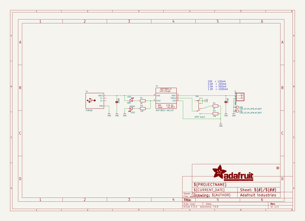
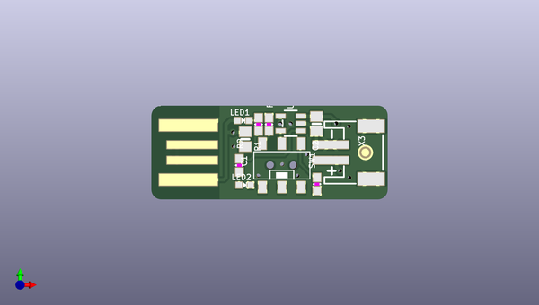
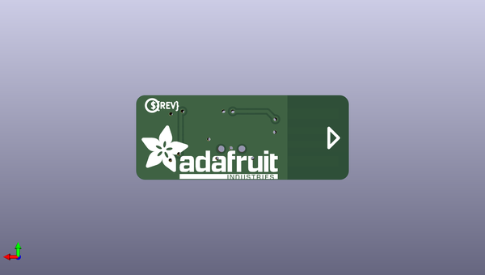

# adafruit_microlipo_pcb
 
## summary 
* id: adafruit_adafruit_microlipo_pcb_adafruit_usb_c_microlipo_charger
* user: adafruit
* name: adafruit_microlipo_pcb
* board: adafruit_usb_c_microlipo_charger
* repo: https://github.com/adafruit/Adafruit-MicroLipo-PCB

* src_file_repo_sch: 
* src_file_repo_sch_link: https://github.com/adafruit/Adafruit-MicroLipo-PCB/tree/master/
* full details link: https://github.com/oomlout/oomlout_oomp_project_bot_v_2/tree/main/projects/adafruit_adafruit_microlipo_pcb_adafruit_usb_c_microlipo_charger/current_version/working  

## schematic  
  
[schematic (pdf)](working_schematic.pdf) 

## pcb  
 
  
  
  
[board (pdf)](working.pdf)  

## working_bom
| Id | Designator | Footprint | Quantity | Designation | Supplier and ref |  | None | 
| --- | --- | --- | --- | --- | --- | --- | --- | 
| 1 | R3,R2 | 0603-NO | 2 | 10K |  |  | [''] | 
| 2 | LED2 | CHIPLED_0603_NOOUTLINE | 1 | GREEN |  |  | [''] | 
| 3 | C1,C2 | 0805-NO | 2 | 10uF |  |  | [''] | 
| 4 | LED1 | CHIPLED_0603_NOOUTLINE | 1 | RED |  |  | [''] | 
| 5 | PLABEL3 | PLABEL3 | 1 |  |  |  | [''] | 
| 6 | PLABEL1 | PLABEL1 | 1 |  |  |  | [''] | 
| 7 | PLABEL8 | PLABEL8 | 1 |  |  |  | [''] | 
| 8 | R4,R1 | 0603-NO | 2 | 2K |  |  | [''] | 
| 9 | PLABEL7 | PLABEL7 | 1 |  |  |  | [''] | 
| 10 | FID1 | FIDUCIAL_1MM | 1 | FIDUCIAL_1MM |  |  | [''] | 
| 11 | PLABEL5 | PLABEL5 | 1 |  |  |  | [''] | 
| 12 | PLABEL2 | PLABEL2 | 1 |  |  |  | [''] | 
| 13 | PLABEL0 | PLABEL0 | 1 |  |  |  | [''] | 
| 14 | PLABEL4 | PLABEL4 | 1 |  |  |  | [''] | 
| 15 | PLABEL6 | PLABEL6 | 1 |  |  |  | [''] | 
| 16 | X3 | JSTPH2_BATT | 1 | CON_JST_PH_2PIN_MT_BATT |  |  | [''] | 
| 17 | X1 | USBA_PCB | 1 | PCBUSB |  |  | [''] | 
| 18 | SW1 | EG1390 | 1 | DPDT Switch |  |  | [''] | 
| 19 | U1 | SOT23-5 | 1 | MCP73831T-2ACI/OT |  |  | [''] | 
| 20 | PLABEL9 | PLABEL9 | 1 |  |  |  | [''] | 
| 21 | PLABEL11 | PLABEL11 | 1 |  |  |  | [''] | 
| 22 | U$8 | ADAFRUIT_TEXT_20MM | 1 |  |  |  | [''] | 
| 23 | U$9 | PCBFEAT-REV-040 | 1 |  |  |  | [''] | 
| 24 | PLABEL10 | PLABEL10 | 1 |  |  |  | [''] | 

## bom_schematic
| Ref | Qnty | Value | Cmp name | Footprint | Description | Vendor | DNP | 
| --- | --- | --- | --- | --- | --- | --- | --- | 
| C1, C2 | 2 | 10uF | CAP_CERAMIC0805-NOOUTLINE | working:0805-NO |  |  |  | 
| FID1 | 1 | FIDUCIAL_1MM | FIDUCIAL_1MM | working:FIDUCIAL_1MM |  |  |  | 
| LED1 | 1 | RED | LED0603_NOOUTLINE | working:CHIPLED_0603_NOOUTLINE |  |  |  | 
| LED2 | 1 | GREEN | LED0603_NOOUTLINE | working:CHIPLED_0603_NOOUTLINE |  |  |  | 
| R1, R4 | 2 | 2K | RESISTOR_0603_NOOUT | working:0603-NO |  |  |  | 
| R2, R3 | 2 | 10K | RESISTOR_0603_NOOUT | working:0603-NO |  |  |  | 
| SW1 | 1 | DPDT Switch | SWITCH_DPDTEG1390 | working:EG1390 |  |  |  | 
| U1 | 1 | MCP73831T-2ACI/OT | MCP73831/2 | working:SOT23-5 |  |  |  | 
| X1 | 1 | PCBUSB | USB_TYPEAPCB | working:USBA_PCB |  |  |  | 
| X3 | 1 | CON_JST_PH_2PIN_MT_BATT | CON_JST_PH_2PIN_MT_BATT | working:JSTPH2_BATT |  |  |  | 

