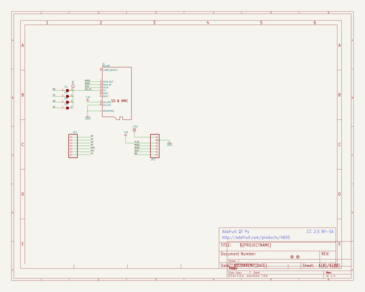
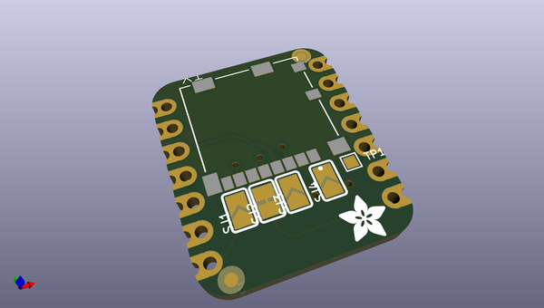
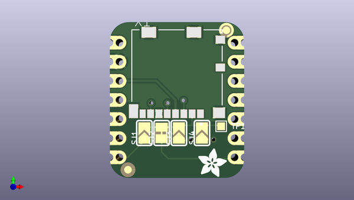
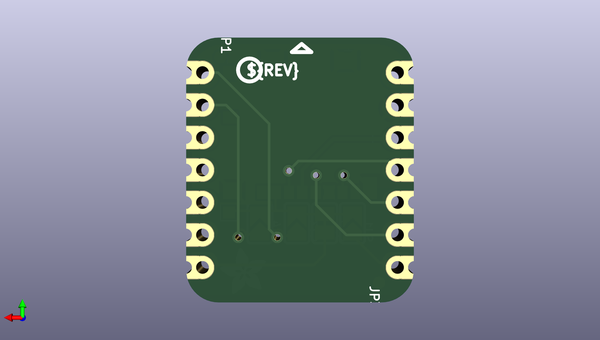

# adafruit_microsd_card_bff_pcb
 
## summary 
* id: adafruit_adafruit_microsd_card_bff_pcb_adafruit_microsd_bff
* user: adafruit
* name: adafruit_microsd_card_bff_pcb
* board: adafruit_microsd_bff
* repo: https://github.com/adafruit/Adafruit-microSD-Card-BFF-PCB

* src_file_repo_sch: 
* src_file_repo_sch_link: https://github.com/adafruit/Adafruit-microSD-Card-BFF-PCB/tree/main/
* full details link: https://github.com/oomlout/oomlout_oomp_project_bot_v_2/tree/main/projects/adafruit_adafruit_microsd_card_bff_pcb_adafruit_microsd_bff/current_version/working  

## schematic  
  
[schematic (pdf)](working_schematic.pdf)  

## pcb  
 
  
  
  
[board (pdf)](working.pdf)  

## working_bom
| Id | Designator | Footprint | Quantity | Designation | Supplier and ref |  | None | 
| --- | --- | --- | --- | --- | --- | --- | --- | 
| 1 | U$8,U$6 | FIDUCIAL_1MM | 2 | FIDUCIAL_1MM |  |  | [''] | 
| 2 | U$2 | ADAFRUIT_3.5MM | 1 |  |  |  | [''] | 
| 3 | TP1 | TESTPOINT_PAD_1MM | 1 |  |  |  | [''] | 
| 4 | X1 | MOLEX_104031-0811 | 1 | MicroSD |  |  | [''] | 
| 5 | PLABEL5 | PLABEL5 | 1 |  |  |  | [''] | 
| 6 | PLABEL2 | PLABEL2 | 1 |  |  |  | [''] | 
| 7 | SJ1,SJ4,SJ3 | SOLDERJUMPER_ARROW_NOPASTE | 3 |  |  |  | [''] | 
| 8 | PLABEL3 | PLABEL3 | 1 |  |  |  | [''] | 
| 9 | PLABEL4 | PLABEL4 | 1 |  |  |  | [''] | 
| 10 | PLABEL0 | PLABEL0 | 1 |  |  |  | [''] | 
| 11 | PLABEL1 | PLABEL1 | 1 |  |  |  | [''] | 
| 12 | SJ2 | SOLDERJUMPER_CLOSEDWIRE | 1 |  |  |  | [''] | 
| 13 | U$3 | PCBFEAT-REV-040 | 1 |  |  |  | [''] | 
| 14 | PLABEL7 | PLABEL7 | 1 |  |  |  | [''] | 
| 15 | JP1,JP3 | 1X07_CASTEL | 2 |  |  |  | [''] | 
| 16 | PLABEL6 | PLABEL6 | 1 |  |  |  | [''] | 

## bom_schematic
| Ref | Qnty | Value | Cmp name | Footprint | Description | Vendor | DNP | 
| --- | --- | --- | --- | --- | --- | --- | --- | 
| JP1, JP3 | 2 | HEADER-1X7_CASTEL | HEADER-1X7_CASTEL | working:1X07_CASTEL |  |  |  | 
| SJ1, SJ3, SJ4 | 3 | SOLDERJUMPER | SOLDERJUMPER | working:SOLDERJUMPER_ARROW_NOPASTE |  |  |  | 
| SJ2 | 1 | SOLDERJUMPERCLOSED | SOLDERJUMPERCLOSED | working:SOLDERJUMPER_CLOSEDWIRE |  |  |  | 
| TP1 | 1 | TESTPOINTPAD1MM | TESTPOINTPAD1MM | working:TESTPOINT_PAD_1MM |  |  |  | 
| U$6, U$8 | 2 | FIDUCIAL_1MM | FIDUCIAL_1MM | working:FIDUCIAL_1MM |  |  |  | 
| X1 | 1 | MicroSD | MICROSD104031-0811 | working:MOLEX_104031-0811 |  |  |  | 

