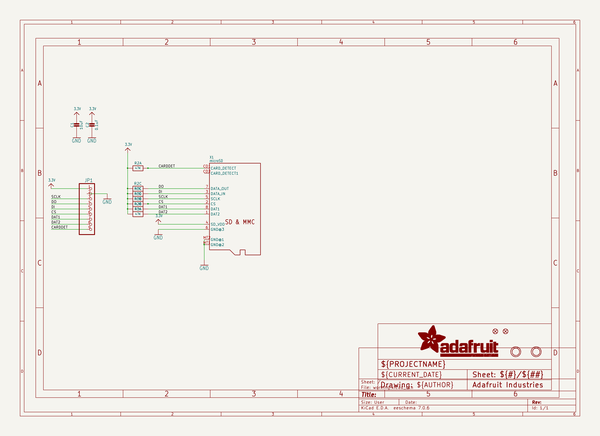
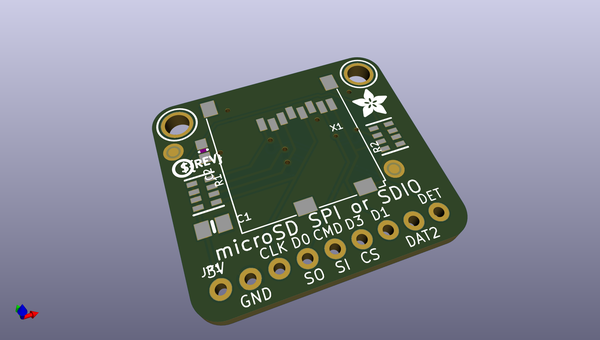
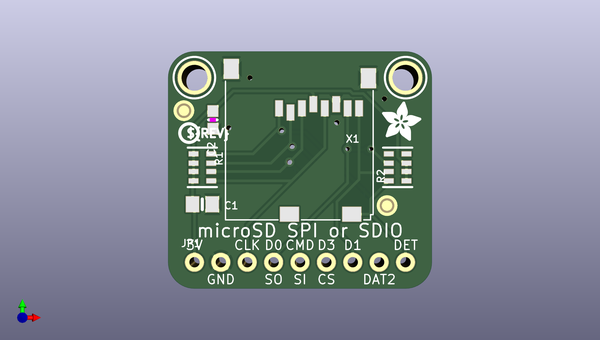
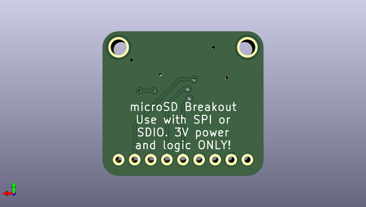

# adafruit_microsd_spi_or_sdio_card_breakout_pcb
 
## summary 
* id: adafruit_adafruit_microsd_spi_or_sdio_card_breakout_pcb_adafruit_sdio_microsd
* user: adafruit
* name: adafruit_microsd_spi_or_sdio_card_breakout_pcb
* board: adafruit_sdio_microsd
* repo: https://github.com/adafruit/Adafruit-MicroSD-SPI-or-SDIO-card-breakout-PCB

* src_file_repo_sch: 
* src_file_repo_sch_link: https://github.com/adafruit/Adafruit-MicroSD-SPI-or-SDIO-card-breakout-PCB/tree/master/
* full details link: https://github.com/oomlout/oomlout_oomp_project_bot_v_2/tree/main/projects/adafruit_adafruit_microsd_spi_or_sdio_card_breakout_pcb_adafruit_sdio_microsd/current_version/working  

## schematic  
  
[schematic (pdf)](working_schematic.pdf)  

## pcb  
 
  
  
  
[board (pdf)](working.pdf)  

## working_bom
| Id | Designator | Footprint | Quantity | Designation | Supplier and ref |  | None | 
| --- | --- | --- | --- | --- | --- | --- | --- | 
| 1 | U$4 | ADAFRUIT_3.5MM | 1 |  |  |  | [''] | 
| 2 | JP1 | 1X09_ROUND_70 | 1 |  |  |  | [''] | 
| 3 | X1 | MICROSD | 1 | microSD |  |  | [''] | 
| 4 | R2,R1 | RESPACK_4X0603 | 2 | 47K |  |  | [''] | 
| 5 | C1 | 0805-NO | 1 | 10uF |  |  | [''] | 
| 6 | FID2,FID1 | FIDUCIAL_1MM | 2 | FIDUCIAL" |  |  | [''] | 
| 7 | U$2,U$1 | MOUNTINGHOLE_2.5_PLATED | 2 | MOUNTINGHOLE2.5 |  |  | [''] | 
| 8 | U$7 | PCBFEAT-REV-040 | 1 |  |  |  | [''] | 
| 9 | C2 | 0603-NO | 1 | 0.1uF |  |  | [''] | 

## bom_schematic
| Ref | Qnty | Value | Cmp name | Footprint | Description | Vendor | DNP | 
| --- | --- | --- | --- | --- | --- | --- | --- | 
| C1 | 1 | 10uF | CAP_CERAMIC0805-NOOUTLINE | working:0805-NO |  |  |  | 
| C2 | 1 | 0.1uF | CAP_CERAMIC0603_NO | working:0603-NO |  |  |  | 
| FID1, FID2 | 2 | FIDUCIAL"" | FIDUCIAL{dblquote}{dblquote} | working:FIDUCIAL_1MM |  |  |  | 
| JP1 | 1 | HEADER-1X970MIL | HEADER-1X970MIL | working:1X09_ROUND_70 |  |  |  | 
| R1, R2 | 2 | 47K | RESISTOR_4PACK | working:RESPACK_4X0603 |  |  |  | 
| U$1, U$2 | 2 | MOUNTINGHOLE2.5 | MOUNTINGHOLE2.5 | working:MOUNTINGHOLE_2.5_PLATED |  |  |  | 
| X1 | 1 | microSD | MICROSD | working:MICROSD |  |  |  | 

## mounting_holes
| x | y | package | value | ref | size | 
| --- | --- | --- | --- | --- | --- | 
| 0.0 | 0.0 | MOUNTINGHOLE_2.5_PLATED | MOUNTINGHOLE2.5 | U$1 | m3 | 
| 20.319999999999993 | 0.0 | MOUNTINGHOLE_2.5_PLATED | MOUNTINGHOLE2.5 | U$2 | m3 | 

