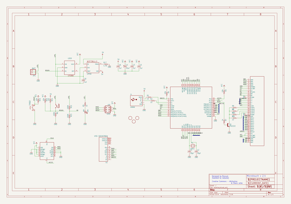
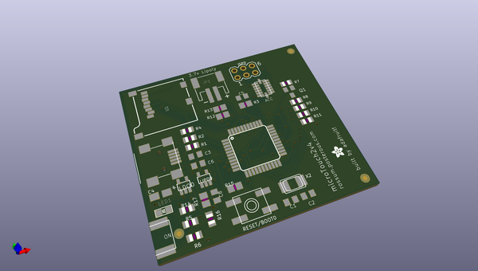
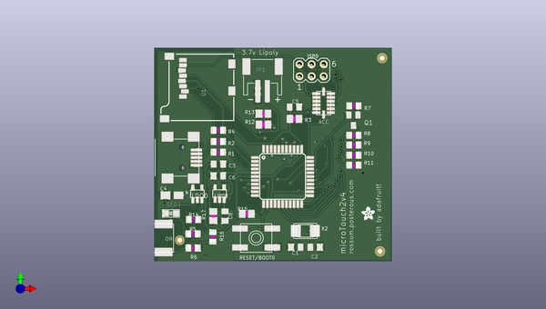
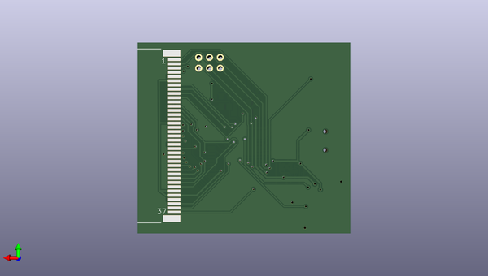

# adafruit_microtouch
 
## summary 
* id: adafruit_adafruit_microtouch_microtouch
* user: adafruit
* name: adafruit_microtouch
* board: microtouch
* repo: https://github.com/adafruit/Adafruit_Microtouch

* src_file_repo_sch: 
* src_file_repo_sch_link: https://github.com/adafruit/Adafruit_Microtouch/tree/master/
* full details link: https://github.com/oomlout/oomlout_oomp_project_bot_v_2/tree/main/projects/adafruit_adafruit_microtouch_microtouch/current_version/working  

## schematic  
  
[schematic (pdf)](working_schematic.pdf) 

## pcb  
 
  
  
  
[board (pdf)](working.pdf)  

## working_bom
| Id | Designator | Footprint | Quantity | Designation | Supplier and ref |  | None | 
| --- | --- | --- | --- | --- | --- | --- | --- | 
| 1 | U2 | KSSMINI | 1 | KSSMINISWITCH |  |  | [''] | 
| 2 | R5,R7 | R0805 | 2 | 1k |  |  | [''] | 
| 3 | LED1 | CHIPLED_0805 | 1 | RED |  |  | [''] | 
| 4 | LIPO0 | SOT23-5L | 1 | MCP73811/2 |  |  | [''] | 
| 5 | U1 | MICRO-SD-SOCKET-PP | 1 | MICROSD |  |  | [''] | 
| 6 | RESET/BOOT0 | EVQ-Q2 | 1 | EVQQ2 |  |  | [''] | 
| 7 | JP1 | JSTPH2 | 1 | BATT |  |  | [''] | 
| 8 | U$6,U$8,U$7 | FIDUCIAL_1MM | 3 | FIDUCIAL |  |  | [''] | 
| 9 | C2,C1 | C0805K | 2 | 18pf |  |  | [''] | 
| 10 | R1,R11,R2,R8,R9,R10 | R0805 | 6 | 22 |  |  | [''] | 
| 11 | X2 | NX5032 | 1 | 16Mhz |  |  | [''] | 
| 12 | C5,C8,C3,C6 | C0805K | 4 | 1uf |  |  | [''] | 
| 13 | R4,R14,R16 | R0805 | 3 | 10k |  |  | [''] | 
| 14 | ISP0 | MA03-2 | 1 | ISP |  |  | [''] | 
| 15 | U$1 | TQFP44 | 1 | ATMEGA32U4 |  |  | [''] | 
| 16 | U$9 | ADAFRUIT200MIL | 1 |  |  |  | [''] | 
| 17 | X1 | USB-MINIB | 1 | USBSMD |  |  | [''] | 
| 18 | R13,R12 | M0805 | 2 | 100K |  |  | [''] | 
| 19 | ACCELEROMERTER0 | LGA | 1 | MMA7455 |  |  | [''] | 
| 20 | R17 | M0805 | 1 | 4.7K |  |  | [''] | 
| 21 | R6 | R0805 | 1 | 100k |  |  | [''] | 
| 22 | C4 | A_3216-18R | 1 | 10uF |  |  | [''] | 
| 23 | LDO0 | SOT23-5L | 1 | LP298XS |  |  | [''] | 
| 24 | R3,R15 | M0805 | 2 | 10k |  |  | [''] | 
| 25 | Q1 | SOT23-BEC | 1 | PN2222 |  |  | [''] | 
| 26 | U$2 | LCD371MM | 1 | LCD37 |  |  | [''] | 

## bom_schematic
| Ref | Qnty | Value | Cmp name | Footprint | Description | Vendor | DNP | 
| --- | --- | --- | --- | --- | --- | --- | --- | 
| ACCELEROMERTER0 | 1 | MMA7455 | MMA7455 | working:LGA |  |  |  | 
| C1, C2 | 2 | 18pf | C-USC0805K | working:C0805K |  |  |  | 
| C3, C5, C6, C8 | 4 | 1uf | C-USC0805K | working:C0805K |  |  |  | 
| C4 | 1 | 10uF | CPOL-USA/3216-18R | working:A_3216-18R |  |  |  | 
| ISP0 | 1 | ISP | MA03-2 | working:MA03-2 |  |  |  | 
| JP1 | 1 | BATT | JST_2PIN | working:JSTPH2 |  |  |  | 
| LDO0 | 1 | LP298XS | LP298XS | working:SOT23-5L |  |  |  | 
| LED1 | 1 | RED | LED0805 | working:CHIPLED_0805 |  |  |  | 
| LIPO0 | 1 | MCP73811/2 | MCP73811/2 | working:SOT23-5L |  |  |  | 
| Q1 | 1 | PN2222 | -NPN-SOT23-BEC | working:SOT23-BEC |  |  |  | 
| R1, R2, R8, R9, R10, R11 | 6 | 22 | R-US_R0805 | working:R0805 |  |  |  | 
| R3, R15 | 2 | 10k | R-US_M0805 | working:M0805 |  |  |  | 
| R4, R14, R16 | 3 | 10k | R-US_R0805 | working:R0805 |  |  |  | 
| R5, R7 | 2 | 1k | R-US_R0805 | working:R0805 |  |  |  | 
| R6 | 1 | 100k | R-US_R0805 | working:R0805 |  |  |  | 
| R12, R13 | 2 | 100K | R-US_M0805 | working:M0805 |  |  |  | 
| R17 | 1 | 4.7K | R-US_M0805 | working:M0805 |  |  |  | 
| RESET/BOOT0 | 1 | EVQQ2 | EVQQ2 | working:EVQ-Q2 |  |  |  | 
| U1 | 1 | USD-SOCKETNEW | USD-SOCKETNEW | working:MICRO-SD-SOCKET-PP |  |  |  | 
| U2 | 1 | KSSMINISWITCH | KSSMINISWITCH | working:KSSMINI |  |  |  | 
| U$1 | 1 | ATMEGA32U4TQFP | ATMEGA32U4TQFP | working:TQFP44 |  |  |  | 
| U$2 | 1 | LCD37 | LCD37 | working:LCD371MM |  |  |  | 
| U$6, U$7, U$8 | 3 | FIDUCIAL | FIDUCIAL | working:FIDUCIAL_1MM |  |  |  | 
| X1 | 1 | USBSMD | USBMINIB | working:USB-MINIB |  |  |  | 
| X2 | 1 | 16Mhz | XTALNX5032 | working:NX5032 |  |  |  | 

