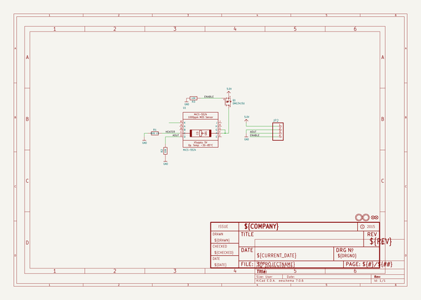
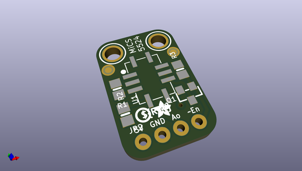
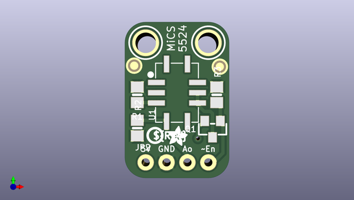
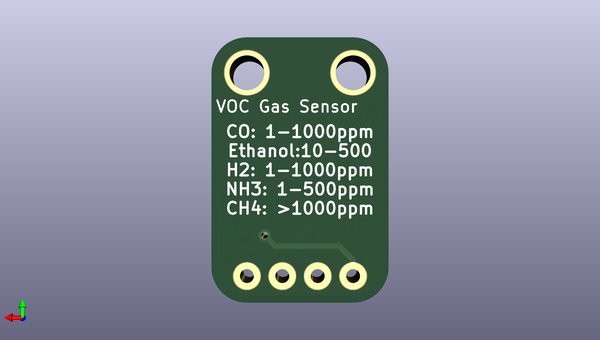

# adafruit_mics_5524_gas_sensor_breakout_pcb
 
## summary 
* id: adafruit_adafruit_mics_5524_gas_sensor_breakout_pcb_adafruit_mics_5524
* user: adafruit
* name: adafruit_mics_5524_gas_sensor_breakout_pcb
* board: adafruit_mics_5524
* repo: https://github.com/adafruit/Adafruit-MiCS-5524-Gas-Sensor-Breakout-PCB

* src_file_repo_sch: 
* src_file_repo_sch_link: https://github.com/adafruit/Adafruit-MiCS-5524-Gas-Sensor-Breakout-PCB/tree/master/
* full details link: https://github.com/oomlout/oomlout_oomp_project_bot_v_2/tree/main/projects/adafruit_adafruit_mics_5524_gas_sensor_breakout_pcb_adafruit_mics_5524/current_version/working  

## schematic  
  
[schematic (pdf)](working_schematic.pdf) 

## pcb  
 
  
  
  
[board (pdf)](working.pdf)  

## working_bom
| Id | Designator | Footprint | Quantity | Designation | Supplier and ref |  | None | 
| --- | --- | --- | --- | --- | --- | --- | --- | 
| 1 | U$3,U$4 | MOUNTINGHOLE_2.5_PLATED | 2 | MOUNTINGHOLE2.5 |  |  | [''] | 
| 2 | FID2,FID1 | FIDUCIAL_1MM | 2 | FIDUCIAL" |  |  | [''] | 
| 3 | U$10 | PCBFEAT-REV-040 | 1 |  |  |  | [''] | 
| 4 | U$7 | ADAFRUIT_2.5MM | 1 |  |  |  | [''] | 
| 5 | JP2 | 1X04_ROUND_76 | 1 |  |  |  | [''] | 
| 6 | R1 | 0805-NO | 1 | 82Ω 1% |  |  | [''] | 
| 7 | R2,R3 | 0805-NO | 2 | 10K |  |  | [''] | 
| 8 | U1 | MICS-5524 | 1 | MiCS-5524 |  |  | [''] | 
| 9 | Q1 | SOT23-WIDE | 1 | DMG3415U |  |  | [''] | 

## bom_schematic
| Ref | Qnty | Value | Cmp name | Footprint | Description | Vendor | DNP | 
| --- | --- | --- | --- | --- | --- | --- | --- | 
| FID1, FID2 | 2 | FIDUCIAL"" | FIDUCIAL{dblquote}{dblquote} | working:FIDUCIAL_1MM |  |  |  | 
| JP2 | 1 | HEADER-1X476MIL | HEADER-1X476MIL | working:1X04_ROUND_76 |  |  |  | 
| Q1 | 1 | DMG3415U | MOSFET-PWIDE | working:SOT23-WIDE |  |  |  | 
| R1 | 1 | 82Ω 1% | RESISTOR0805_NOOUTLINE | working:0805-NO |  |  |  | 
| R2, R3 | 2 | 10K | RESISTOR0805_NOOUTLINE | working:0805-NO |  |  |  | 
| U1 | 1 | MiCS-5524 | MICS-5524 | working:MICS-5524 |  |  |  | 
| U$3, U$4 | 2 | MOUNTINGHOLE2.5 | MOUNTINGHOLE2.5 | working:MOUNTINGHOLE_2.5_PLATED |  |  |  | 

## mounting_holes
| x | y | package | value | ref | size | 
| --- | --- | --- | --- | --- | --- | 
| 0.0 | 0.0 | MOUNTINGHOLE_2.5_PLATED | MOUNTINGHOLE2.5 | U$3 | m3 | 
| 7.62 | 0.0 | MOUNTINGHOLE_2.5_PLATED | MOUNTINGHOLE2.5 | U$4 | m3 | 

