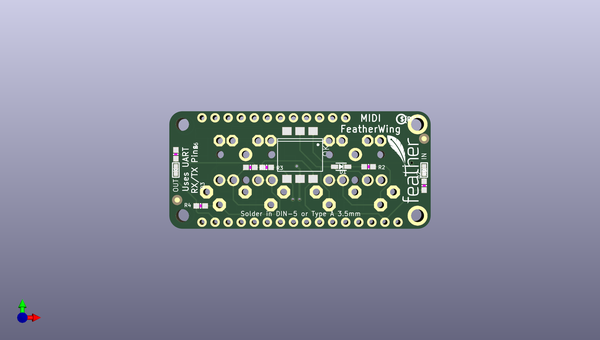

# adafruit_midi_featherwing_pcb
 
## summary 
* id: adafruit_adafruit_midi_featherwing_pcb_adafruit_midi_featherwing
* user: adafruit
* name: adafruit_midi_featherwing_pcb
* board: adafruit_midi_featherwing
* repo: https://github.com/adafruit/Adafruit-MIDI-FeatherWing-PCB

* src_file_repo_sch: 
* src_file_repo_sch_link: https://github.com/adafruit/Adafruit-MIDI-FeatherWing-PCB/tree/master/
* full details link: https://github.com/oomlout/oomlout_oomp_project_bot_v_2/tree/main/projects/adafruit_adafruit_midi_featherwing_pcb_adafruit_midi_featherwing/current_version/working  

## schematic  
  
[schematic (pdf)](working_schematic.pdf)  

## pcb  
 
  
  
  
[board (pdf)](working.pdf)  

## working_bom
| Id | Designator | Footprint | Quantity | Designation | Supplier and ref |  | None | 
| --- | --- | --- | --- | --- | --- | --- | --- | 
| 1 | R5,R6 | 0603-NO | 2 | 2.2K |  |  | [''] | 
| 2 | D2,D3 | CHIPLED_0603 | 2 | BLUE |  |  | [''] | 
| 3 | R4 | 0603-NO | 1 | 10 |  |  | [''] | 
| 4 | FID1,FID2 | FIDUCIAL_1MM | 2 | FIDUCIAL_1MM |  |  | [''] | 
| 5 | D1 | SOD-323 | 1 | 1N4148 |  |  | [''] | 
| 6 | R3 | 0603-NO | 1 | 470 |  |  | [''] | 
| 7 | OK2 | DIL6-SMD | 1 | H11L1MS |  |  | [''] | 
| 8 | U$9 | FEATHERLOGO_SMALL | 1 |  |  |  | [''] | 
| 9 | U$8 | PCBFEAT-REV-040 | 1 |  |  |  | [''] | 
| 10 | R2 | 0603-NO | 1 | 220 |  |  | [''] | 
| 11 | R1 | 0603-NO | 1 | 33 |  |  | [''] | 
| 12 | MIDIOUT0,MIDIIN0 | CP-2350 | 2 | DIN_5 |  |  | [''] | 
| 13 | X2,X1 | STX3100 | 2 | 3.5mm |  |  | [''] | 
| 14 | MS1 | FEATHERWING_NODIM | 1 | FEATHERWING_NODIM |  |  | [''] | 

## bom_schematic
| Ref | Qnty | Value | Cmp name | Footprint | Description | Vendor | DNP | 
| --- | --- | --- | --- | --- | --- | --- | --- | 
| D1 | 1 | 1N4148 | DIODESOD-323 | working:SOD-323 |  |  |  | 
| D2, D3 | 2 | BLUE | LED0603 | working:CHIPLED_0603 |  |  |  | 
| FID1, FID2 | 2 | FIDUCIAL_1MM | FIDUCIAL_1MM | working:FIDUCIAL_1MM |  |  |  | 
| MIDIIN0 | 1 | DIN_5 | DIN_5 | working:CP-2350 |  |  |  | 
| MIDIOUT0 | 1 | DIN_5 | DIN_5 | working:CP-2350 |  |  |  | 
| MS1 | 1 | FEATHERWING_NODIM | FEATHERWING_NODIM | working:FEATHERWING_NODIM |  |  |  | 
| OK2 | 1 | H11LMS | H11LMS | working:DIL6-SMD |  |  |  | 
| R1 | 1 | 33 | RESISTOR_0603_NOOUT | working:0603-NO |  |  |  | 
| R2 | 1 | 220 | RESISTOR_0603_NOOUT | working:0603-NO |  |  |  | 
| R3 | 1 | 470 | RESISTOR_0603_NOOUT | working:0603-NO |  |  |  | 
| R4 | 1 | 10 | RESISTOR_0603_NOOUT | working:0603-NO |  |  |  | 
| R5, R6 | 2 | 2.2K | RESISTOR_0603_NOOUT | working:0603-NO |  |  |  | 
| X1, X2 | 2 | 3.5mm | AUDIO_STEREOJACK | working:STX3100 |  |  |  | 

