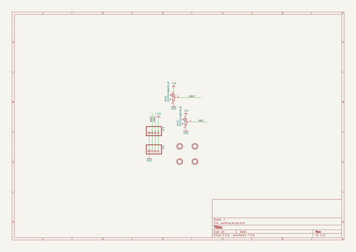
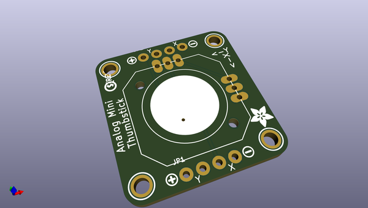
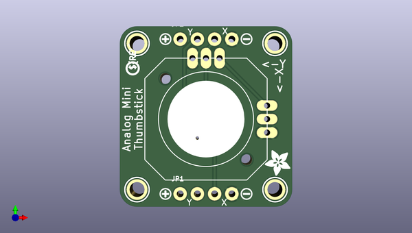
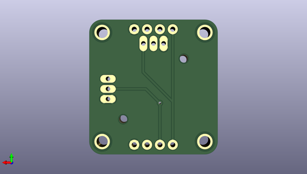

# adafruit_mini_analog_thumbstick_breakout_pcb
 
## summary 
* id: adafruit_adafruit_mini_analog_thumbstick_breakout_pcb_adafruit_mini_analog_thumbstick
* user: adafruit
* name: adafruit_mini_analog_thumbstick_breakout_pcb
* board: adafruit_mini_analog_thumbstick
* repo: https://github.com/adafruit/Adafruit-Mini-Analog-Thumbstick-Breakout-PCB

* src_file_repo_sch: 
* src_file_repo_sch_link: https://github.com/adafruit/Adafruit-Mini-Analog-Thumbstick-Breakout-PCB/tree/master/
* full details link: https://github.com/oomlout/oomlout_oomp_project_bot_v_2/tree/main/projects/adafruit_adafruit_mini_analog_thumbstick_breakout_pcb_adafruit_mini_analog_thumbstick/current_version/working  

## schematic  
  
[schematic (pdf)](working_schematic.pdf) 

## pcb  
 
  
  
  
[board (pdf)](working.pdf)  

## working_bom
| Id | Designator | Footprint | Quantity | Designation | Supplier and ref |  | None | 
| --- | --- | --- | --- | --- | --- | --- | --- | 
| 1 | U$13 | PCBFEAT-REV-040 | 1 |  |  |  | [''] | 
| 2 | U$5,U$6,U$1,U$4 | MOUNTINGHOLE_2.0_PLATED | 4 | MOUNTINGHOLE2.0 |  |  | [''] | 
| 3 | U$11,U$12 | SYMBOL_MINUS | 2 |  |  |  | [''] | 
| 4 | JOY1 | JOYSTICK_ANALOG_MINITHM | 1 | JOYSTICK_ANALOG_XY |  |  | [''] | 
| 5 | U$10,U$9 | SYMBOL_PLUS | 2 |  |  |  | [''] | 
| 6 | JP1,JP2 | 1X04_ROUND_76 | 2 |  |  |  | [''] | 
| 7 | U$8 | ADAFRUIT_3.5MM | 1 |  |  |  | [''] | 

## bom_schematic
| Ref | Qnty | Value | Cmp name | Footprint | Description | Vendor | DNP | 
| --- | --- | --- | --- | --- | --- | --- | --- | 
| JOY1 | 1 | JOYSTICK_ANALOG_XY | JOYSTICK_ANALOG_XY | working:JOYSTICK_ANALOG_MINITHM |  |  |  | 
| JP1, JP2 | 2 | HEADER-1X476MIL | HEADER-1X476MIL | working:1X04_ROUND_76 |  |  |  | 
| U$1, U$4, U$5, U$6 | 4 | MOUNTINGHOLE2.0 | MOUNTINGHOLE2.0 | working:MOUNTINGHOLE_2.0_PLATED |  |  |  | 

## mounting_holes
| x | y | package | value | ref | size | 
| --- | --- | --- | --- | --- | --- | 
| 20.32 | 0.0 | MOUNTINGHOLE_2.0_PLATED | MOUNTINGHOLE2.0 | U$1 | m3 | 
| 0.0 | 0.0 | MOUNTINGHOLE_2.0_PLATED | MOUNTINGHOLE2.0 | U$4 | m3 | 
| 20.32 | 21.59 | MOUNTINGHOLE_2.0_PLATED | MOUNTINGHOLE2.0 | U$5 | m3 | 
| 0.0 | 21.59 | MOUNTINGHOLE_2.0_PLATED | MOUNTINGHOLE2.0 | U$6 | m3 | 

