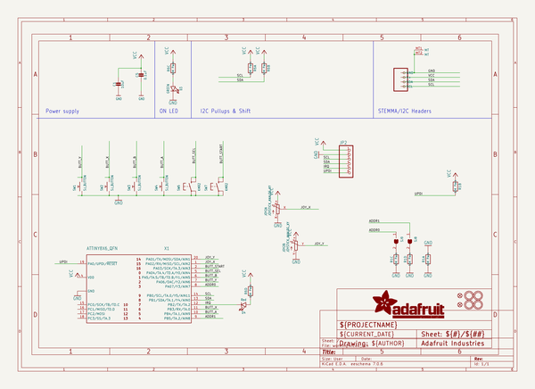
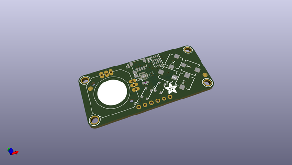
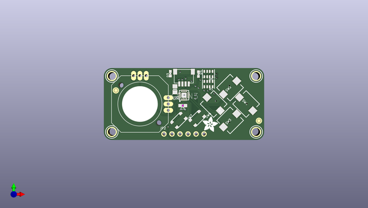
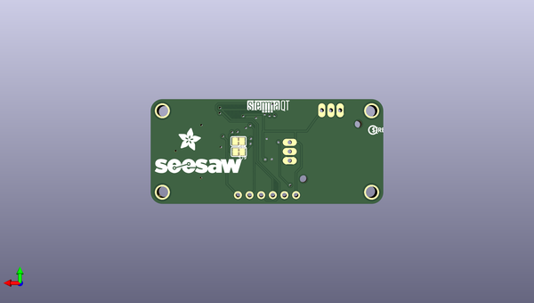

# adafruit_mini_i2c_gamepad_pcb
 
## summary 
* id: adafruit_adafruit_mini_i2c_gamepad_pcb_gamepad_seesaw_qt_rev_a
* user: adafruit
* name: adafruit_mini_i2c_gamepad_pcb
* board: gamepad_seesaw_qt_rev_a
* repo: https://github.com/adafruit/Adafruit-Mini-I2C-Gamepad-PCB

* src_file_repo_sch: 
* src_file_repo_sch_link: https://github.com/adafruit/Adafruit-Mini-I2C-Gamepad-PCB/tree/main/
* full details link: https://github.com/oomlout/oomlout_oomp_project_bot_v_2/tree/main/projects/adafruit_adafruit_mini_i2c_gamepad_pcb_gamepad_seesaw_qt_rev_a/current_version/working  

## schematic  
  
[schematic (pdf)](working_schematic.pdf) 

## pcb  
 
  
  
  
[board (pdf)](working.pdf)  

## working_bom
| Id | Designator | Footprint | Quantity | Designation | Supplier and ref |  | None | 
| --- | --- | --- | --- | --- | --- | --- | --- | 
| 1 | SW2,SW3,SW4,SW1 | PUSHBUTTON_SMD_SJ | 4 | SJ_BUTTON |  |  | [''] | 
| 2 | R6,R1 | RESPACK_4X0603 | 2 | 10K Pack |  |  | [''] | 
| 3 | U$1,U$2,U$3,U$4 | MOUNTINGHOLE_2.5_PLATED | 4 | MOUNTINGHOLE2.5 |  |  | [''] | 
| 4 | PLABEL6 | PLABEL6 | 1 |  |  |  | [''] | 
| 5 | FID2,FID1 | FIDUCIAL_1MM | 2 | FIDUCIAL_1MM |  |  | [''] | 
| 6 | U$9,U$11 | ADAFRUIT_5MM | 2 |  |  |  | [''] | 
| 7 | PLABEL4 | PLABEL4 | 1 |  |  |  | [''] | 
| 8 | PLABEL7 | PLABEL7 | 1 |  |  |  | [''] | 
| 9 | X1 | QFN20_3MM | 1 | ATTINY8X6_QFN |  |  | [''] | 
| 10 | D4 | CHIPLED_0603_NOOUTLINE | 1 | Red |  |  | [''] | 
| 11 | JOY2 | JOYSTICK_ANALOG_MINITHM | 1 | JOYSTICK_ANALOG_XY |  |  | [''] | 
| 12 | PLABEL0 | PLABEL0 | 1 |  |  |  | [''] | 
| 13 | SW7,SW6 | BTN_RKB2_4.6X2.8 | 2 | KMR2 |  |  | [''] | 
| 14 | PLABEL3 | PLABEL3 | 1 |  |  |  | [''] | 
| 15 | D3 | CHIPLED_0603_NOOUTLINE | 1 | GREEN |  |  | [''] | 
| 16 | PLABEL5 | PLABEL5 | 1 |  |  |  | [''] | 
| 17 | PLABEL2 | PLABEL2 | 1 |  |  |  | [''] | 
| 18 | CONN3 | JST_SH4 | 1 | STEMMA_I2C_QT |  |  | [''] | 
| 19 | JP2 | 1X06_ROUND | 1 |  |  |  | [''] | 
| 20 | C1 | 0805-NO | 1 | 10uF |  |  | [''] | 
| 21 | C5 | 0603-NO | 1 | 0.1uF |  |  | [''] | 
| 22 | PLABEL1 | PLABEL1 | 1 |  |  |  | [''] | 
| 23 | SJ8,SJ9 | SOLDERJUMPER_CLOSEDWIRE | 2 |  |  |  | [''] | 
| 24 | PLABEL11 | PLABEL11 | 1 |  |  |  | [''] | 
| 25 | U$5 | STEMMAQT | 1 |  |  |  | [''] | 
| 26 | PLABEL17 | PLABEL17 | 1 |  |  |  | [''] | 
| 27 | PLABEL13 | PLABEL13 | 1 |  |  |  | [''] | 
| 28 | PLABEL9 | PLABEL9 | 1 |  |  |  | [''] | 
| 29 | PLABEL10 | PLABEL10 | 1 |  |  |  | [''] | 
| 30 | U$7 | PCBFEAT-REV-040 | 1 |  |  |  | [''] | 
| 31 | PLABEL8 | PLABEL8 | 1 |  |  |  | [''] | 
| 32 | PLABEL14 | PLABEL14 | 1 |  |  |  | [''] | 
| 33 | PLABEL12 | PLABEL12 | 1 |  |  |  | [''] | 
| 34 | PLABEL16 | PLABEL16 | 1 |  |  |  | [''] | 
| 35 | PLABEL15 | PLABEL15 | 1 |  |  |  | [''] | 
| 36 | U$12 | SEESAW_LOGO | 1 |  |  |  | [''] | 

## bom_schematic
| Ref | Qnty | Value | Cmp name | Footprint | Description | Vendor | DNP | 
| --- | --- | --- | --- | --- | --- | --- | --- | 
| C1 | 1 | 10uF | CAP_CERAMIC0805-NOOUTLINE | working:0805-NO |  |  |  | 
| C5 | 1 | 0.1uF | CAP_CERAMIC0603_NO | working:0603-NO |  |  |  | 
| CONN3 | 1 | STEMMA_I2C_QT | STEMMA_I2C_QT | working:JST_SH4 |  |  |  | 
| D3 | 1 | GREEN | LED0603_NOOUTLINE | working:CHIPLED_0603_NOOUTLINE |  |  |  | 
| D4 | 1 | Red | LED0603_NOOUTLINE | working:CHIPLED_0603_NOOUTLINE |  |  |  | 
| FID1, FID2 | 2 | FIDUCIAL_1MM | FIDUCIAL_1MM | working:FIDUCIAL_1MM |  |  |  | 
| JOY2 | 1 | JOYSTICK_ANALOG_XY | JOYSTICK_ANALOG_XY | working:JOYSTICK_ANALOG_MINITHM |  |  |  | 
| JP2 | 1 | HEADER-1X6ROUND | HEADER-1X6ROUND | working:1X06_ROUND |  |  |  | 
| R1, R6 | 2 | 10K Pack | RESISTOR_4PACK | working:RESPACK_4X0603 |  |  |  | 
| SJ8, SJ9 | 2 | SOLDERJUMPERCLOSED | SOLDERJUMPERCLOSED | working:SOLDERJUMPER_CLOSEDWIRE |  |  |  | 
| SW1, SW2, SW3, SW4 | 4 | SJ_BUTTON | SWITCH_PUSHBUTTONSOFTTOUCHSMD_SJ | working:PUSHBUTTON_SMD_SJ |  |  |  | 
| SW6, SW7 | 2 | KMR2 | SWITCH_TACT_SMT_RKB2 | working:BTN_RKB2_4.6X2.8 |  |  |  | 
| U$1, U$2, U$3, U$4 | 4 | MOUNTINGHOLE2.5 | MOUNTINGHOLE2.5 | working:MOUNTINGHOLE_2.5_PLATED |  |  |  | 
| X1 | 1 | ATTINY8X6_QFN | ATTINY8X6_QFN | working:QFN20_3MM |  |  |  | 

## mounting_holes
| x | y | package | value | ref | size | 
| --- | --- | --- | --- | --- | --- | 
| 0.0 | 17.78 | MOUNTINGHOLE_2.5_PLATED | MOUNTINGHOLE2.5 | U$1 | m3 | 
| 0.0 | 0.0 | MOUNTINGHOLE_2.5_PLATED | MOUNTINGHOLE2.5 | U$2 | m3 | 
| 45.72 | 17.78 | MOUNTINGHOLE_2.5_PLATED | MOUNTINGHOLE2.5 | U$3 | m3 | 
| 45.72 | 0.0 | MOUNTINGHOLE_2.5_PLATED | MOUNTINGHOLE2.5 | U$4 | m3 | 

