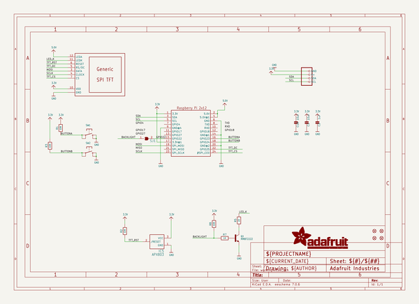
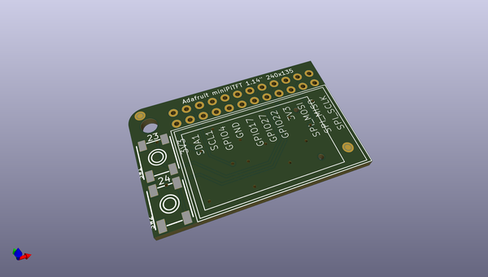
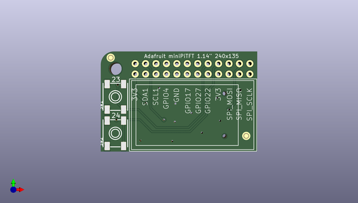
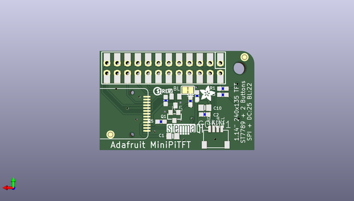

# adafruit_mini_pitft_240x135_tft_pcb
 
## summary 
* id: adafruit_adafruit_mini_pitft_240x135_tft_pcb_adafruit_mini_pitft_135x240_color_tft
* user: adafruit
* name: adafruit_mini_pitft_240x135_tft_pcb
* board: adafruit_mini_pitft_135x240_color_tft
* repo: https://github.com/adafruit/Adafruit-Mini-PiTFT-240x135-TFT-PCB

* src_file_repo_sch: 
* src_file_repo_sch_link: https://github.com/adafruit/Adafruit-Mini-PiTFT-240x135-TFT-PCB/tree/master/
* full details link: https://github.com/oomlout/oomlout_oomp_project_bot_v_2/tree/main/projects/adafruit_adafruit_mini_pitft_240x135_tft_pcb_adafruit_mini_pitft_135x240_color_tft/current_version/working  

## schematic  
  
[schematic (pdf)](working_schematic.pdf)  

## pcb  
 
  
  
  
[board (pdf)](working.pdf)  

## working_bom
| Id | Designator | Footprint | Quantity | Designation | Supplier and ref |  | None | 
| --- | --- | --- | --- | --- | --- | --- | --- | 
| 1 | SW2,SW1 | EVQ-Q2_SMALLER | 2 |  |  |  | [''] | 
| 2 | @HOLE0 |  | 1 |  |  |  | [''] | 
| 3 | DISP1 | TFT_1.14IN_240X135_WRAPAROUND | 1 | DISP_LCD_GENERIC_SPI_1.14IN_13P |  |  | [''] | 
| 4 | FID2,FID1,FID4,FID3 | FIDUCIAL_1MM | 4 | FIDUCIAL_1MM |  |  | [''] | 
| 5 | RASPI1 | RASPBERRYPI_2X12_THMSMT | 1 | RASPBERRYPI_2X12_THMSMT |  |  | [''] | 
| 6 | R5 | 0603-NO | 1 | 22 |  |  | [''] | 
| 7 | R7 | 0603-NO | 1 | 1K |  |  | [''] | 
| 8 | R2,R8,R1,R3 | 0603-NO | 4 | 10K |  |  | [''] | 
| 9 | U$15 | STEMMAQT | 1 |  |  |  | [''] | 
| 10 | C2 | 0603-NO | 1 | 1uF |  |  | [''] | 
| 11 | CONN1 | JST_SH4 | 1 | STEMMA_I2C_QT |  |  | [''] | 
| 12 | C1,C10 | 0805-NO | 2 | 10uF |  |  | [''] | 
| 13 | SJ1 | SOLDERJUMPER_CLOSEDWIRE | 1 |  |  |  | [''] | 
| 14 | U$6 | PCBFEAT-REV-040 | 1 |  |  |  | [''] | 
| 15 | Q1 | SOT23-WIDE | 1 | MMBT2222 |  |  | [''] | 
| 16 | IC5 | SOT23 | 1 | APX803 |  |  | [''] | 
| 17 | U$4 | ADAFRUIT_3.5MM | 1 | MICROSD |  |  | [''] | 

## bom_schematic
| Ref | Qnty | Value | Cmp name | Footprint | Description | Vendor | DNP | 
| --- | --- | --- | --- | --- | --- | --- | --- | 
| C1, C10 | 2 | 10uF | CAP_CERAMIC0805-NOOUTLINE | working:0805-NO |  |  |  | 
| C2 | 1 | 1uF | CAP_CERAMIC0603_NO | working:0603-NO |  |  |  | 
| CONN1 | 1 | STEMMA_I2C_QT | STEMMA_I2C_QT | working:JST_SH4 |  |  |  | 
| DISP1 | 1 | DISP_LCD_GENERIC_SPI_1.14IN_13P | DISP_LCD_GENERIC_SPI_1.14IN_13P | working:TFT_1.14IN_240X135_WRAPAROUND |  |  |  | 
| FID1, FID2, FID3, FID4 | 4 | FIDUCIAL_1MM | FIDUCIAL_1MM | working:FIDUCIAL_1MM |  |  |  | 
| IC5 | 1 | APX803 | AXP083-SAG | working:SOT23 |  |  |  | 
| Q1 | 1 | MMBT2222 | TRANSISTOR_NPNWIDE | working:SOT23-WIDE |  |  |  | 
| R1, R2, R3, R8 | 4 | 10K | RESISTOR_0603_NOOUT | working:0603-NO |  |  |  | 
| R5 | 1 | 22 | RESISTOR_0603_NOOUT | working:0603-NO |  |  |  | 
| R7 | 1 | 1K | RESISTOR_0603_NOOUT | working:0603-NO |  |  |  | 
| RASPI1 | 1 | RASPBERRYPI_2X12_THMSMT | RASPBERRYPI_2X12_THMSMT | working:RASPBERRYPI_2X12_THMSMT |  |  |  | 
| SJ1 | 1 | SOLDERJUMPER_CLOSED | SOLDERJUMPER_CLOSED | working:SOLDERJUMPER_CLOSEDWIRE |  |  |  | 
| SW1, SW2 | 2 | SWITCH_TACT_SMT_EVQQ2_SMALL | SWITCH_TACT_SMT_EVQQ2_SMALL | working:EVQ-Q2_SMALLER |  |  |  | 

