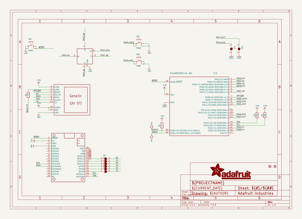
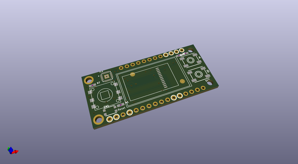
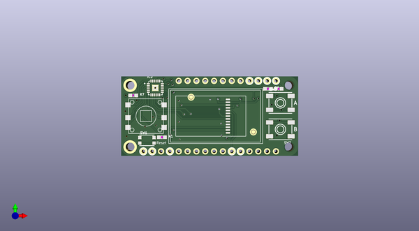
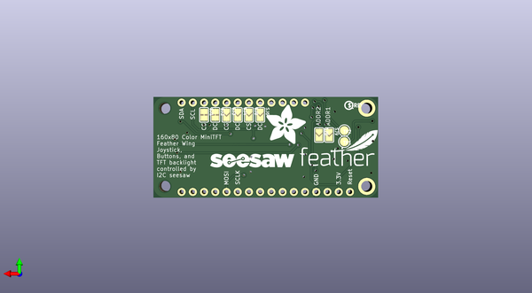

# adafruit_mini_tft_with_joystick_featherwing_pcb
 
## summary 
* id: adafruit_adafruit_mini_tft_with_joystick_featherwing_pcb_adafruit_mini_tft_wing
* user: adafruit
* name: adafruit_mini_tft_with_joystick_featherwing_pcb
* board: adafruit_mini_tft_wing
* repo: https://github.com/adafruit/Adafruit-Mini-TFT-with-Joystick-Featherwing-PCB

* src_file_repo_sch: 
* src_file_repo_sch_link: https://github.com/adafruit/Adafruit-Mini-TFT-with-Joystick-Featherwing-PCB/tree/master/
* full details link: https://github.com/oomlout/oomlout_oomp_project_bot_v_2/tree/main/projects/adafruit_adafruit_mini_tft_with_joystick_featherwing_pcb_adafruit_mini_tft_wing/current_version/working  

## schematic  
  
[schematic (pdf)](working_schematic.pdf) 

## pcb  
 
  
  
  
[board (pdf)](working.pdf)  

## working_bom
| Id | Designator | Footprint | Quantity | Designation | Supplier and ref |  | None | 
| --- | --- | --- | --- | --- | --- | --- | --- | 
| 1 | R7 | 0603-NO | 1 | 1k |  |  | [''] | 
| 2 | FID1,FID2 | FIDUCIAL_1MM | 2 | FIDUCIAL_1MM |  |  | [''] | 
| 3 | U$2 | TFT_0.96IN_160X80 | 1 | DISP_LCD_0.9IN_160X80 |  |  | [''] | 
| 4 | IC2 | QFN24_4MM | 1 | ATSAMD09D14A-MU |  |  | [''] | 
| 5 | SW1 | BTN_KMR2_4.6X2.8 | 1 | KMR2 |  |  | [''] | 
| 6 | SW3,SW2 | EVQ-Q2_SMALLER | 2 | EVQQ |  |  | [''] | 
| 7 | SW4 | SKQUBAE010 | 1 | NAVSWITCHSKQUABAUE010 |  |  | [''] | 
| 8 | R5 | 0603-NO | 1 | 10K |  |  | [''] | 
| 9 | MS1 | FEATHERWING | 1 | FEATHERWING |  |  | [''] | 
| 10 | R1 | 0603-NO | 1 | 10 |  |  | [''] | 
| 11 | R6 | 0603-NO | 1 | 10k |  |  | [''] | 
| 12 | U$8 | SEESAW_LOGO | 1 |  |  |  | [''] | 
| 13 | U$12 | ADAFRUIT_9MM | 1 |  |  |  | [''] | 
| 14 | U$4 | FEATHERLOGO_MED | 1 |  |  |  | [''] | 
| 15 | SJ6,SJ8,SJ5,SJ4,SJ3,SJ9 | SOLDERJUMPER_ARROW_NOPASTE | 6 |  |  |  | [''] | 
| 16 | SJ1,SJ2 | SOLDERJUMPER_CLOSEDWIRE | 2 |  |  |  | [''] | 
| 17 | U$14 | PCBFEAT-REV-040 | 1 |  |  |  | [''] | 
| 18 | TP1,TP2 | TESTPOINT_ROUND_2MM | 2 |  |  |  | [''] | 

## bom_schematic
| Ref | Qnty | Value | Cmp name | Footprint | Description | Vendor | DNP | 
| --- | --- | --- | --- | --- | --- | --- | --- | 
| FID1, FID2 | 2 | FIDUCIAL_1MM | FIDUCIAL_1MM | working:FIDUCIAL_1MM |  |  |  | 
| IC2 | 1 | ATSAMD09D14A-MU | ATSAMD09D14A-MU | working:QFN24_4MM |  |  |  | 
| MS1 | 1 | FEATHERWING | FEATHERWING | working:FEATHERWING |  |  |  | 
| R1 | 1 | 10 | RESISTOR_0603_NOOUT | working:0603-NO |  |  |  | 
| R5 | 1 | 10K | RESISTOR_0603_NOOUT | working:0603-NO |  |  |  | 
| R6 | 1 | 10k | RESISTOR_0603_NOOUT | working:0603-NO |  |  |  | 
| R7 | 1 | 1k | RESISTOR_0603_NOOUT | working:0603-NO |  |  |  | 
| SJ1, SJ2 | 2 | SOLDERJUMPER_CLOSED | SOLDERJUMPER_CLOSED | working:SOLDERJUMPER_CLOSEDWIRE |  |  |  | 
| SJ3, SJ4, SJ5, SJ6, SJ8, SJ9 | 6 | SOLDERJUMPER | SOLDERJUMPER | working:SOLDERJUMPER_ARROW_NOPASTE |  |  |  | 
| SW1 | 1 | KMR2 | SWITCH_TACT_SMT4.6X2.8 | working:BTN_KMR2_4.6X2.8 |  |  |  | 
| SW2, SW3 | 2 | EVQQ | SWITCH_TACT_SMT_EVQQ2_SMALL | working:EVQ-Q2_SMALLER |  |  |  | 
| SW4 | 1 | NAVSWITCHSKQUABAUE010 | NAVSWITCHSKQUABAUE010 | working:SKQUBAE010 |  |  |  | 
| TP1, TP2 | 2 | TESTPOINTROUND2MM | TESTPOINTROUND2MM | working:TESTPOINT_ROUND_2MM |  |  |  | 
| U$2 | 1 | DISP_LCD_0.9IN_160X80 | DISP_LCD_0.9IN_160X80 | working:TFT_0.96IN_160X80 |  |  |  | 

